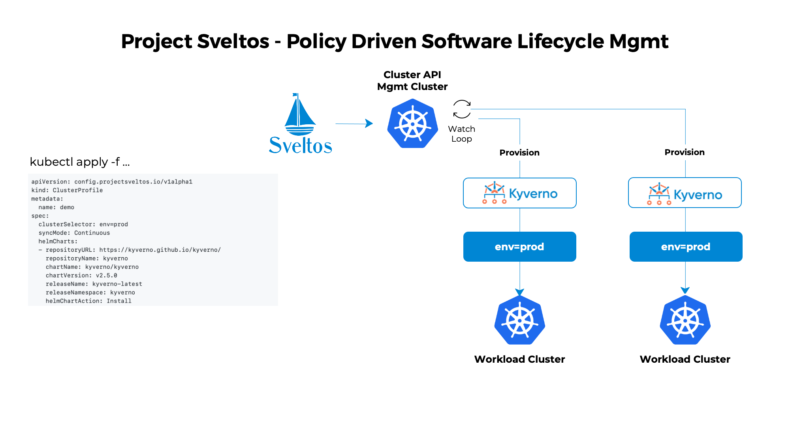

[Sveltos](https://github.com/projectsveltos) is a lightweight application designed to manage hundreds of clusters. It does so by providing declarative APIs to deploy Kubernetes addons across multiple clusters.

Sveltos focuses not only on the ability to scale the number of clusters it can manage, but also to give visibility to exactly which addons are installed on each cluster.

Sveltos comes with support to automatically discover [ClusterAPI](https://github.com/kubernetes-sigs/cluster-api) powered clusters. But it is not limited to that. Any other cluster (GKE for instance) can easily be [registered](register-cluster.md#register-cluster) with Sveltos. Then, Sveltos can manage Kubernetes addons on all the clusters seamless.


## How does Sveltos work?

Sveltos provides declarative APIs for provisioning Kubernetes addons such as Helm charts or raw Kubernetes YAML in a set of Kubernetes clusters.

Sveltos provides few custom resource definitions (CRDs) to be configured.

The idea is simple:

1. from the management cluster, selects one or more clusters with a Kubernetes [label selector](https://kubernetes.io/docs/concepts/overview/working-with-objects/labels/#label-selectors);
1. lists which Kubernetes addons need to be deployed on such clusters.

## Quick example

By simply creating an instance of [ClusterProfile](https://github.com/projectsveltos/sveltos-manager/blob/main/api/v1alpha1/clusterprofile_types.go), Sveltos can be instructed on what addons to deploy and where.

Following ClusterProfile instance is instructing Sveltos to deploy Kyverno helm chart in any cluster with label *env:prod*

```yaml
---
apiVersion: config.projectsveltos.io/v1alpha1
kind: ClusterProfile
metadata:
  name: demo
spec:
  clusterSelector: env=prod
  helmCharts:
  - repositoryURL: https://kyverno.github.io/kyverno/
    repositoryName: kyverno
    chartName: kyverno/kyverno
    chartVersion: v2.5.0
    releaseName: kyverno-latest
    releaseNamespace: kyverno
    helmChartAction: Install
```



For a quick video of Sveltos, watch the video [Sveltos introduction](https://www.youtube.com/watch?v=Ai5Mr9haWKM) on YouTube.

## More examples

1. Deploy calico in each CAPI powered cluster [clusterprofile.yaml](https://raw.githubusercontent.com/projectsveltos/sveltos-manager/main/examples/calico.yaml)
2. Deploy Kyverno in each cluster [clusterprofile.yaml](https://raw.githubusercontent.com/projectsveltos/sveltos-manager/main/examples/kyverno.yaml)
3. Deploy multiple helm charts [clusterprofile.yaml](https://raw.githubusercontent.com/projectsveltos/sveltos-manager/main/examples/multiple_helm_charts.yaml)
