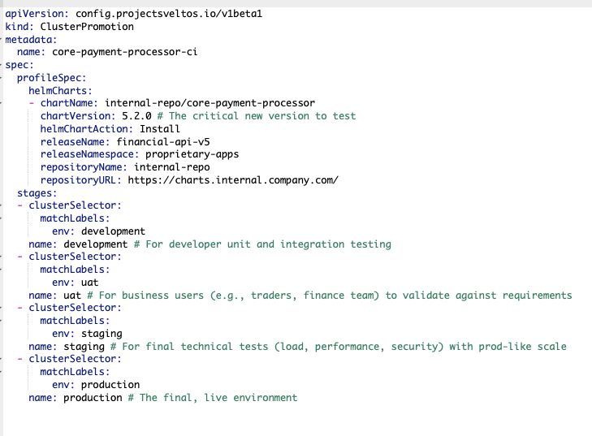

# Cluster Promotion: Progressive Rollouts

The `ClusterPromotion` CRD solves the challenge of performing phased rollouts of cluster configurations and add-ons managed by Sveltos. Instead of creating and manually managing multiple ClusterProfile resources with identical content for different environments, you define the configuration once and specify an ordered series of deployment stages.

Sveltos automatically handles the workflow:

1. It takes a single, shared configuration defined in `spec.profileSpec`.
2. It applies this configuration sequentially to clusters matching the selector of the first stage.
3. Upon successful deployment of the current stage, Sveltos waits for the configured `promotion trigger` (e.g., a time delay) before proceeding to the next stage.

| Concept | Description |
| :--- | :--- |
| **profileSpec** | The **single source of truth** for the configuration (e.g., Helm charts, Kubernetes resources, secrets, or config maps). This specification is shared across all stages. |
| **Staged Rollout** | An ordered series of stages, each with a unique **`clusterSelector`**. The configuration is only deployed to the next stage once the previous stage is fully reconciled and the trigger condition is met. |
| **ClusterProfile Generation** | For each active stage, Sveltos automatically generates a temporary **`ClusterProfile`** resource using the shared `profileSpec` and the stage's specific `clusterSelector`. This keeps the configuration **DRY (Don't Repeat Yourself)** while leveraging Sveltos's core reconciliation logic. |
| **Promotion Control** | The **`trigger`** field within each stage dictates the criteria for moving to the next stage. Both **Automated Promotion** and **Manual Promotion** |




## Example

This example demonstrates rolling out the `kyverno-latest` Helm chart with a specific replica count, first to clusters labeled `env: staging`, and then to clusters labeled `env: production`.

```yaml
apiVersion: config.projectsveltos.io/v1beta1
kind: ClusterPromotion
metadata:
  name: test-kyverno-rollout
spec:
  # The configuration (profileSpec) is defined once
  profileSpec:
    syncMode: Continuous
    helmCharts:
    - repositoryURL:    https://kyverno.github.io/kyverno/
      repositoryName:   kyverno
      chartName:        kyverno/kyverno
      chartVersion:     3.4.2
      releaseName:      kyverno-latest
      releaseNamespace: kyverno
      helmChartAction:  Install

  # Stages are processed sequentially
  stages:
  - name: staging # Stage 1: Staging environment
    clusterSelector:
      matchLabels:
        env: staging
    trigger:
      auto:
        delay: 5m # Wait 5 minutes after successful deployment before promoting

  - name: production # Stage 2: Production environment
    clusterSelector:
      matchLabels:
        env: production
    trigger:
      auto:
        delay: 5m # Wait 5 minutes after successful deployment (optional for final stage)
```

## Workflow Execution

- Stage 1 (staging): Sveltos creates a ClusterProfile targeting clusters where `env: staging`.
- Sveltos waits for the deployment to successfully complete on all staging clusters.
- Once complete, Sveltos waits for 5 minutes (the delay period).
- Stage 2 (production): After the delay, the configuration is automatically promoted. Sveltos creates a new ClusterProfile targeting clusters where env: production.
- Sveltos waits for the deployment to successfully complete on all production clusters.
- The ClusterPromotion resource is marked as fully reconciled.

## Triggers and Control

The progressive rollout is governed by the `Trigger` defined within each Stage. A stage's trigger dictates the specific condition—manual approval or automatic criteria—that must be met before Sveltos proceeds to the next stage in the pipeline. A stage can have either a **Manual** or **Auto** trigger, but not both.

### 1️⃣ Automatic Promotion (`AutoTrigger`)

The `AutoTrigger` facilitates a hands-off, time-based, and health-checked promotion flow.

| Field | Type | Description |
| :--- | :--- | :--- |
| **`delay`** | `metav1.Duration` | An optional duration to wait after the current stage's configuration is fully deployed before proceeding to health checks. This is your soak time. |
| **`postDelayHealthChecks`** | `[]ValidateHealth` | A slice of health checks (defined using `ValidateHealth`) that Sveltos must successfully run *after* the `delay` has elapsed. Promotion is blocked until all these checks pass. |
| **`promotionWindow`** | `*TimeWindow` | An optional recurring time window that restricts when the promotion can begin. Sveltos waits for this window to be open *after* the `delay` has elapsed and all health checks have passed. |

### 2️⃣ Manual Promotion (`ManualTrigger`)

The `ManualTrigger` halts the pipeline and requires explicit human intervention, typically used for promotion into high-risk environments like **Production**.

| Field | Description |
| :--- | :--- |
| **`approved`** | When set to `true`, this signals to Sveltos that the human operator has reviewed the previous stage and **approved** the promotion to the next stage. |
| **`automaticReset`** | If set to `true` (default), Sveltos will automatically reset the `approved` field to `nil`/`false` after successfully promoting to the next stage. This prevents unintentional double-advancement past the following stage. |