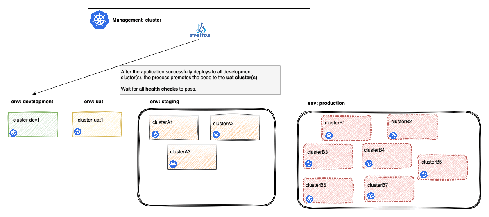

# Cluster Promotion: Progressive Rollouts

The `ClusterPromotion` Custom Resource Definition (CRD) solves the challenge of performing phased rollouts of cluster configurations and add-ons managed by Sveltos. We can avoid creating and managing multiple `ClusterProfile` resources with the same content. Instead, we define the configuration once and list the deployment stages in order.

Sveltos automatically handles the workflow:

1. It takes a single, shared configuration defined in `spec.profileSpec`.
1. It applies this configuration sequentially to clusters matching the selector of the first stage.
1. Upon successful deployment of the current stage, Sveltos waits for the configured `promotion trigger` (e.g., a time delay) before proceeding to the next stage.

| Concept | Description |
| :--- | :--- |
| **profileSpec** | The **single source of truth** for the configuration (e.g., Helm charts, Kubernetes resources, secrets, or config maps). This specification is shared across all stages. |
| **Staged Rollout** | An ordered series of stages, each with a unique **`clusterSelector`**. The configuration is only deployed to the next stage once the previous stage is fully reconciled and the trigger condition is met. |
| **ClusterProfile Generation** | For each active stage, Sveltos automatically generates a temporary **`ClusterProfile`** resource using the shared `profileSpec` and the stage's specific `clusterSelector`. This keeps the configuration **DRY (Don't Repeat Yourself)** while leveraging Sveltos's core reconciliation logic. |
| **Promotion Control** | The **`trigger`** field within each stage dictates the criteria for moving to the next stage. Both **Automated Promotion** and **Manual Promotion** |

!!! example ""
    ```yaml
    apiVersion: config.projectsveltos.io/v1beta1
    kind: ClusterPromotion
    metadata:
      name: core-payment-processor-ci
    spec:
      profileSpec:
        helmCharts:
        - chartName: internal-repo/core-paymet-processor
          chartVersion:     5.2.0 # The critical new version to test
          helmChartAction:  Install
          releaseName:      financial-api-v5
          releaseNamespace: propietary-apps
          repositoryName:   internal-repo
          repositoryURL:    internal-repo/core-paymet-processor
      stages:
      - name: development # For developer unit and integration testing
        clusterSelector:
          matchLabels:
            env: development
      - name: uat # For business users (e.g., traders, finance teams) to validate against requirements
        clusterSelector:
          matchLabels:
            env: uat
      - name: staging # For final technical tests (load, performance, security) with prod-like scale
        clusterSelector:
          matchLabels:
            env: staging
      - name: production # For final, live environment
        clusterSelector:
          matchLabels:
            env: production
    ```



## Advantages

1. **Stage-based Promotion**: Deployments start in early-stage environments like **QA**. Then, they are gradually promoted through stages such as **staging** and **pre-production** before reaching **production**. This staged approach keeps clusters **available** during deployments and **minimises downtime**.
1. **Lower Risk**: Teams can catch issues early in the rollout and fix them before they affect other clusters.
1. **Easy Management**: The **DRY** approach is used, allowing teams to define the configuration once and Sveltos handles the rest.
1. **Flexible Control**: Teams can choose their preferred workflows. They can select between **automatic** or **manual** promotion for each stage based on their needs.
1. **Health Checks Support**: Automated health checks ensure clusters are in a good state before moving to the next stage.

## Example

The example demonstrates rolling out the `kyverno-latest` Helm chart with a specific replica count, first to clusters labeled `env: staging`, and then to clusters labeled `env: production`.

!!! example "Example - ClusterPromotion for Kyverno Deployment"
    ```yaml
    apiVersion: config.projectsveltos.io/v1beta1
    kind: ClusterPromotion
    metadata:
      name: test-kyverno-rollout
    spec:
      # The configuration (profileSpec) is defined once
      profileSpec:
        syncMode: Continuous
        helmCharts:
        - repositoryURL:    https://kyverno.github.io/kyverno/
          repositoryName:   kyverno
          chartName:        kyverno/kyverno
          chartVersion:     3.5.2
          releaseName:      kyverno-latest
          releaseNamespace: kyverno
          helmChartAction:  Install

      # Stages are processed sequentially
      stages:
      - name: staging # Stage 1: Staging environment
        clusterSelector:
          matchLabels:
            env: staging
        trigger:
          auto:
            delay: 5m # Wait 5 minutes after successful deployment before promoting

      - name: production # Stage 2: Production environment
        clusterSelector:
          matchLabels:
            env: production
        trigger:
          auto:
            delay: 5m # Wait 5 minutes after successful deployment (optional for final stage)
    ```

## Workflow Execution

- **Stage 1 (staging)**:
    - Sveltos creates a `ClusterProfile` targeting clusters with the label set to `env: staging`.
    - Sveltos waits for the deployment to complete on **all staging** clusters without errors.
    - Once complete, Sveltos waits for 5 minutes (the delay period).
- **Stage 2 (production)**:
    - After the delay, the configuration is **automatically** promoted. Sveltos creates a new `ClusterProfile` targeting clusters with the label set to `env: production`.
    - Sveltos waits for the deployment to complete on **all production** clusters without errors.
    - The `ClusterPromotion` resource is marked as fully reconciled.

!!!tip
    To **manually promote** the Kyverno deployment from staging to production, perform the changes described below.

    ```yaml
          stages:
          - name: staging # Stage 1: Staging environment
            clusterSelector:
              matchLabels:
                env: staging
            trigger:
              manual:
                approved: false

          - name: production # Stage 2: Production environment
            clusterSelector:
              matchLabels:
                env: production
            trigger:
              auto:
                delay: 5m # Wait 5 minutes after successful deployment (optional for final stage)
    ```
    An operator must manually set the `trigger.manual.approved` field to `true`. Once that is done, Kyverno will get deployed in the production clusters.

    **Verification commands**:

    ```bash
    $ kubectl get clusterpromotion,clusterprofile,clustersummary -A

    $ kubectl get clusterpromotion <ClusterPromotion name> -n <namespace> -o yaml
    ```

## Triggers and Control

The progressive rollout is governed by the `Trigger` defined within each stage. A stage's trigger defines the condition needed—either manual approval or automatic criteria—before Sveltos moves to the next stage in the pipeline. A stage can have either a **Manual** or **Auto** trigger, but not both.

### Automatic Promotion (`AutoTrigger`)

The `AutoTrigger` facilitates a hands-off, time-based, and health-checked promotion flow.

| Field | Type | Description |
| :--- | :--- | :--- |
| **`delay`** | `metav1.Duration` | An optional duration to wait after the current stage's configuration is fully deployed before proceeding to health checks. This is your soak time. |
| **`postDelayHealthChecks`** | `[]ValidateHealth` | A slice of health checks (defined using `ValidateHealth`) that Sveltos must successfully run *after* the `delay` has elapsed. Promotion is blocked until all these checks pass. |
| **`promotionWindow`** | `*TimeWindow` | An optional recurring time window that restricts when the promotion can begin. Sveltos waits for this window to be open *after* the `delay` has elapsed and all health checks have passed. |

### Manual Promotion (`ManualTrigger`)

The `ManualTrigger` stops the pipeline and needs human intervention. It is usually used for moving into high-risk environments, like **Production**.

| Field | Description |
| :--- | :--- |
| **`approved`** | When set to `true`, this signals to Sveltos that the human operator has reviewed the previous stage and **approved** the promotion to the next stage. |
| **`automaticReset`** | If set to `true` (default), Sveltos will automatically reset the `approved` field to `nil`/`false` after successfully promoting to the next stage. |

!!!note
    Test the **progressive rollout** capabilities with up to **two** `ClusterPromotion` instances for free. Need more than two clusters? Contact us at `support@projectsveltos.io` to explore license options based on your needs!

For more information about the `Automatic` and `Manual` promotion and available fields, have a look at the [ClusterPromotion Types](https://github.com/projectsveltos/addon-controller/blob/main/api/v1beta1/clusterpromotion_types.go).

## Next Steps

Take a look at an [example](./example_rollout_and_progressive_rollout.md) on how the rolling update and the progressive rollout approach work together.