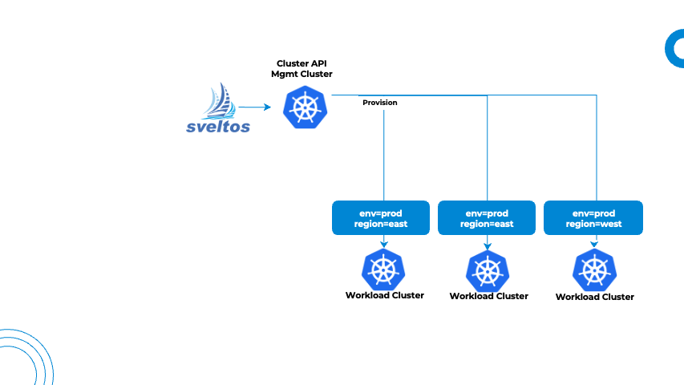

## Introduction to Sveltos Tiers
The section explains [ClusterProfile](https://github.com/projectsveltos/addon-controller/blob/main/api/v1beta1/clusterprofile_types.go)/[Profile](https://github.com/projectsveltos/addon-controller/blob/main/api/v1beta1/profile_types.go) in Sveltos, focusing on how __tiers__ enable **prioritized deployments** for resources targeted by multiple configurations.

## Efficient Cluster Management with ClusterProfiles/Profiles

Sveltos streamlines application and add-on deployments across different Kubernetes clusters using **ClusterProfiles** and **Profiles**. They target a set of managed clusters, simplifying the configuration for large groups.

## Addressing the Challenge of Subset Modifications

Imagine we have the need to **adjust deployments** for a **subset** of **clusters** within a previously defined group. Traditionally, creating a new Profile targeting the subset and including resources already managed by another profile would lead to conflicts.
Sveltos will **not** allow deployment for the overlapping resources.

## Introducing Tiers for Conflict Resolution and Priority

Sveltos tiers provide a solution for managing deployment priority when resources are targeted by multiple configurations.

- **Tier Property**: Each ClusterProfile/Profile now has a new property called `tier`
- **Deployment Order Control**: The tier value dictates the deployment order for resources targeting the same element within a cluster (e.g., a Helm chart or Kubernetes object)
- **Default Behavior**: By default, the first configuration to reach the cluster successfully deploys the resource
- **Tier Overrides**: `tier` overrides the default behavior. In case of conflicts, the configuration with the **lowest** tier value **takes precedence** and deploys the resource

!!!note
    Lower tier values represent **higher priority deployments**. The `default` tier value is set to **100**.

## Example

Let's consider a scenario with managed clusters labeled by environment (`env:prod`) and regions (`region:west` and `region:east`).

An initial ClusterProfile named `validation-and-monitoring` deploys Kyverno (v3.1.1), Prometheus (23.4.0), and Grafana (6.58.9) across all clusters (`env:prod`).

!!! example ""
    ```yaml
    ---
    apiVersion: config.projectsveltos.io/v1beta1
    kind: ClusterProfile
    metadata:
      name: validation-and-monitoring
    spec:
      clusterSelector:
        matchLabels:
          env: prod
      continueOnConflict: true
      helmCharts:
      - repositoryURL:    https://kyverno.github.io/kyverno/
        repositoryName:   kyverno
        chartName:        kyverno/kyverno
        chartVersion:     v3.3.3
        releaseName:      kyverno-latest
        releaseNamespace: kyverno
        helmChartAction:  Install
      - repositoryURL:    https://prometheus-community.github.io/helm-charts
        repositoryName:   prometheus-community
        chartName:        prometheus-community/prometheus
        chartVersion:     26.0.0
        releaseName:      prometheus
        releaseNamespace: prometheus
        helmChartAction:  Install
      - repositoryURL:    https://grafana.github.io/helm-charts
        repositoryName:   grafana
        chartName:        grafana/grafana
        chartVersion:     8.6.4
        releaseName:      grafana
        releaseNamespace: grafana
        helmChartAction:  Install
    ```

Imagine we want to **upgrade Kyverno** to version **3.1.4** and only in the clusters within the `region:west` area.

Creating a new ClusterProfile targeting `region:west` for Kyverno (v3.1.4) would result in a conflict because both profiles manage Kyverno. By default, the first one wins (validation-and-monitoring), and the upgrade will not occur.

!!! example ""
    ```yaml
    ---
    apiVersion: config.projectsveltos.io/v1beta1
    kind: ClusterProfile
    metadata:
    name: kyverno
    spec:
    clusterSelector:
      matchLabels:
        region: west
    helmCharts:
    - repositoryURL:    https://kyverno.github.io/kyverno/
      repositoryName:   kyverno
      chartName:        kyverno/kyverno
      chartVersion:     v3.3.3
      releaseName:      kyverno-latest
      releaseNamespace: kyverno
      helmChartAction:  Install
    ```

### Resolving Conflicts with Tiers



We can leverage `tiers` to prioritize the upgrade for **west** regions. Check the YAML definition below for more details. The revised ClusterProfile targets the `region:west` and set the`tier` to the value of **50** (lower than the default 100).

!!! example ""
    ```yaml
    ---
    apiVersion: config.projectsveltos.io/v1beta1
    kind: ClusterProfile
    metadata:
      name: kyverno
    spec:
      tier: 50
      clusterSelector:
        matchLabels:
          region: west
      helmCharts:
      - repositoryURL:    https://kyverno.github.io/kyverno/
        repositoryName:   kyverno
        chartName:        kyverno/kyverno
        chartVersion:     v3.3.3
        releaseName:      kyverno-latest
        releaseNamespace: kyverno
        helmChartAction:  Install
    ```

The `kyverno` ClusterProfile (tier:50) overrides the default `validation-and-monitoring` profile (tier:100) for the Kyverno deployment in west clusters. This ensures Kyverno gets upgraded to version 3.1.4 only in the desired region.

The snippet below shows a sample cluster state after applying both ClusterProfiles.

```
+-----------------------------+---------------+------------+----------------+---------+--------------------------------+------------------------------------------+
|           CLUSTER           | RESOURCE TYPE | NAMESPACE  |      NAME      | VERSION |              TIME              |                 PROFILES                 |
+-----------------------------+---------------+------------+----------------+---------+--------------------------------+------------------------------------------+
| default/clusterapi-workload | helm chart    | prometheus | prometheus     | 23.4.0  | 2024-05-14 12:48:20 +0200 CEST | ClusterProfile/validation-and-monitoring |
| default/clusterapi-workload | helm chart    | grafana    | grafana        | 6.58.9  | 2024-05-14 12:48:31 +0200 CEST | ClusterProfile/validation-and-monitoring |
| default/clusterapi-workload | helm chart    | kyverno    | kyverno-latest | 3.1.4   | 2024-05-14 13:01:55 +0200 CEST | ClusterProfile/kyverno                   |
+-----------------------------+---------------+------------+----------------+---------+--------------------------------+------------------------------------------+
```
