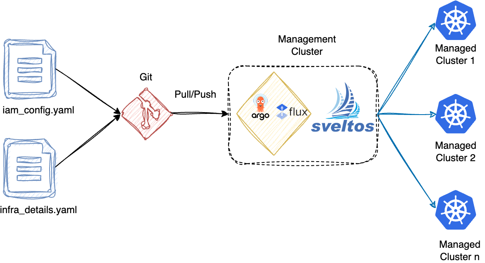

## Introduction

The example demonstrates how to integrate the Sveltos Event Framework together with the [Crossplane provider for AWS](https://github.com/crossplane-contrib/provider-aws) to achieve the [GitOps Bridge Pattern](https://github.com/gitops-bridge-dev/gitops-bridge) in a Kubernetes environment.

**Crossplane** is an open-source, CNCF tool that allows users to manage and provision cloud infrastructure using Kubernetes-style configuration files across multiple environments. For more information about Crossplane, check out the official website.

**GitOps Bridge Pattern** enables Kubernetes administrators to utilise Infrastructure as Code (IaC) and GitOps tools to deploy Kubernetes add-ons and applications across a fleet of clusters. Go through the GitHub repository to learn more about the pattern and its purpose.

## Pre-requisites

- A Kubernetes cluster acting as the **management cluster**
- A GitOps controller is already available in the **management cluster**
- Familiarity with the Sveltos Event Framework. If you are new to Sveltos, take a look at the "Quick Start" guide [here](../../getting_started/install/quick_start.md)
- Basic familiarity with [Crossplane](https://www.crossplane.io/)
- Fundamental knowledge of GitOps practices

## How does it work?

To achieve the **GitOps Bridge Pattern**, a GitOps controller such as ArgoCD or Flux is deployed in the Sveltos **management cluster**. The YAML manifests (described in the sections below) are stored in a Git repository. The GitOps controller continuously monitors this repository and automatically applies any changes, ensuring the manifests in the Sveltos **management cluster** are always in sync with Git. This approach guarantees that the add-on deployments for **managed clusters** are **versioned** and **auditable**. Sveltos uses the updated resources to take care of the add-on deployment across the **managed clusters**. Sveltos has an integration with Flux; for more information, take a look [here](../../use_cases/use_case_gitops.md).

As part of the flow, **Crossplane** provisions the required **infrastructure** (e.g., IAM Role), and once ready, **Sveltos** observes it. Sveltos pre-instantiates the manifests deployed and performs actions only when the required infrastructure is ready. For more details about how the `EventSource` and `EventTrigger` work, have a look [here](../addon_event_deployment.md).

### GitOps



### Managed Cluster Resources


## Key Objectives

- **Listen for Infrastructure Events**: Use Sveltos `EventSource` and `EventTrigger` to monitor infrastructure events.
- **Copy Infrastructure Details**: Synchronise relevant infrastructure details to the **management cluster**
- **Deploy IAM Roles for `external-dns` service**: Provision Identity and Access Management (IAM) roles using Crossplane for the `external-dns` service
- **Trigger `external-dns` Deployment**: Ensure `external-dns` is only deployed once the IAM roles are ready.

## Advantages

The proposed pattern lets us use Sveltos to collect infrastructure details from the **managed clusters** and pass that information to Crossplane, which then deploys other resources like IAM Roles. This is useful for add-ons that need infrastructure components in place before they can be installed.

It’s like laying the foundation before building, ensuring all necessary infrastructure is in place and making add-on deployment **smooth** and **reliable**. The approach easily scales to support any number of add-ons that need infrastructure to be ready ahead of time.

## Configuration Details

The `iam_config.yaml` and `infra_details.yaml` files need to be deployed in the Sveltos **management clusters**. Effectively, the Kubernetes cluster Sveltos is deployed.

!!! example "Example - IAM Roles Configuration"
    ```yaml
    cat > iam_config.yaml <<'EOF'
    ---
    apiVersion: lib.projectsveltos.io/v1beta1
    kind: EventSource
    metadata:
      name: iam-roles
    spec:
      collectResources: true
      resourceSelectors:
        - group: "iam.aws.upbound.io"
          version: "v1beta1"
          kind: "Role"
          evaluateCEL:
            - name: "externalDnsRole"
              rule: has(resource.status.atProvider.arn) && resource.metadata.name == "external-dns-role"
    ---
    apiVersion: lib.projectsveltos.io/v1beta1
    kind: EventTrigger
    metadata:
      name: iam-roles
    spec:
      sourceClusterSelector:
        matchLabels:
          environment: landing-zone
      eventSourceName: iam-roles
      oneForEvent: false
      syncMode: ContinuousWithDriftDetection
      secretGenerator:
        - name: iam-roles
          namespace: projectsveltos
          nameFormat: "{{ .Cluster.metadata.name }}-iam-roles"
      templateResourceRefs:
        - resource:
            apiVersion: v1
            kind: Secret
            name: "{{ .Cluster.metadata.name }}-infra-details"
            namespace: projectsveltos
          identifier: InfrastructureDetails
    ---
    apiVersion: v1
    kind: Secret
    metadata:
      name: iam-roles
      namespace: projectsveltos
      annotations:
        projectsveltos.io/instantiate: "true"
    type: addons.projectsveltos.io/cluster-profile
    stringData:
      resources: |
        {{- range $resource := .Resources }}
        {{- if eq $resource.kind "Role" }}
        "{{ $resource.metadata.name }}": {{ $resource.status.atProvider.arn}}
        {{- end }}
        {{- end }}
    ---
    apiVersion: config.projectsveltos.io/v1beta1
    kind: ClusterProfile
    metadata:
      name: external-dns
    spec:
      syncMode: ContinuousWithDriftDetection
      templateResourceRefs:
        - resource:
            apiVersion: v1
            kind: Secret
            name: "{{ .Cluster.metadata.name }}-iam-roles"
            namespace: projectsveltos
          identifier: IamRoles
      helmCharts:
        - chartName: external-dns/external-dns
          chartVersion: "1.18.0"
          helmChartAction: Install
          releaseName: external-dns
          releaseNamespace: external-dns
          repositoryName: external-dns
          repositoryURL: https://kubernetes-sigs.github.io/external-dns/
          valuesFrom:
            - kind: ConfigMap
              name: external-dns-default-values
              namespace: projectsveltos
              optional: true
            - kind: ConfigMap
              name: external-dns-{{- if index .Cluster.metadata.labels `environment` -}}{{- index .Cluster.metadata.labels `environment` -}}{{- end -}}-values
              namespace: projectsveltos
              optional: true
    ---
    apiVersion: v1
    kind: ConfigMap
    metadata:
      name: external-dns-landing-zone-values
      namespace: projectsveltos
      annotations:
        projectsveltos.io/template: "true"
    data:
      values: |
        {{- /* Get the generated Secret (IamRoles) */ -}}
        {{- $resource := (getResource "IamRoles") -}}
        {{- $raw := index $resource.data "resources" -}}
        {{- $decoded := b64dec $raw | trim -}}
        {{- $parsed := fromYaml $decoded | default (fromJson $decoded) -}}
        {{- $externalDnsRoleArn := index $parsed "external-dns-role" -}}

        provider: aws
        serviceAccount:
          name: "external-dns-sa"
          annotations:
            eks.amazonaws.com/role-arn: "{{ $externalDnsRoleArn }}"
        domainFilters:
          - {{ index $parsed "hosted_zone_name" }}
        txtOwnerId: {{ .Cluster.metadata.name }}
        policy: sync
    EOF
    ```

The above YAML snippet is an advanced use-case configuration, but this is what happens after deploying the YAML file to the Sveltos **management cluster**. The description starts following the top-to-bottom approach.

1. **Monitor for IAM Roles**: Sveltos watches the **managed clusters** for IAM Role resources named `external-dns-role` that have an Amazon Resource Name (ARN) available
1. **Collect Role Details**: When such a role is found in a cluster labelled as `environment=landing-zone`, Sveltos collects the required details
1. **Store in a Secret**: The IAM Role information (like the ARN) is automatically copied into a Secret in the **management cluster**
1. **Trigger Addon Deployment**: The Sveltos ClusterProfile named `external-dns` uses this Secret to deploy the `external-dns` Helm chart, ensuring it only happens when the IAM Role is ready

The power of this setup? It ensures the `external-dns` is **safely** and **automatically** installed with the right permissions across all clusters that match the label `environment=landing-zone`.

!!! example "Example - Infrastructure Details Configuration"
    ```yaml
    cat > infra_details.yaml <<'EOF'
    ---
    apiVersion: lib.projectsveltos.io/v1beta1
    kind: EventSource
    metadata:
      name: infrastructure-details
    spec:
      collectResources: true
      resourceSelectors:
        - group: ""
          version: "v1"
          kind: "Secret"
          name: "infrastructure-details"
          namespace: kube-system
    ---
    apiVersion: lib.projectsveltos.io/v1beta1
    kind: EventTrigger
    metadata:
      name: infrastructure-details
    spec:
      sourceClusterSelector:
        matchLabels:
          environment: landing-zone
      eventSourceName: infrastructure-details
      oneForEvent: false
      syncMode: ContinuousWithDriftDetection
      secretGenerator:
        - name: infrastructure-details
          namespace: projectsveltos
          nameFormat: "{{ .Cluster.metadata.name }}-infra-details"
      templateResourceRefs:
        - resource:
            apiVersion: v1
            kind: Secret
            name: "{{ .Cluster.metadata.name }}-infra-details"
            namespace: projectsveltos
          identifier: InfrastructureDetails
      policyRefs:
        - kind: ConfigMap
          name: landing-zone-external-dns
          namespace: projectsveltos
        - kind: ConfigMap
          name: landing-zone-external-secrets
          namespace: projectsveltos
    ---
    apiVersion: v1
    kind: Secret
    metadata:
      name: infrastructure-details
      namespace: projectsveltos
      annotations:
        projectsveltos.io/instantiate: "true"
    type: addons.projectsveltos.io/cluster-profile
    stringData:
      resources: |
        {{- range $resource := .Resources }}
        "{{ $resource.metadata.name }}": |
          {{ toJson $resource | trim | indent 6 }}
        {{- end }}
    ---
    apiVersion: v1
    kind: ConfigMap
    metadata:
      name: landing-zone-external-dns
      namespace: projectsveltos
      annotations:
        projectsveltos.io/template: "true"
    data:
      external-dns-role.yaml: |
        {{- /* Get the generated Secret (InfrastructureDetails) */ -}}
        {{- $resource := (getResource "InfrastructureDetails") -}}
        {{- $raw := index $resource.data "resources" -}}
        {{- $decoded := b64dec $raw | trim -}}
        {{- $parsed := fromYaml $decoded | default (fromJson $decoded) -}}
        {{- $res := index $parsed "infrastructure-details" | fromJson -}}
        {{- $anns := index $res "metadata" "annotations" | default dict -}}
        {{- $oidcProvider := index $anns "oidc_provider" | default "not-found" }}
        {{- $oidcProviderArn := index $anns "oidc_provider_arn" | default "not-found" }}
        apiVersion: iam.aws.upbound.io/v1beta1
        kind: Role
        metadata:
          name: external-dns-role
        spec:
          forProvider:
            assumeRolePolicy: |-
              {
                "Version": "2012-10-17",
                "Statement": [
                  {
                    "Effect": "Allow",
                    "Principal": {
                      "Federated": "{{ $oidcProviderArn }}"
                    },
                    "Action": "sts:AssumeRoleWithWebIdentity",
                    "Condition": {
                      "StringEquals": {
                        "{{ $oidcProvider }}:aud": "sts.amazonaws.com",
                        "{{ $oidcProvider }}:sub": "system:serviceaccount:external-dns:external-dns-sa"
                      }
                    }
                  }
                ]
              }
      external-dns-rolepolicy.yaml: |
        apiVersion: iam.aws.upbound.io/v1beta1
        kind: RolePolicy
        metadata:
          name: external-dns-role
        spec:
          forProvider:
            roleRef:
              name: external-dns-role
            policy: |
              {
                "Version": "2012-10-17",
                "Statement": [
                  {
                    "Effect": "Allow",
                    "Action": [
                      "route53:ChangeResourceRecordSets"
                    ],
                    "Resource": [
                      "arn:aws:route53:::hostedzone/*"
                    ]
                  },
                  {
                    "Effect": "Allow",
                    "Action": [
                      "route53:ListHostedZones",
                      "route53:ListResourceRecordSets",
                      "route53:ListTagsForResource"
                    ],
                    "Resource": [
                      "*"
                    ]
                  }
                ]
              }
    ---
    apiVersion: v1
    kind: ConfigMap
    metadata:
      name: landing-zone-external-secrets
      namespace: projectsveltos
      annotations:
        projectsveltos.io/template: "true"
    data:
      external-secrets-role.yaml: |
        apiVersion: iam.aws.upbound.io/v1beta1
        kind: Role
        metadata:
          name: external-secrets-role
        spec:
          forProvider:
            assumeRolePolicy: |-
              {
                "Version": "2012-10-17",
                "Statement": [
                  {
                    "Sid": "AllowEksAuthToAssumeRoleForPodIdentity",
                    "Effect": "Allow",
                    "Principal": {
                      "Service": "pods.eks.amazonaws.com"
                    },
                    "Action": [
                      "sts:AssumeRole",
                      "sts:TagSession"
                    ]
                  }
                ]
              }
      external-secrets-rolepolicy.yaml: |
        apiVersion: iam.aws.upbound.io/v1beta1
        kind: RolePolicy
        metadata:
          name: external-secrets-role
        spec:
          forProvider:
            roleRef:
              name: external-secrets-role
            policy: |
              {
                "Statement": [
                  {
                    "Action": "ssm:DescribeParameters",
                    "Effect": "Allow",
                    "Resource": "*"
                  },
                  {
                    "Action": [
                      "ssm:GetParameters",
                      "ssm:GetParameter"
                    ],
                    "Effect": "Allow",
                    "Resource": "arn:aws:ssm:*:*:parameter/platform/*"
                  },
                  {
                    "Action": "secretsmanager:ListSecrets",
                    "Effect": "Allow",
                    "Resource": "*"
                  },
                  {
                    "Action": [
                      "secretsmanager:ListSecretVersionIds",
                      "secretsmanager:GetSecretValue",
                      "secretsmanager:GetResourcePolicy",
                      "secretsmanager:DescribeSecret",
                      "secretsmanager:BatchGetSecretValue"
                    ],
                    "Effect": "Allow",
                    "Resource": "arn:aws:secretsmanager:*:*:secret:/platform/*"
                  },
                  {
                    "Action": "kms:Decrypt",
                    "Effect": "Allow",
                    "Resource": "arn:aws:kms:*:*:key/*"
                  }
                ],
                "Version": "2012-10-17"
              }
    EOF
    ```

Continuing with the infrastructure details, this is what happens after deploying the YAML file to the Sveltos **management cluster**. The description starts following the top-to-bottom approach.

1. **Watch for Infrastructure Details**: Sveltos monitors the **managed clusters** for the Secret named `infrastructure-details` in the `kube-system` namespace
1. **Collect and Copy Information**: When the Secret is found in clusters with the label set to `environment=landing-zone`, Sveltos gathers its contents and copies them into a new Secret in the **management cluster**
1. **Make Details Available to Addons**: This copied Secret provides infrastructure details which are required for the setup
1. **Trigger Policy Templates**: The configuration references ConfigMaps containing templates for IAM roles and policies for addons like `external-dns` and `external-secrets`

The power of Sveltos' advanced Templating allows Kubernetes administrators to **automatically** **generate** and **configure** the correct IAM roles and policies for each cluster, ensuring addons have the permissions and settings they require.

```bash
$ export KUBECONFIG=</dir/to/Sveltos/management/cluster/kubeconfig>
$ kubectl apply -f iam_config.yaml,infra_details.yaml
```

### Rendered Output Secret

```yaml
# Example of generated Secret (for IAM roles)
apiVersion: v1
kind: Secret
metadata:
  name: "example-iam-roles"
  namespace: projectsveltos
type: addons.projectsveltos.io/cluster-profile
stringData:
  resources: |
    "external-dns-role": arn:aws:iam::1234567890:role/external-dns-role
```

## Further Reading

1. [Sveltos Event Framework Templating](../templating.md)
1. [Sveltos Example Workflow](./service_event_trigger.md)
1. [Next-Level Kubernetes Deployment and Management: Sveltos and Flux in Action](https://blog.grosdouli.dev/blog/Better%20Together%20Sveltos%20and%20Flux%20Integration#eventsource)
