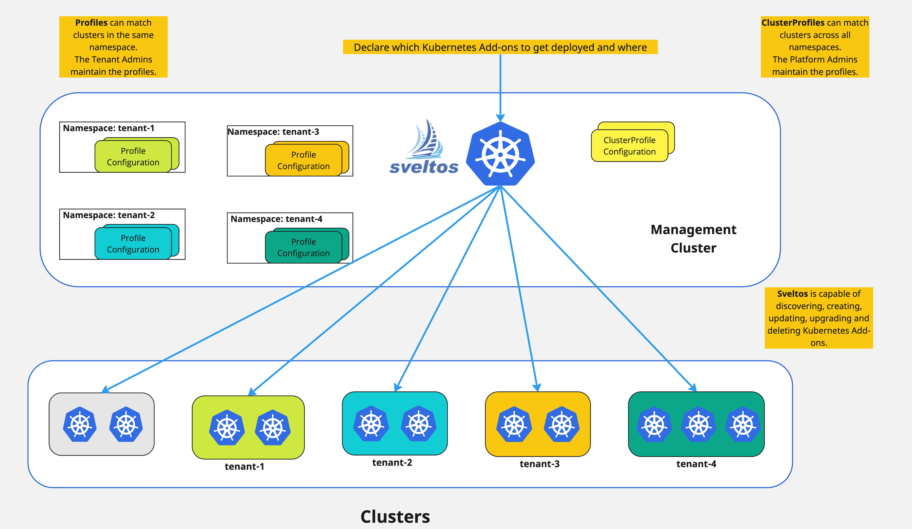

A common multi-tenant scenario involves assigning dedicated namespaces within the management cluster for each tenant. 
Tenant admins then create and manage their clusters within their designated namespace and use Profile instances to define list of add-ons and applications to deploy in their managed clusters.

Similar to ClusterProfiles, Profiles utilize a cluster selector and list of add-ons and applications. 
However,  Profiles operate within a specific namespace, matching only clusters created in that namespace. 

