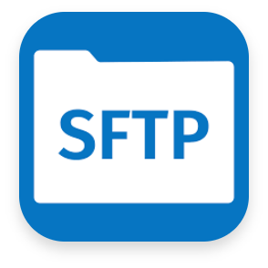

## Introduction to Tech Support Feature

To simplify debugging, we need a single, user-friendly command that users can execute to gather all necessary diagnostic data from both management and managed Kubernetes clusters.

The Techsupport Custom Resource Definition (CRD) within Sveltos provides this capability, allowing for the collection of technical support information (tech support) from Kubernetes clusters, either on a scheduled basis or as needed.

!!! note
    This is a **premium** feature which is not available by default. Schools and non-profits can contact us for free access. Maintaining Sveltos has costs, in addition to the time we invest. Features like tech support help us cover these expenses.

## Motiviation

Because software inevitably contains bugs, it's impossible to know in advance exactly what data will be needed for debugging. This diagnostic tool aims to gather a comprehensive initial dataset, reducing the need for repeated requests to users.

Simplicity is crucial. Managing multiple Kubernetes clusters is inherently complex and prone to issues. Therefore, the diagnostic tool must be as simple as possible to avoid adding further complexity. Given the likelihood of using multiple tools across these clusters, a single, programmable tool is required to specify what data to collect and from which clusters.

Relying on external data collection products creates dependencies on different priorities, development styles, and release cycles. While this might seem easier initially, it ultimately introduces undesirable constraints. If a team can ship their software, they can also ship a matching, self-contained diagnostic tool. If you are using Sveltos, this is the tool for you.

## Techsupport CRD

This YAML example demonstrates how to configure Techsupport collection:

!!! example "Example 1"
    ```yaml
    cat > techsupport.yaml <<EOF
    ---
    apiVersion: lib.projectsveltos.io/v1beta1
    kind: Techsupport
    metadata:
      name: techsupport
    spec:
      onDemand: true  # Enables on-demand tech support collection

      deliveryMethods:  # Defines how to delivery tech support
        - name: slack   # name must be unique within a TechSupport instance
          type: Slack   # Type can be Webex, Slack, Discord, Telegram, SMTP, SFTP
          secretRef: 
            name: slack
            namespace: default
    
      # Data collection from the management cluster
      fromManagement:
        resources:  # Specific resources to collect
          - group: ""  # Empty group indicates core Kubernetes resources
            version: v1
            kind: ConfigMap
            namespace: projectsveltos
          - group: ""
            version: v1
            kind: Secret
            namespace: projectsveltos
        logs:  # Collect logs from specific namespaces
          - namespace: projectsveltos
        events:  # Collect events from specified namespaces. Filter by type
          - namespace: projectsveltos
          - namespace: kube-system
            type: Warning  # Only collect Warning events from kube-system
    
      # Data collection from managed clusters
      fromManaged:
        clusterSelector:  # Filter managed clusters for collection
          matchLabels:
            env: fv  # Only collect data from clusters with label "env: fv"
        resources:  # Specific resources to collect
          - group: ""
            version: v1
            kind: Secret
            namespace: projectsveltos
          - group: apps
            version: v1
            kind: Deployments
            namespace: projectsveltos
        logs:  # Collect logs from specific namespaces
          - namespace: projectsveltos
        events:  # Collect events from specified namespaces and types
          - namespace: projectsveltos
          - namespace: kube-system
            type: Warning  # Only collect Warning events from kube-system
    EOF
    ```

The __Techsupport__ CRD allows filtering pods and resources using the label and the field selectors.

!!! example "Example 2"
    ```yaml
    cat > techsupport_advanced.yaml <<EOF
    ---
    apiVersion: lib.projectsveltos.io/v1beta1
    kind: Techsupport
    metadata:
      name: hourly
    spec:
      schedulingConfig:
        schedule: "00 * * * *"
      
      deliveryMethods:
      - name: discord
        type: Discord
        secretRef:
          name: discord
          namespace: default
      - name: telegram
        type: Telegram
        secretRef:
          name: telegram
          namespace: default

      fromManaged:
        clusterSelector:
          matchLabels:
            env: fv
        logs:
        - labelFilters:
          - key: env
            operation: Equal
            value: production
          - key: department
            operation: Different
            value: eng
          namespace: default
          sinceSeconds: 600
        resources:
        - group: "apps"
          version: v1
          kind: Deployment
          labelFilters:
          - key: env
            operation: Equal
            value: production
          - key: department
            operation: Different
            value: eng
          namespace: default
        - group: ""
          version: v1
          kind: Service
          labelFilters:
          - key: env
            operation: Equal
            value: production
          - key: department
            operation: Different
            value: eng
          namespace: default
    EOF
    ```

- *schedulingConfig.schedule* field specifies when a tech-support needs to be collected. It is in [Cron format](https://en.wikipedia.org/wiki/Cron).

## Delivery Options

Supported Delivery Options:

1.  Slack
1.   Webex
1.  Discord
1.  Telegram
1.  SMTP
1.  SFTP

### Creating Secrets

This guide demonstrates how to create Kubernetes `Secrets` for each supported platform to store your credentials/necessary info.

#### Slack

  ```bash
  $ kubectl create secret generic slack \
    --from-literal=SLACK_CHANNEL_ID=<your channel id> \
    --from-literal=SLACK_TOKEN=<your token> \
    --type=addons.projectsveltos.io/cluster-profile
  ```

  ```yaml
  deliveryMethods:
  - name: slack
    type: Slack
    secretRef:
      name: slack
      namespace: default
  ```

#### Webex

  ```bash
  $ kubectl create secret generic webex \
    --from-literal=WEBEX_ROOM_ID=<your channel id> \
    --from-literal=WEBEX_TOKEN=<your token> \
    --type=addons.projectsveltos.io/cluster-profile
  ```

  ```yaml
  deliveryMethods:
  - name: webex
    type: Webex
    secretRef:
      name: webext
      namespace: default
  ```

#### Discord

  ```bash
  $ kubectl create secret generic discord \
    --from-literal=DISCORD_CHANNEL_ID=<your channel id> \
    --from-literal=DISCORD_TOKEN=<your token> \
    --type=addons.projectsveltos.io/cluster-profile
  ```  

  ```yaml
  deliveryMethods:
  - name: discord
    type: Discord
    secretRef:
      name: discord
      namespace: default
  ```

#### Telegram

  ```bash
  $ kubectl create secret generic telegram \                                               
    --from-literal=TELEGRAM_CHAT_ID=<your int64 chat id> \
    --from-literal=TELEGRAM_TOKEN=<your token> \
    --type=addons.projectsveltos.io/cluster-profile
  ```

  ```yaml
  deliveryMethods:
  - name: telegram
    type: Telegram
    secretRef:
      name: telegram
      namespace: default
  ```  

#### SMTP 

  ```bash
  $ kubectl create secret generic smtp \
    --from-literal=SMTP_RECIPIENTS=<COMMA-SEPARATED EMAIL ADDRESSES> \
    --from-literal=SMTP_CC=<OPTIONAL, COMMA-SEPARATED EMAIL ADDRESSES> \
    --from-literal=SMTP_BCC=<OPTIONAL, COMMA-SEPARATED EMAIL ADDRESSES> \
    --from-literal=SMTP_SENDER=<EMAIL ADDRESS> \
    --from-literal=SMTP_PASSWORD=<OPTIONAL, SMTP PASSWORD FOR EMAIL ADDRESS IF APPLICABLE> \
    --from-literal=SMTP_HOST=<SMTP SERVER HOSTNAME> \
    --from-literal=SMTP_PORT=<OPTIONAL, SMTP SERVER PORT, DEFAULTS TO "587"> \
    --type=addons.projectsveltos.io/cluster-profile
  ```
!!! note
    You might need to create an app password, like [this](https://support.google.com/mail/answer/185833?hl=en).

  ```yaml
  deliveryMethods:
  - name: smtp
    type: SMTP
    secretRef:
      name: smtp
      namespace: default
  ```

#### SFTP

  ```bash
  $  kubectl create secret generic sftp \
    --from-literal=SFTP_HOST=<SFTP Server IP> \
    --from-literal=SFTP_PORT=<SFTP Server Port> \
    --from-literal=SFTP_USERNAME=<username> \
    --from-literal=SFTP_PASSWORD=<password, optional ... set SFTP_CERT otherwise>  \
    --from-literal=SFTP_CERT=<cert, optional ... set SFTP_PASSWORD otherwise>  \
    --from-literal=SFTP_PATH="/data/" \
    --from-literal=SFTP_HOST_KEY="ssh-ed25519..., optional if not set insecure ignore host will be set" \
    --type=addons.projectsveltos.io/cluster-profile
  ```

  ```yaml
  deliveryMethods:
  - name: sftp
    type: SFTP
    secretRef:
      name: sftp
      namespace: default
  ```

## Output Format

The collected techsupport contains:

1. **errors.txt**: This file contains any errors encountered during the collection process.
1. **management-cluster**: This directory holds logs, resources, and events collected from the management cluster.
1. **managed-clusters**: This directory contains subdirectories for each managed cluster matching the specified cluster selector. Each managed cluster subdirectory contains collected logs, resources, and events.

For example, if a ClusterAPI cluster named __clusterapi-workload__ exists in the __default__ namespace, the following directory structure would be present:

```
managed-clusters/Cluster/default/clusterapi-workload
```

Within each managed cluster directory, you'll find the below subdirectories:

1. **logs**: Contains collected logs.
1. **resources**: Contains collected Kubernetes resource information.
1. **events**: Contains collected events.

For instance, logs collected from the __projectsveltos__ namespace within the __clusterapi-workload__ cluster would be located at:

```
managed-clusters/Cluster/default/clusterapi-workload/logs/projectsveltos/
```

```
├── errors.txt
├── management-cluster
│   ├── events
│   │   ├── one directory per namespace
│   |   |   ├── 2025-01-03-09-08-41-component.yaml
│   ├── logs
│   │   ├── one directory per namespace
│   |   |   ├── <pod-name>-<container-name>.yaml
│   ├── resources
│   │   ├── one directory per Kind
│   |   |   ├── one directory per namespace
|   |   |   |   ├── <resource-name>.yaml
├── managed-clusters
│   ├── one path per cluster (cluster type/cluster namespace/cluster name)
|   │   ├── events
|   │   │   ├── one directory per namespace
|   │   |   |   ├── 2025-01-03-09-08-41-component.yaml
|   │   ├── logs
|   │   │   ├── one directory per namespace
|   │   |   |   ├── <pod-name>-<container-name>.yaml
|   │   ├── resources
|   │   │   ├── one directory per Kind
|   │   |   |   ├── one directory per namespace
|   |   |   |   |   ├── <resource-name>.yaml
```


For more information, refer to the [CRD](https://raw.githubusercontent.com/projectsveltos/libsveltos/refs/heads/main/config/crd/bases/lib.projectsveltos.io_techsupports.yaml).

