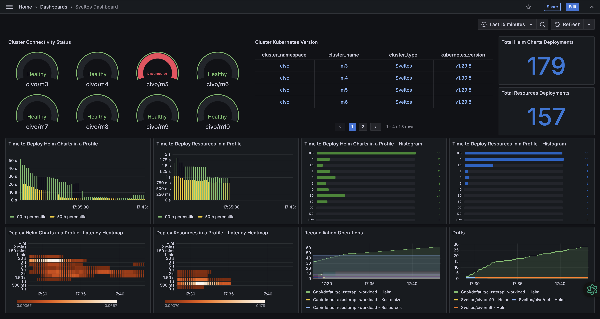

# Introduction to the Sveltos Grafana Dashboard

The Sveltos Dashboard is designed to help users monitor key operational metrics and the status of their sveltosclusters in real-time. Grafana helps users visualize this data effectively, so they can make more efficient and informed operational decisions.



## Getting Started

With the latest Sveltos release, users can take full advantage of the Sveltos Grafana dashboard. Before we start using the capabilities, ensure [Grafana](https://artifacthub.io/packages/helm/grafana/grafana) and [Prometheus](https://artifacthub.io/packages/helm/prometheus-community/prometheus) are deployed on the **Sveltos management** cluster.

To allow Prometheus to collect metrics from the **Sveltos management** cluster, perform the below if Sveltos was installed using the Helm chart.

### Helm Chart

```bash
$ helm upgrade <your release name> projectsveltos/projectsveltos -n projectsveltos --set prometheus.enabled=true
```

#### Interactive Import

Once Grafana and Prometheus are available, proceed by adding the [Prometheus data source](https://grafana.com/docs/grafana/latest/datasources/prometheus/configure-prometheus-data-source/) to Grafana and then **importing** the below Grafana dashboard.

```bash
https://raw.githubusercontent.com/projectsveltos/sveltos/main/docs/assets/sveltosgrafanadashboard.json
```

!!! note
    Depending on the Grafana/Prometheus installation, identify the `serviceMonitorSelector` label of the **Prometheus** instance and import it to the Sveltos `servicemonitor` resources as a label. Check out the example below.

    ```bash
    $ kubectl get servicemonitor -n projectsveltos
    $ kubectl patch servicemonitor addon-controller -n projectsveltos -p '{"metadata":{"labels":{"prometheus":"example-label"}}}' --type=merge
    ```

Confirm that all metrics are linked to their corresponding panels. The dashboard should automatically detect data connections from Prometheus.

Refresh to begin plotting tracked metrics. Customize the dashboard to maximize utility -- by updating thresholds, adding/removing/editing panels, and transforming metrics tracked.

!!! note
    Some metrics only appear on Grafana when their value is non-zero, e.g. ``projectsveltos_reconcile_operations_total`` and ``projectsveltos_total_drifts``. As long as Prometheus and Grafana have been configured correctly, this should not be a problem.

Detailed descriptions of the panels available on the dashboard and the tracked metrics are listed below.

#### Automated Import with Sidecar

Planning to use a sidecar for the dashboard import, feel free to use the below `.json` file. The same notes apply as in the [above](#interactive-import) section.

```bash
https://raw.githubusercontent.com/projectsveltos/sveltos/main/docs/assets/sveltosgrafanadashboard_sidecar.json
```

## Available Metrics

Sveltos lets users track and visualize a number of key operational metrics. All custom metrics are prefixed
`projectsveltos_` regardless of which component emits them, purely to avoid name collisions with unrelated
tools scraped by the same Prometheus instance — the prefix is not tied to the Kubernetes namespace a given
component happens to be deployed into, so it stays stable across every install.

!!! note
    A few metric names are emitted by **more than one component** (e.g. addon-controller,
    event-manager, and classifier all export a `reconcile_duration_seconds`), each with a different
    label set and meaning — the same pattern controller-runtime's own generic metrics already use,
    disambiguated by which component's `/metrics` endpoint was scraped. When a query below needs to
    isolate one component's series from another's, it filters on a label only that component sets
    (e.g. `profile_name!=""` for addon-controller, `event_trigger_name!=""` for event-manager,
    `classifier_name!=""` for classifier, `feature=""` for event-manager's duration histogram, since
    addon-controller always sets `feature` and event-manager never does). The one exception is
    classifier's own `reconcile_duration_seconds`: it carries the exact same three labels as
    event-manager's (`cluster_type`/`cluster_namespace`/`cluster_name`, no fourth distinguishing label),
    so isolating it requires filtering on the Prometheus-injected `job`/`instance` label from the scrape
    target instead (e.g. `job="classifier"`, depending on how the ServiceMonitor's job name resolves in
    your Prometheus setup) rather than an in-metric label.

### SveltosCluster Manager

The microservice that continuously verifies connectivity with registered clusters.

* ``projectsveltos_cluster_connectivity_status``: Gauge indicating the connectivity status of each cluster, where `0` means healthy and `1` means disconnected.

* ``projectsveltos_kubernetes_version_info:`` Gauge providing the Kubernetes version (major.minor.patch) of each cluster, using the "info metric" pattern (value always `1`, the version lives in the `kubernetes_version` label). Any prior version's row for a cluster is cleared before the current one is set, so a cluster upgrade doesn't leave both the old and new version showing simultaneously.

* ``projectsveltos_connection_failures:`` Gauge mirroring `SveltosCluster.status.connectionFailures` — resets to `0` on the next successful check, so it answers "is this cluster stuck failing connectivity checks right now," the same distinction `reconcile_consecutive_failures` makes for addon-controller.

* ``projectsveltos_agent_last_heartbeat_timestamp_seconds:`` Gauge with the Unix timestamp of the last heartbeat received from a pull-mode cluster's sveltos-agent (`SveltosCluster.status.agentLastReportTime`). Distinct from `cluster_connectivity_status`: heartbeat staleness is specific to the pull-mode agent-push mechanism, not general management-cluster-to-workload-cluster API connectivity. `time() - projectsveltos_agent_last_heartbeat_timestamp_seconds` gives seconds since the last heartbeat.

All four metrics are removed entirely when a cluster is deregistered from Sveltos, so a deleted cluster's last-known state doesn't linger in Prometheus indefinitely.

### Addon Controller

* ``projectsveltos_reconcile_duration_seconds:`` Histogram of the duration to program a feature (Resources, Helm, or Kustomize) on a workload cluster. Labeled by `cluster_type`/`cluster_namespace`/`cluster_name`/`feature`, so it can be filtered to one cluster, aggregated to a namespace, or averaged fleet-wide, and each feature type is distinguishable rather than lumped together.

* ``projectsveltos_reconcile_operations_total:`` Counter of the total number of reconcile operations (attempts, regardless of outcome) performed for Helm charts, Resources, and Kustomizations, labeled by cluster and feature.

* ``projectsveltos_reconcile_outcome_total:`` Counter of terminal reconcile outcomes (`status="success"` or `status="failure"`), unlike `reconcile_operations_total` which counts every attempt blind to outcome. Labeled by cluster, feature, status, and the owning `profile_kind`/`profile_namespace`/`profile_name` (ClusterProfile or Profile) — this is what answers "is add-on X currently failing on N clusters."

* ``projectsveltos_matching_clusters:`` Gauge of how many clusters currently match a ClusterProfile/Profile's selector. Labeled by `profile_kind`/`profile_namespace`/`profile_name`. Set independently of any reconcile activity, so it stays accurate even for a profile matching zero clusters.

* ``projectsveltos_reconcile_consecutive_failures:`` Gauge mirroring `ClusterSummary.status.featureSummaries[].consecutiveFailures` — resets to `0` on the next success, so it answers "is this stuck failing right now," unlike `reconcile_outcome_total` which only accumulates and never reflects recovery.

* ``projectsveltos_reconcile_last_success_timestamp_seconds:`` Gauge with the Unix timestamp of the last successful (Provisioned/Removed) terminal outcome for a feature on a cluster. Only moves forward on success, so `time() - projectsveltos_reconcile_last_success_timestamp_seconds` gives "seconds since this last worked," useful even for something failing intermittently rather than in a tight consecutive streak.

* ``projectsveltos_total_drifts:`` Counter of the total number of configuration drifts detected in clusters, labeled by cluster, feature, and the owning `profile_kind`/`profile_namespace`/`profile_name`.

* ``projectsveltos_outdated_helm_chart:`` Gauge that is `1` for every Helm chart deployment currently behind the latest version published in its upstream repository/registry, labeled by the owning `profile_kind`/`profile_namespace`/`profile_name`, cluster, and chart/release. Set by a periodic check, independent of the reconcile loop; see [Detecting Newer Helm Chart Versions](../../addons/helm_charts.md#detecting-newer-helm-chart-versions).

* ``projectsveltos_outdated_helm_chart_check_last_run_timestamp_seconds:`` Gauge with the Unix timestamp of the last completed pass of the periodic outdated-Helm-chart checker. Runs only on the default (unsharded) addon-controller instance, since the check needs visibility across every cluster to avoid checking the same chart more than once.

* ``projectsveltos_outdated_helm_chart_check_failures_total:`` Counter of chart lookups skipped in the most recent check pass because their upstream repository/registry could not be queried (unreachable, authentication failure, timeout, chart not found). A coarse "is the checker itself healthy" signal — per-chart failures are logged instead, not exposed as a metric label, to avoid unbounded label cardinality.

### Event Manager

* ``projectsveltos_reconcile_duration_seconds:`` Histogram of the duration to process an EventTrigger for a cluster (evaluate matching events, create/update the resulting ClusterProfile(s)). Labeled by `cluster_type`/`cluster_namespace`/`cluster_name` only — no `feature` label, unlike addon-controller's metric of the same name, which is the label to filter on when disambiguating the two.

* ``projectsveltos_reconcile_outcome_total:`` Counter of terminal reconcile outcomes for an EventTrigger on a cluster. Labeled by cluster, status, and `event_trigger_name`.

* ``projectsveltos_matching_clusters:`` Gauge of how many clusters currently match an EventTrigger's `sourceClusterSelector`. Labeled by `event_trigger_name` only.

* ``projectsveltos_matching_resources:`` Gauge of how many resources the most recently processed EventReport matched for an EventTrigger on a cluster (`EventReport.spec.matchingResources`, not CloudEvents — a separate matching mechanism). Labeled by `event_trigger_name`/`cluster_type`/`cluster_namespace`/`cluster_name`. Set independent of whether ClusterProfile creation subsequently succeeds — it's a fact about the EventReport, not about what Sveltos did with it.

* ``projectsveltos_reconcile_last_success_timestamp_seconds:`` Gauge with the Unix timestamp of the last successful terminal outcome for an EventTrigger on a cluster. Same semantics as addon-controller's version above, labeled by `event_trigger_name` instead of profile.

### Classifier

* ``projectsveltos_reconcile_duration_seconds:`` Histogram of the duration to program a Classifier (deploy sveltos-agent, required CRDs, and the Classifier instance itself) on a workload cluster. Labeled by `cluster_type`/`cluster_namespace`/`cluster_name` only — the same three labels as event-manager's metric of the same name, with no fourth label to disambiguate; see the note above on filtering by the scrape `job` instead.

* ``projectsveltos_reconcile_outcome_total:`` Counter of terminal reconcile outcomes (`status="success"` or `status="failure"`) for a Classifier on a cluster. Labeled by cluster, status, and `classifier_name`.

* ``projectsveltos_reconcile_last_success_timestamp_seconds:`` Gauge with the Unix timestamp of the last successful (Provisioned) terminal outcome for a Classifier on a cluster. Same semantics as the addon-controller/event-manager versions above, labeled by `classifier_name`.

* ``projectsveltos_matching_clusters:`` Gauge of how many clusters currently match a Classifier's rules (`kubernetesVersionConstraints`, `deployedResourceConstraint`) and so receive its `classifierLabels`. Labeled by `classifier_name` only.

* ``projectsveltos_label_conflicts:`` Gauge of how many clusters currently have at least one label key this Classifier wants to manage but can't, because another Classifier already owns that key on that cluster (see the keymanager conflict-detection logic). Labeled by `classifier_name` only. Unique to classifier — no equivalent in addon-controller or event-manager.

* ``projectsveltos_mgmt_cluster_matching_clusters:`` Gauge of how many clusters currently match a `ManagementClusterClassifier`'s `classificationLua` (evaluated against management-cluster resources, not managed clusters). Labeled by `classifier_name`. Kept as a separate metric from `matching_clusters` above since `ManagementClusterClassifier` is a distinct CRD/reconciler with its own matching semantics.

* ``projectsveltos_mgmt_cluster_label_conflicts:`` Gauge of how many clusters currently have at least one label key a `ManagementClusterClassifier` cannot manage due to a conflict. Labeled by `classifier_name`. Same relationship to `label_conflicts` above as `mgmt_cluster_matching_clusters` has to `matching_clusters`.

## Dashboard Panels

### 1. Cluster Connectivity Status
- **Type**: Gauge
- **Purpose**: Displays the connectivity status of each Kubernetes cluster managed by Sveltos.
- **Query Used**: ``projectsveltos_cluster_connectivity_status``
- **Interpretation**: A “Healthy" cluster is one that is connected ( projectsveltos_cluster_connectivity_status: 0) and depicted in green. A "Disconnected" cluster (projectsveltos_cluster_connectivity_status: 1) is shown in red, to help users rapidly identify and address connectivity issues.

### 2. Cluster Kubernetes Version
- **Type**: Table
- **Purpose**: Lists the Kubernetes version deployed in each sveltoscluster.
- **Query Used**: ``projectsveltos_kubernetes_version_info``
- **Interpretation**: The table displays clusters with their respective Kubernetes versions, to help users identify clusters in need of updates, and ensure compatibility everywhere.

### 3. Total Helm Charts Deployments
- **Type**: Stat
- **Purpose**: Counts the number of Helm chart deployments.
- **Query Used**: ``sum(projectsveltos_reconcile_duration_seconds_count{feature="Helm"})``
- **Interpretation**: Displays the number of Helm charts deployed across all sveltosclusters. This helps users assess the workload managed by Sveltos, track deployment activity, correlate any change in application performance with deployments, and optimize deployment strategies accordingly.

### 4. Total Resources Deployments
- **Type**: Stat
- **Purpose**: Counts the number of resource deployments.
- **Query Used**: ``sum(projectsveltos_reconcile_duration_seconds_count{feature="Resources"})``
- **Interpretation**: Displays the total count of resources deployed across all sveltosclusters. This helps users assess the workload managed by Sveltos, track deployment activity, correlate any change in application performance with deployments, and optimize deployment strategies accordingly.


### 5. Time to Deploy Helm Charts in a Profile
- **Type**: Bar Chart
- **Purpose**: Depicts the time required for deploying Helm Charts, by visualizing the 50th and 90th percentile of deployment times.
- **Queries Used**:
``histogram_quantile(0.90, sum(rate(projectsveltos_reconcile_duration_seconds_bucket{feature="Helm"}[5m])) by (le))``
``histogram_quantile(0.50, sum(rate(projectsveltos_reconcile_duration_seconds_bucket{feature="Helm"}[5m])) by (le))``
- **Interpretation**: Provides deeper insights into the deployment times required by Helm Charts. By plotting both the 50th and the 90th percentile, this chart intends to help users gauge performance consistency and distribution, and update their deployment strategies accordingly.

### 6. Time to Deploy Resources in a Profile
- **Type**: Bar Chart
- **Purpose**: Depicts the time required for deploying Resources, by visualizing the 50th and 90th percentile of deployment times.
- **Queries Used**:
``histogram_quantile(0.90, sum(rate(projectsveltos_reconcile_duration_seconds_bucket{feature="Resources"}[5m])) by (le))``
``histogram_quantile(0.50, sum(rate(projectsveltos_reconcile_duration_seconds_bucket{feature="Resources"}[5m])) by (le))``
- **Interpretation**: Provides deeper insights into the resource deployment times. By plotting both the 50th and the 90th percentile, this chart intends to help users gauge performance consistency and distribution, and update their deployment strategies accordingly.

### 7.Time to Deploy Helm Charts in a Profile - Histogram
- **Type**: Bar Gauge
- **Purpose**: Provides a histogram view of deployment times for Helm charts.
- **Query Used**: ``projectsveltos_reconcile_duration_seconds_bucket{feature="Helm"}``
- **Interpretation**: Captures the distribution of deployment times for Helm charts, and allows users to track and address long-tail latencies.

### 8. Time to Deploy Resources in a Profile - Histogram
- **Type**: Bar Gauge
- **Purpose**: Offers a histogram vieew of resource deployment times.
- **Query Used**: ``projectsveltos_reconcile_duration_seconds_bucket{feature="Resources"}``
- **Interpretation**: Captures the distribution of deployment times for resources, and allows users to track and address long-tail latencies.

### 9. Deploy Helm Charts in a Profile - Latency Heatmap
- **Type**: Heatmap
- **Purpose**: Provides a heatmap of Helm chart deployment latencies
- **Query Used**:
``
sum(rate(projectsveltos_reconcile_duration_seconds_bucket{feature="Helm"}[5m])) by (le)
``
- **Interpretation**: Highlights the frequency and duration of Helm chart deployment latencies to help users identify patterns and optimize deployment management.

### 10. Deploy Resources in a Profile - Latency Heatmap
- **Type**: Heatmap
- **Purpose**: Provides a heatmap of Resource deployment latencies
- **Query Used**:
``
sum(rate(projectsveltos_reconcile_duration_seconds_bucket{feature="Resources"}[5m])) by (le)
``
- **Interpretation**: Highlights the frequency and duration of resource deployment latencies to help users identify patterns and optimize deployment management.

### 11. Reconciliation Operations
- **Type**: Time Series
- **Purpose**: Shows the number of reconciliation operations performed, categorized by cluster (type, namespace, name) and feature.
- **Query Used**: ``projectsveltos_reconcile_operations_total``
- **Interpretation**: Helps users monitor reconciliation processes triggered by Sveltos across clusters, to ensure operational stability.

### 12. Drifts
- **Type**: Time Series
- **Purpose**: Tracks and displays drifts, categorized by cluster (type, namespace, name) and feature.
- **Query Used**: ``projectsveltos_total_drifts``
- **Interpretation**: Allows users to monitor configuration drifts, crucial for maintaining consistency and compliance across sveltosclusters, so they may detect and rectify discrepancies in workload clusters.

### 13. Reconcile Outcomes
- **Type**: Time Series
- **Purpose**: Shows the rate of successful vs. failed terminal reconcile outcomes, per ClusterProfile/Profile and status.
- **Query Used**: ``sum(rate(projectsveltos_reconcile_outcome_total{profile_name!=""}[5m])) by (profile_name, status)``
- **Interpretation**: Answers "is add-on X currently failing on N clusters" directly — a rising `failure` line for a given `profile_name` means that ClusterProfile/Profile is actively failing to deploy, distinct from `reconcile_operations_total` which counts every attempt regardless of outcome.

### 14. Matching Clusters per Profile
- **Type**: Time Series
- **Purpose**: Shows how many clusters currently match each ClusterProfile/Profile's selector.
- **Query Used**: ``projectsveltos_matching_clusters{profile_name!=""}``
- **Interpretation**: A profile matching `0` clusters may indicate a misconfigured `clusterSelector`; tracked over time this also shows fleet adoption of a given add-on.

### 15. Consecutive Failures per Profile
- **Type**: Time Series
- **Purpose**: Shows the current consecutive-failure streak for each cluster/feature/profile combination.
- **Query Used**: ``projectsveltos_reconcile_consecutive_failures{profile_name!=""}``
- **Interpretation**: Unlike the cumulative outcome counter, this resets to `0` on the next success — a non-zero, rising value means something is stuck failing *right now*, rather than having failed at some point in the past.

### 16. Time Since Last Success per Profile
- **Type**: Time Series
- **Purpose**: Shows how long it has been since each cluster/feature/profile combination last reached a successful terminal state.
- **Query Used**: ``time() - projectsveltos_reconcile_last_success_timestamp_seconds{profile_name!=""}``
- **Interpretation**: Catches staleness even for something failing intermittently rather than in a tight consecutive streak that would trip the panel above.

### 17. EventTrigger Reconcile Duration - Latency Heatmap
- **Type**: Heatmap
- **Purpose**: Provides a heatmap of EventTrigger processing latencies (evaluating matching events and creating/updating the resulting ClusterProfile(s)).
- **Query Used**:
``
sum(rate(projectsveltos_reconcile_duration_seconds_bucket{feature=""}[5m])) by (le)
``
- **Interpretation**: The `feature=""` filter isolates event-manager's series from addon-controller's metric of the same name, since only addon-controller ever sets the `feature` label.

### 18. EventTrigger Reconcile Outcomes
- **Type**: Time Series
- **Purpose**: Shows the rate of successful vs. failed terminal reconcile outcomes, per EventTrigger and status.
- **Query Used**: ``sum(rate(projectsveltos_reconcile_outcome_total{event_trigger_name!=""}[5m])) by (event_trigger_name, status)``
- **Interpretation**: A rising `failure` line for a given EventTrigger means it's actively failing to process events into ClusterProfiles for at least one cluster — worth cross-referencing with `EventTrigger.status.clusterInfo[].failureMessage` for the reason.

### 19. Matching Clusters per EventTrigger
- **Type**: Time Series
- **Purpose**: Shows how many clusters currently match each EventTrigger's `sourceClusterSelector`.
- **Query Used**: ``projectsveltos_matching_clusters{event_trigger_name!=""}``
- **Interpretation**: Same idea as the ClusterProfile version above, applied to EventTriggers — a `0` may indicate a misconfigured selector.

### 20. Matching Resources per EventTrigger
- **Type**: Time Series
- **Purpose**: Shows how many resources the most recently processed EventReport matched, per EventTrigger and cluster.
- **Query Used**: ``projectsveltos_matching_resources``
- **Interpretation**: Lets you tell "this EventTrigger keeps getting EventReports but nothing ever matches" (misconfigured EventSource) apart from "this is actively firing." Unique to event-manager, no name collision to filter around.

### 21. Time Since Last Success per EventTrigger
- **Type**: Time Series
- **Purpose**: Shows how long it has been since each EventTrigger last successfully processed a cluster.
- **Query Used**: ``time() - projectsveltos_reconcile_last_success_timestamp_seconds{event_trigger_name!=""}``
- **Interpretation**: Same semantics as the ClusterProfile version above — catches an EventTrigger that's gone stale even if it isn't failing on every single reconcile.

### 22. Connection Failures per Cluster
- **Type**: Time Series
- **Purpose**: Shows the current consecutive-failure streak for each cluster's connectivity checks, as tracked by sveltoscluster-manager.
- **Query Used**: ``projectsveltos_connection_failures``
- **Interpretation**: Resets to `0` on the next successful check, so a non-zero, rising value means a cluster is stuck failing connectivity checks right now — the same "is this stuck right now" signal `reconcile_consecutive_failures` gives for addon-controller, applied to basic cluster reachability instead of add-on deployment.

### 23. Time Since Last Agent Heartbeat (Pull Mode)
- **Type**: Time Series
- **Purpose**: Shows how long it has been since each pull-mode cluster's sveltos-agent last reported in.
- **Query Used**: ``time() - projectsveltos_agent_last_heartbeat_timestamp_seconds``
- **Interpretation**: Specific to pull-mode/air-gapped clusters, where sveltos-agent pushes heartbeats rather than the management cluster polling — a climbing value here catches a stalled agent even before `cluster_connectivity_status` would flag it, since heartbeat staleness and general API connectivity are checked independently.

### 24. Classifier Reconcile Duration - Latency Heatmap
- **Type**: Heatmap
- **Purpose**: Provides a heatmap of Classifier programming latencies (deploying sveltos-agent, required CRDs, and the Classifier instance to a workload cluster).
- **Query Used**:
``
sum(rate(projectsveltos_reconcile_duration_seconds_bucket{job="classifier"}[5m])) by (le)
``
- **Interpretation**: Filtered by the scrape `job` rather than an in-metric label, since classifier's `reconcile_duration_seconds` shares the exact same label set as event-manager's metric of the same name (see the note above). Adjust the `job` label value to match how your Prometheus/ServiceMonitor setup names the classifier scrape target.

### 25. Classifier Reconcile Outcomes
- **Type**: Time Series
- **Purpose**: Shows the rate of successful vs. failed terminal reconcile outcomes, per Classifier and status.
- **Query Used**: ``sum(rate(projectsveltos_reconcile_outcome_total{classifier_name!=""}[5m])) by (classifier_name, status)``
- **Interpretation**: A rising `failure` line for a given `classifier_name` means that Classifier is actively failing to deploy to at least one cluster.

### 26. Matching Clusters per Classifier
- **Type**: Time Series
- **Purpose**: Shows how many clusters currently match each Classifier's rules.
- **Query Used**: ``projectsveltos_matching_clusters{classifier_name!=""}``
- **Interpretation**: A Classifier matching `0` clusters may indicate overly-restrictive `kubernetesVersionConstraints`/`deployedResourceConstraint` rules; tracked over time this also shows how a label rolls out across the fleet.

### 27. Label Conflicts per Classifier
- **Type**: Time Series
- **Purpose**: Shows how many clusters currently have a label-key conflict for each Classifier.
- **Query Used**: ``projectsveltos_label_conflicts{classifier_name!=""}``
- **Interpretation**: A non-zero, rising value means this Classifier is currently losing ownership of at least one label key to another Classifier on some clusters — worth cross-referencing with `ClassifierReport.status.unmanagedLabels` for which key and which competing Classifier.

### 28. Time Since Last Success per Classifier
- **Type**: Time Series
- **Purpose**: Shows how long it has been since each Classifier last successfully reconciled a cluster.
- **Query Used**: ``time() - projectsveltos_reconcile_last_success_timestamp_seconds{classifier_name!=""}``
- **Interpretation**: Same semantics as the ClusterProfile/EventTrigger versions above — catches a Classifier that's gone stale even if it isn't failing on every single reconcile.

### 29. Matching Clusters per ManagementClusterClassifier
- **Type**: Time Series
- **Purpose**: Shows how many clusters currently match each `ManagementClusterClassifier`'s `classificationLua`.
- **Query Used**: ``projectsveltos_mgmt_cluster_matching_clusters``
- **Interpretation**: Same idea as panel 26, applied to `ManagementClusterClassifier` instead of `Classifier` — evaluated against management-cluster resources rather than managed clusters.

### 30. Label Conflicts per ManagementClusterClassifier
- **Type**: Time Series
- **Purpose**: Shows how many clusters currently have a label-key conflict for each `ManagementClusterClassifier`.
- **Query Used**: ``projectsveltos_mgmt_cluster_label_conflicts``
- **Interpretation**: Same idea as panel 27, applied to `ManagementClusterClassifier` instead of `Classifier`.

### 31. Outdated Helm Chart Check Failures
- **Type**: Time Series
- **Purpose**: Shows how many chart lookups failed (unreachable repository/registry, authentication failure, timeout) during the most recent outdated-Helm-chart check pass.
- **Query Used**: ``projectsveltos_outdated_helm_chart_check_failures_total``
- **Interpretation**: A coarse checker-health signal, not a per-chart diagnostic — a non-zero, rising value means the periodic version check is degraded for at least one chart, separate from any individual chart actually being outdated. Cross-reference addon-controller logs for which repository/registry failed.

### 32. Time Since Last Outdated Helm Chart Check
- **Type**: Time Series
- **Purpose**: Shows how long it has been since the periodic outdated-Helm-chart checker last completed a full pass.
- **Query Used**: ``time() - projectsveltos_outdated_helm_chart_check_last_run_timestamp_seconds``
- **Interpretation**: A climbing value means the checker has stopped running or is stuck — without this, a broken checker is indistinguishable from "every chart happens to be up to date," since `projectsveltos_outdated_helm_chart` alone reads the same in both cases. In a sharded deployment this metric is emitted only by the default (unsharded) instance, which keeps running the check for the whole fleet — there's no per-shard equivalent to scrape.


