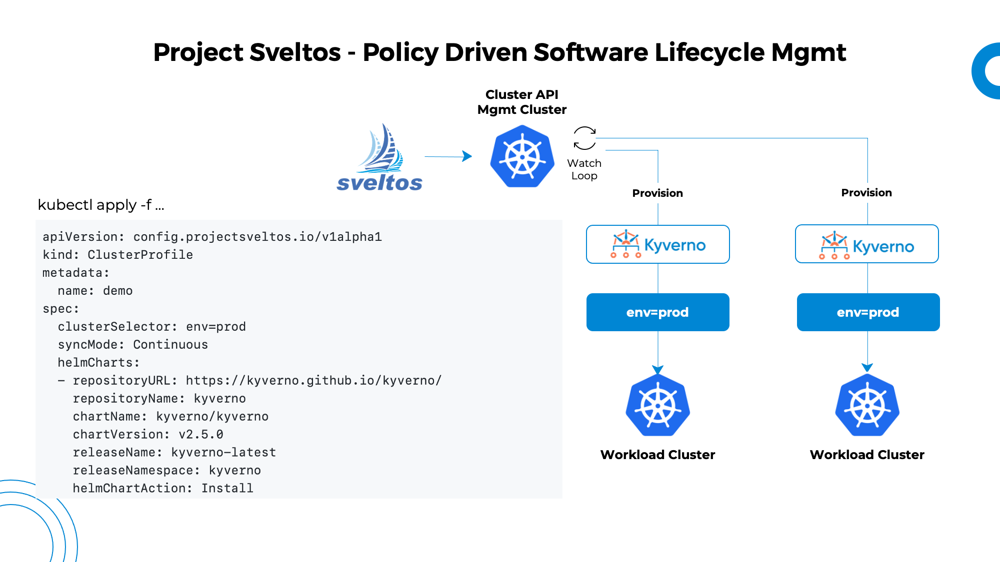

<a class="github-button" href="https://github.com/projectsveltos/sveltos-manager" data-icon="icon-park:star" data-show-count="true" aria-label="Star projectsveltos/sveltos-manager on GitHub">Star</a>

Are you struggling to manage Kubernetes add-ons across multiple clusters on different cloud providers or infrastructures? You're not alone! But we have great news - [Sveltos](https://github.com/projectsveltos "Manage Kubernetes add-ons") is here to help.

Sveltos is a lightweight application designed to manage hundreds of clusters effortlessly. Sveltos Kubernetes add-on controller simplifies the deployment and management of add-ons in Kubernetes clusters. With Sveltos controller, you can easily automate the deployment process and ensure consistency across your cluster environment. Plus, Sveltos provides platform admins with a solution for multi-tenancy, making it even easier to manage permissions for tenant admins.

But that's not all! Sveltos not only helps you scale the number of clusters you can manage, but it also provides visibility into exactly which add-ons are installed on each cluster. So you can stay on top of your cluster management game and never miss a beat.

Say goodbye to the headache of managing Kubernetes add-ons across multiple clusters and hello to Sveltos - your new best friend in cluster management!

## Features List
1. Kubernetes [addon distribution](addons.md) across multiple clusters. Add-ons can be expressed as Helm charts, resources assembled with Kustomize, resource YAMLs. [Carvel ytt](ytt_extension.md) and [Jsonnet](jsonnet_extension.md) are also supported as an extension;
2. [Templates](template.md): express add-ons as templates and have those instantiated reading values from management cluster;
3. [Addon constraints](addon_constraint.md): OpenAPI can be utilized to define custom add-on constraints. When deploying add-ons with Sveltos, these constraints will be enforced by Sveltos to ensure compliance;
4. [event driven framework](addon_event_deployment.md) to deploy add-ons as response to events in managed clusters. Event can be defined in the form of Lua script;
5. Sveltos' event driven framework can also be configured for [cross-cluster configuration](https://projectsveltos.github.io/sveltos/addon_event_deployment/#cross-clusters);
6. [configuration drift detection](configuration_drift.md): when Sveltos detects a configuration drift, it re-syncs the cluster state back to the state described in the management cluster;
7. [Dry run](dryrun.md) to preview effect of a change; 
8. [Notification](notifications.md): Sveltos can be configured to send notifications when for instance all add-ons are deployed in a cluster. Custom health checks can be passed to Sveltos in the form of [Lua script](notifications.md#healthcheck-crd);
9. Kubernetes [cluster classification](labels_management.md) and automatic label management based on cluster runtime states;
10. [Multi-tenancy](multi-tenancy.md) allowing platform admin to easily grant permissions to tenant admins and have Sveltos enforces those;
11. [Techsupport](techsupport.md): collect tech support from managed clusters;
12. [Snapshot and Rollback](snapshot.md).

## Core Concepts

Sveltos is a set of Kubernetes custom resource definitions (CRDs) and controllers to deploy kubernetes add-ons across multiple Kubernetes clusters.

1. [ClusterProfile CRD](addons.md#deep-dive-clusterprofile-crd) is the CRD used to instruct Sveltos on which add-ons to deploy on a set of clusters;
2. [Sveltos manager](addons.md#sveltos-manager-controller-configuration) is a controller running in the management cluster. It watches for *ClusterProfile* instances and *cluster* instances (both CAPI Cluster and SveltosCluster). It orchestrates Kubernetes addon deployments: when a cluster is a match for a ClusterProfile instance, all add-ons listed in the ClusterProfile instance are deployed in the cluster;
3. [Classifier CRD](labels_management.md#deep-dive-classifier-crd) is the CRD used to instructs Sveltos on how to classify a cluster;
4. [Classifier](labels_management.md#classifier-controller-configuration) is a controller running in the management cluster. Its counterpart, *Classifier Agent* is a controller running in each managed cluster. Classifier distributes Classifier CRD instances to any managed cluster. Classifier Agent watches for cluster runtime state (kubernetes version and/or resources deployed) and Classifier CRD instances. It reports back to management cluster whether a managed cluster is a match or not for each Classifier instance;
5. [RoleRequest CRD](multi-tenancy.md#rolerequest-crd) is the CRD used to allow platform admin to grant permissions to tenant admins;
6. [Sveltosctl](https://github.com/projectsveltos/sveltosctl "Sveltos CLI") is the Sveltos CLI; 
7. [Techsupport CRD](techsupport.md#techsupport-crd) is the CRD used to instruct Sveltos to collect tech support, both logs and resources, from managed clusetrs;
8. [Snapshot CRD](snapshot.md#snapshot-crd) is the CRD used to instruct Sveltos on collecting configuration snapshots;
9.  [SveltosCluster](register-cluster.md#register-cluster) is the CRD used to register a cluster with Sveltos (only non CAPI powered cluster needs to be manually registered with Sveltos);
10. [Drift detection manager](configuration_drift.md#configuration-drift) is a controller running in each managed cluster. It watches for Kubernetes resources deployed by ClusterProfiles set in SyncModeContinuousWithDriftDetection mode. Anytime it detects a possible configuration drift, it informs management cluster so that a re-sync happens and the cluster state is brought back to the desidered state expressed in the management cluster;
11. [ClusterHealthCheck](notifications.md#clusterhealthcheck) is the CRD used to configure Sveltos to send notifications when certain conditions happen.

## 😻 Contributing to projectsveltos
We believe in the power of community and collaboration, and that's where you come in!

We would love to hear your suggestions, contributions, and feedback to make our project even better! Whether you want to report a bug, request a new feature, or just stay up-to-date with the latest news, we've got you covered.

We would love your suggestions, contributions, and help! 

1. Open a bug/feature enhancement on github 
2. Chat with us on the Slack in the #projectsveltos channel 
3. If you prefer to reach out directly, just shoot us an [email](mailto:support@projectsveltos.io)

We are always thrilled to welcome new members to our community, and your contributions are always appreciated. So don't be shy - join us today and let's make Sveltos the best it can be! ❤️

## Support us

{==

If you like the project, please [give us a](https://github.com/projectsveltos/sveltos-manager "Manage Kubernetes add-ons")  [:octicons-star-fill-24:{ .heart }](https://github.com/projectsveltos/sveltos-manager "Manage Kubernetes add-ons") if you haven't done so yet. Your support means a lot to us. **Thank you :pray:.**

==}

[:star: projectsveltos](https://github.com/projectsveltos/sveltos-manager "Manage Kubernetes add-ons"){ .md-button .md-button--primary }

