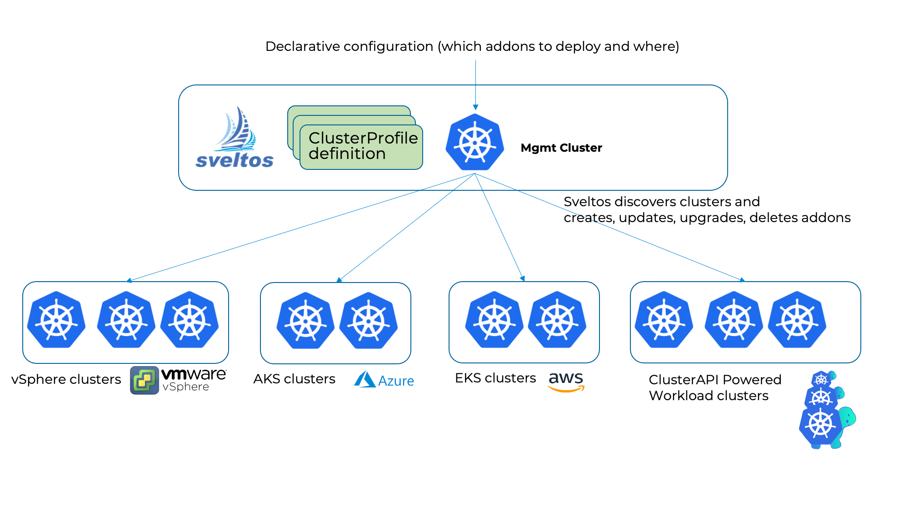

<a class="github-button" href="https://github.com/projectsveltos/sveltos-manager" data-icon="icon-park:star" data-show-count="true" aria-label="Star projectsveltos/sveltos-manager on GitHub">Star</a>

<h1>Sveltos: Kubernetes Add-on Controller for Multi-Cluster Fleets</h1>

**Deploy and manage Kubernetes add-ons and applications across hundreds of clusters from a single management cluster.** Helm, Kustomize, or raw YAML/JSON. Define once, deploy everywhere, with per-cluster variation, drift detection, and event-driven automation.

[:star: Star us on GitHub](https://github.com/projectsveltos/addon-controller){:target="_blank" .md-button .md-button--primary}
[:rocket: Quick Start](./getting_started/install/quick_start.md){.md-button}
[:globe_with_meridians: Website](https://website.projectsveltos.io/){:target="_blank" .md-button}

## What is Sveltos?

[Sveltos](https://github.com/projectsveltos "Manage Kubernetes add-ons") is a [Kubernetes add-on controller](https://github.com/projectsveltos/addon-controller). It deploys and manages add-ons and applications across many clusters using label-based matching. Sveltos does not compete with GitOps controllers like ArgoCD or Flux. Instead, it extends their capabilities.

A GitOps controller monitors a repository and syncs manifests. In contrast, Sveltos takes these manifests and applies them across the entire fleet. Its configurations are cluster-agnostic; they do not reference a specific cluster. Instead, they target clusters by labels, which means when a new cluster joins the fleet, it requires no configuration changes, only the right labels. One configuration can serve any number of clusters that meet the defined criteria.

!!! tip "Have Questions?"
    Join the **#projectsveltos** Slack channel for questions, discussions, and community support!
    

!!! note
    Sveltos is not a GitOps replacement. It's designed to be an extension for GitOps workflows when managing multiple clusters.

Here's how it works:

- **Sveltos runs in a management cluster**. It assists with the deployment and management of Kubernetes add-ons and applications. This works for any cluster in the fleet, including the management cluster.
- **GitOps principles**. We can use a GitOps controller to push configuration to the management cluster. Then, Sveltos takes over, distributing the desired state down the managed clusters.
- **Sveltos supports a variety of add-on formats**. This includes Helm charts, raw YAML/JSON, Kustomize, Carvel ytt, and Jsonnet. This flexibility allows us to manage add-ons using the format that best suits our needs.
- **Sveltos provides powerful template capabilities and an event framework**. This approach empowers us to better manage a fleet of clusters by customising deployments and reacting to cluster events.

## Features

* **🔄 Orchestrated Deployment Order**: Deploy resources in a defined order using simple Custom Resource Definitions (CRDs). Predictable, controlled rollouts.
* **👥 Multitenancy**: Use `ClusterProfile` for fleet-wide policies and `Profile` for namespace-scoped tenant isolation.
* **🧩 Templating**: Define add-ons and applications as templates; Sveltos instantiates them per cluster using cluster metadata.
* **⚡ Event-driven Framework**: Trigger deployments from in-cluster or NATS events, with matching logic written in [Lua](https://www.lua.org/) or [CEL](https://cel.dev/).
* **📢 Observability**: Notifications via Slack, Teams, Discord, Webex, Telegram, SMTP, or Kubernetes events.
* **🛡️ Pull Mode**: Deploy into restricted environments: air-gapped, edge, or behind firewalls.
* **🚦 Progressive rollouts**: Phased deployments from a single configuration; no need to maintain multiple profiles.

## Why Sveltos?

Sveltos was created to tackle the real challenges of managing multi-cluster add-ons. Sveltos complements GitOps controllers like ArgoCD and Flux by handling fleet-level orchestration and letting them continue to do what they do best.

Sveltos stands out for:

- **Label-based fleet targeting**: One configuration serves any matching cluster.
- **Flexible drift detection (agent or agentless)**: Choose the mode that fits your environment.
- **Per-cluster templating**: Same definition, different values per cluster.
- **Event framework and progressive rollouts**: Safe, automated, and adaptable.

## Sveltos at the Edge

Running Kubernetes at the edge usually means a tight resource budget, limited CPU, memory, and bandwidth. Sveltos agents deployed in managed clusters are built for edge use cases. Sveltos deploys only what is actually needed.

**What gets deployed and when**

- **drift-detection-manager**: Only shows up when a matching profile sets `syncMode: ContinuousWithDriftDetection`. It watches **only** the resources that Sveltos itself deployed, nothing more. Footprint and resource consumption stay small.

- **sveltos-agent**: Handles event detection. If we have not defined any events to watch, it barely consumes resources. Even when watching resources, memory usage scales with what we ask Sveltos to observe. In a typical edge cluster setup, we will not have thousands of resources to watch. Even if we do, Sveltos will not act unless we specifically tell it to watch them.

- **sveltos-applier (Pull Mode)**: It polls the **management** cluster for new configurations to apply. That is all it does. Very light resource consumption.

## Who's Using Sveltos?

See our [adopters list](https://github.com/projectsveltos/adopters/blob/main/ADOPTERS.md). Using Sveltos in production? We'd love to add you.

## Enterprise Offering

Need SLAs, professional services, or custom features? See our [Enterprise Offering](https://website.projectsveltos.io/pricing/).

## 😻 Contributing to projectsveltos

We love to hear from you! We believe in the power of community and collaboration!

Your ideas and feedback are important to us. Whether you want to report a bug, suggest a new feature, or stay updated with our latest news, we are here for you.

1. Open a bug/feature enhancement on GitHub .
1. Chat with us on Slack in the #projectsveltos channel .
1. If you prefer to reach out directly, just shoot us an [email](mailto:support@projectsveltos.io).

We are always thrilled to welcome new members to our community, and your contributions are always appreciated. Do not be shy - join us today and let's make Sveltos the best it can be! ❤️

## Support the Project

If Sveltos saves you time, the single most helpful thing you can do is **star the repo**. It helps other engineers and the community to discover the project.

[:star: Star us on GitHub](https://github.com/projectsveltos/sveltos-manager "Manage Kubernetes add-ons"){:target="_blank" .md-button}

**Thank you 🙏**

<!-- If you like the project, please [give us a](https://github.com/projectsveltos/sveltos-manager "Manage Kubernetes add-ons") [:octicons-star-fill-24:{ .heart }](https://github.com/projectsveltos/sveltos-manager "Manage Kubernetes add-ons") if you haven't done so yet. Your support means a lot to us. **Thank you :pray:.** -->
