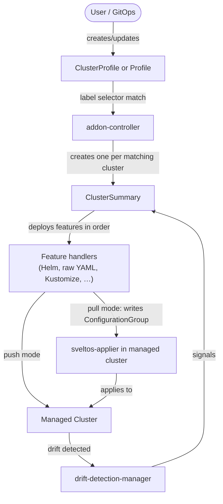

# Sveltos Architecture

Sveltos is a set of Kubernetes controllers that all run in a single **management cluster**. From there they deploy and manage add-ons across a fleet of **managed clusters**. This page describes what each component does, which ones can be removed, and how the two deployment modes differ in the permissions they require on managed clusters.

## Entry Point

Sveltos has no separate API server. The Kubernetes API of the management cluster is the only entry point. All Sveltos resources — `ClusterProfile`, `Classifier`, `EventTrigger`, `SveltosCluster`, and the rest — are Kubernetes custom resources. Users interact with them using `kubectl`, Helm, or any GitOps controller pointed at the management cluster. Standard Kubernetes RBAC controls who can read and write Sveltos resources.

## Cluster Discovery and Registration

Sveltos supports several ways to bring a cluster under management: providing a kubeconfig `Secret`, using cloud workload identity (AWS IRSA, GKE Workload Identity), pull mode for clusters not reachable from the management cluster, and automatic discovery of Cluster API `Cluster` objects. See [Register a Cluster](../register/register-cluster.md) for details on each approach.

Profiles target clusters by **label selectors**. A `ClusterProfile` does not name specific clusters; it declares which labels a cluster must carry. When a cluster is registered and its labels match an existing profile, Sveltos begins managing it immediately with no further configuration.

## Core Reconciliation Loop

The central reconciliation loop is what drives all add-on deployments.



**Step by step:**

1. A user (or a GitOps controller) creates or updates a `ClusterProfile` in the management cluster.
2. addon-controller finds all clusters whose labels match the `clusterSelector` and creates or updates one `ClusterSummary` per matching cluster.
3. The `ClusterSummary` reconciler deploys each declared feature — Helm charts, raw YAML, Kustomize packages — in the order defined by the profile. A failure on one feature stops further features for that cluster until the next reconciliation cycle.
4. The deployed resource list is recorded in a `ClusterConfiguration`, which serves as the source of truth for what Sveltos owns on each cluster.
5. When `syncMode` is `ContinuousWithDriftDetection`, drift-detection-manager watches every resource Sveltos deployed. If anything is changed externally, it signals the `ClusterSummary` reconciler to re-apply the desired state.

addon-controller continuously compares the declared spec of each `ClusterSummary` against what is actually deployed. If the two diverge — because a `ClusterProfile` changed, a dependency became ready, or drift was detected — it reconciles immediately. Clusters that are paused or unreachable are skipped and retried on the next cycle.

## Management Cluster Components

### Core Controllers

These controllers are always deployed and cannot be disabled.

| Component | Helm key | Purpose |
|---|---|---|
| **addon-controller** | `addonController` | Watches `ClusterProfile` and `Profile` resources; creates one `ClusterSummary` per matching cluster; deploys Helm charts, raw YAML, Kustomize, Carvel ytt, and Jsonnet. The main add-on deployment engine. |
| **classifier-manager** | `classifierManager` | Evaluates `Classifier` rules (Kubernetes version, deployed resources) against each cluster and applies the matching labels. Also the component responsible for bootstrapping `sveltos-agent` (or `sveltos-applier` in pull mode) in every managed cluster. |
| **event-manager** | `eventManager` | Implements the event-driven add-on workflow. Deploys `EventSource` instances to managed clusters, collects `EventReport` results, and creates new `ClusterProfile` instances when events fire. |
| **sveltoscluster-manager** | `scManager` | Monitors connectivity to every registered cluster (both `SveltosCluster` and CAPI `Cluster`). Periodically connects to each cluster, updates its heartbeat, and runs user-defined readiness and liveness checks. |

### Optional Components

These components can be disabled when not needed.

| Component | Helm key | Default | Purpose | When to disable |
|---|---|---|---|---|
| **healthcheck-manager** | `hcManager.enabled` | `true` | Manages `ClusterHealthCheck` resources; deploys `HealthCheck` instances to managed clusters; collects `HealthCheckReport` results; sends notifications to Slack, Teams, and similar channels. | Safe to disable when not using `ClusterHealthCheck` resources or cluster health notifications. |
| **access-manager** | `accessManager.enabled` | `true` | (1) Processes `RoleRequest` resources — grants permissions to tenant admins inside managed clusters. (2) Handles `AccessRequest` resources — generates short-lived kubeconfigs for in-cluster agents to call back to the management cluster. | Safe to disable when not using multi-tenancy (`RoleRequest`) and when running in Mode 2 (no agents in managed clusters need to call back). |
| **shard-controller** | `shardController.enabled` | `true` | Enables horizontal scaling. When a managed cluster carries the `sharding.projectsveltos.io/key` annotation, the shard controller automatically deploys a dedicated set of Sveltos controllers for that shard. When the annotation is removed, it tears the shard down. | Safe to disable when managing a small enough fleet that a single controller set is sufficient. |
| **techsupport-controller** | `techsupportController.enabled` | `true` | Manages `TechSupport` resources; collects logs, events, and resource state from management and managed clusters. | Safe to disable when not using `TechSupport` resources. |
| **mcp-server** | `mcpServer.enabled` | `true` | Exposes a Model Context Protocol (MCP) server so AI tools can inspect and manage the Sveltos fleet. | Safe to disable when not integrating with AI tooling. |
| **clusterInventory** | `clusterInventory.enabled` | `false` | Bridges the [Kubernetes Cluster Inventory API](https://github.com/kubernetes-sigs/cluster-inventory-api) to Sveltos by watching `ClusterProfile` objects (`multicluster.x-k8s.io`) and creating the corresponding `SveltosCluster` and kubeconfig `Secret`. | Enable only when integrating with a cluster inventory provider that implements the Cluster Inventory API. |
| **Prometheus** | `prometheus.enabled` | `false` | Deploys Prometheus and Grafana alongside Sveltos for metrics collection. | Enable only when an in-cluster Prometheus stack is needed. |

### Installation Jobs

Two Jobs run at install and upgrade time. They are not long-running controllers.

| Job | Purpose |
|---|---|
| **crd-manager** | Installs and upgrades all Sveltos CRDs before the controllers start. Runs as a pre-upgrade Helm hook. |
| **register-mgmt-cluster** | Registers the management cluster itself as a `SveltosCluster` in the `mgmt` namespace so add-ons can be deployed to the management cluster just like any other cluster. |

## Agents

Two agents handle work that requires direct access to the managed cluster's API server: evaluating classification rules, detecting events, checking health, and detecting configuration drift. Where these agents run is the key difference between the two deployment modes.

| Agent | Purpose |
|---|---|
| **sveltos-agent** | Evaluates `Classifier`, `EventSource`, and `HealthCheck` rules against the resources in a cluster. Writes `ClassifierReport`, `EventReport`, `HealthCheckReport`, and `ReloaderReport` results. |
| **drift-detection-manager** | Watches the resources that Sveltos deployed to a cluster. When any of those resources is modified externally, it signals the management cluster to reconcile. Deployed only for clusters that have at least one profile with `syncMode: ContinuousWithDriftDetection`. |

## Deployment Modes

Sveltos ships in two modes that differ only in where the agents run.

### Mode 1 — Local Agent Mode (default)

```sh
helm install projectsveltos projectsveltos/projectsveltos -n projectsveltos --create-namespace
```

The agents run **inside each managed cluster**. Classifier-manager deploys `sveltos-agent` as a `Deployment` in the `projectsveltos` namespace on every managed cluster. Addon-controller deploys `drift-detection-manager` to managed clusters that have at least one profile using `ContinuousWithDriftDetection`.

```
Management cluster                     Managed cluster
─────────────────────────────────      ─────────────────────────────────────────
addon-controller                       projectsveltos namespace:
classifier-manager  ──deploys──►         sveltos-agent (Deployment)
event-manager                            drift-detection-manager (if needed)
healthcheck-manager                      Sveltos CRDs
sveltoscluster-manager                   ClassifierReports, EventReports, …
access-manager
```

**RBAC created in each managed cluster by Sveltos:**

- `Namespace`: `projectsveltos`
- `ServiceAccount`: `sveltos-agent-manager` in `projectsveltos`
- `ClusterRole` `sveltos-agent-manager-role`:
    - `get`, `list`, `watch` on `*.*` — needed to evaluate Classifier, EventSource, and HealthCheck rules against arbitrary resource types
    - `create`, `delete`, `get`, `list`, `patch`, `update`, `watch` on `ClassifierReport`, `EventReport`, `HealthCheckReport`, `ReloaderReport`
    - `get`, `list`, `patch`, `update`, `watch` on `Classifier`, `EventSource`, `HealthCheck`, `Reloader`
    - `create`, `patch`, `update` on `Events`
- `ClusterRoleBinding`: binds the ClusterRole to the ServiceAccount
- When `syncMode: ContinuousWithDriftDetection`: a separate `drift-detection-manager` Deployment, ServiceAccount, and ClusterRole are also created (read access on tracked resources, write on `ResourceSummary`)

The management cluster needs a kubeconfig for each managed cluster (stored as a `Secret`, referenced by `SveltosCluster`) so controllers can connect outbound to deploy agents, collect reports, and push add-ons.

**When is access-manager needed in Mode 1?**

- Always needed for `RoleRequest` (granting tenant admins permissions in managed clusters).
- Needed for `AccessRequest` only when running in report-push mode (`--report-mode=1`), where agents push reports back to the management cluster instead of being polled.
- In the default collect mode (`--report-mode=0`), management cluster controllers poll the managed cluster to read agent reports, so `AccessRequest` is not required.

### Mode 2 — Centralized Agent Mode

```sh
helm install projectsveltos projectsveltos/projectsveltos -n projectsveltos --create-namespace \
  --set agent.managementCluster=true
```

The agents run in the **management cluster**, one `Deployment` per managed cluster. Sveltos leaves **no footprint** on managed clusters.

```
Management cluster
──────────────────────────────────────────────────────────────────────────
addon-controller
classifier-manager
event-manager
healthcheck-manager
sveltoscluster-manager
access-manager

Per-managed-cluster Deployments (running in the management cluster):
  sveltos-agent-<cluster>            ──► connects to managed cluster API
  drift-detection-manager-<cluster>  ──► connects to managed cluster API (if needed)
```

**RBAC in managed clusters:** none. Sveltos creates no `ServiceAccount`, `ClusterRole`, or `Deployment` in managed clusters. The only requirement is that the kubeconfig for each managed cluster — stored as a `Secret` in the management cluster and referenced by `SveltosCluster` — grants the permissions Sveltos needs.

The kubeconfig must allow:

- `get`, `list`, `watch` on `*.*` — for sveltos-agent to evaluate classification, event, and health-check rules
- Read access on resources being drift-detected — for drift-detection-manager
- Sufficient permissions for addon-controller to deploy (create, update, delete) the add-ons defined in profiles

**Scoping deployment permissions**

The deployment permissions are not fixed — they are exactly the permissions needed to create, update, and delete whatever a `ClusterProfile` declares. There is no need to grant cluster-admin; a least-privilege identity works fine.

For example, a `ClusterProfile` that installs the `podinfo` Helm chart into the `podinfo` namespace:

```yaml
apiVersion: config.projectsveltos.io/v1beta1
kind: ClusterProfile
metadata:
  name: podinfo
spec:
  clusterSelector:
    matchLabels:
      env: fv
  helmCharts:
  - repositoryURL:    https://stefanprodan.github.io/podinfo
    repositoryName:   podinfo
    chartName:        podinfo/podinfo
    chartVersion:     6.14.0
    releaseName:      podinfo-latest
    releaseNamespace: podinfo
    helmChartAction:  Install
    options:
      installOptions:
        createNamespace: false
```

requires only the following RBAC on the managed cluster:

```yaml
apiVersion: v1
kind: ServiceAccount
metadata:
  name: sa-deployer
  namespace: podinfo
---
apiVersion: rbac.authorization.k8s.io/v1
kind: Role
metadata:
  name: sa-deployer-role
  namespace: podinfo
rules:
- apiGroups: ["apps"]
  resources: ["deployments"]
  verbs: ["get", "list", "watch", "create", "update", "patch", "delete"]
- apiGroups: ["autoscaling"]
  resources: ["horizontalpodautoscalers"]
  verbs: ["get", "list", "watch", "create", "update", "patch", "delete"]
- apiGroups: [""]
  resources: ["services"]
  verbs: ["get", "list", "watch", "create", "update", "patch", "delete"]
- apiGroups: ["networking.k8s.io"]
  resources: ["ingresses"]
  verbs: ["get", "list", "watch", "create", "update", "patch", "delete"]
- apiGroups: [""]
  resources: ["secrets"]   # Helm stores release state in Secrets
  verbs: ["get", "list", "watch", "create", "update", "patch", "delete"]
- apiGroups: [""]
  resources: ["pods"]      # Helm test pods
  verbs: ["get", "list", "watch", "create", "patch", "delete"]
---
apiVersion: rbac.authorization.k8s.io/v1
kind: RoleBinding
metadata:
  name: sa-deployer-binding
  namespace: podinfo
subjects:
- kind: ServiceAccount
  name: sa-deployer
  namespace: podinfo
roleRef:
  kind: Role
  name: sa-deployer-role
  apiGroup: rbac.authorization.k8s.io
```

The kubeconfig stored in the management cluster is generated for the `sa-deployer` ServiceAccount. Sveltos uses it to connect to the managed cluster with exactly those permissions — nothing more.

**When is access-manager needed in Mode 2?**

Only if using `RoleRequest` (multi-tenancy). `AccessRequest` is not used because the agents run in the management cluster and already have direct access to its API. If not using `RoleRequest`, access-manager can be disabled:

```sh
--set accessManager.enabled=false
```

### Mode Comparison

| Aspect | Mode 1 (Local Agent) | Mode 2 (Centralized Agent) |
|---|---|---|
| Where agents run | Inside each managed cluster | Inside the management cluster |
| Managed cluster footprint | `projectsveltos` namespace, ServiceAccount, ClusterRole, Deployments | None |
| RBAC in managed cluster | ClusterRole with `get/list/watch *.*` plus write on Sveltos report CRDs | Not applicable — permissions come via the provided kubeconfig |
| Outbound connection | Management cluster connects to managed cluster API servers | Management cluster connects to managed cluster API servers |
| access-manager needed | Yes for `RoleRequest`; only for `AccessRequest` in report-push mode | Only if using `RoleRequest` |
| Resource consumption | Agent pods run in managed clusters (small footprint, good for edge) | Agent pods run in management cluster (resource usage centralized) |
| Good for | Environments where managed-cluster API is reachable and a small in-cluster footprint is acceptable | Environments where managed clusters must remain untouched, or where centralising agent resource usage is preferred |

!!! note "Pull Mode"
    Pull mode is orthogonal to Mode 1 and Mode 2. When a `SveltosCluster` sets `spec.pullMode: true`, `sveltos-applier` is deployed in the managed cluster and initiates outbound connections to the management cluster to fetch configurations. This is designed for clusters behind firewalls or in restricted networks where the management cluster cannot reach the managed cluster's API server. See [Registration Pull Mode](../register/register_cluster_pull_mode.md) for details.
