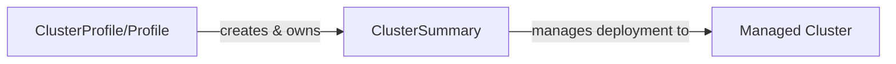
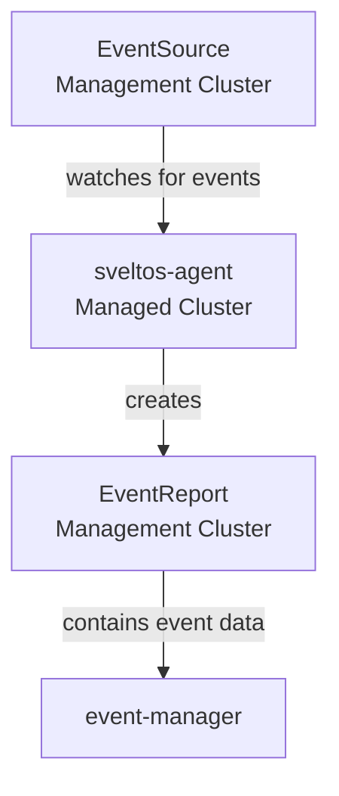
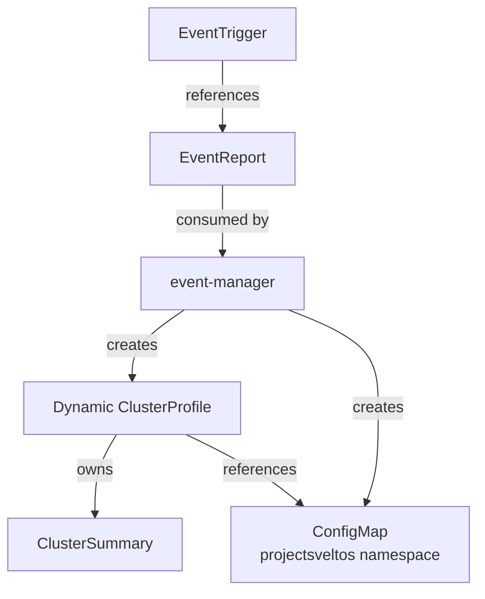
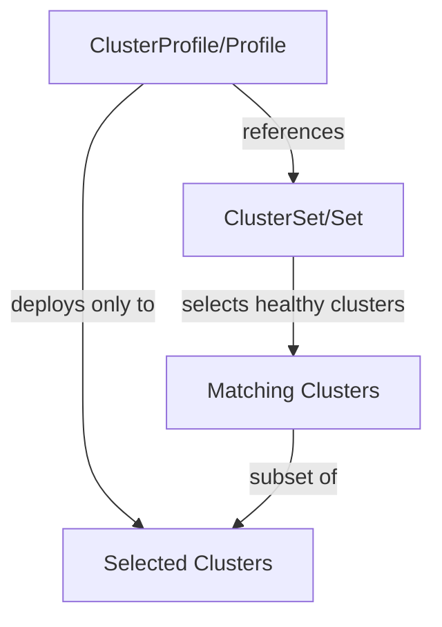
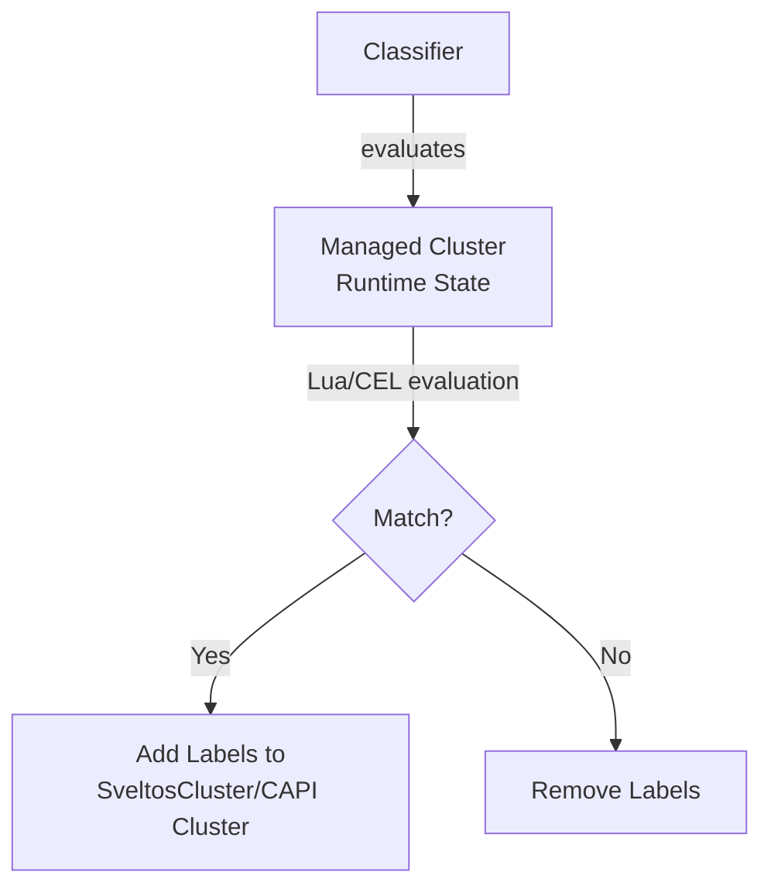
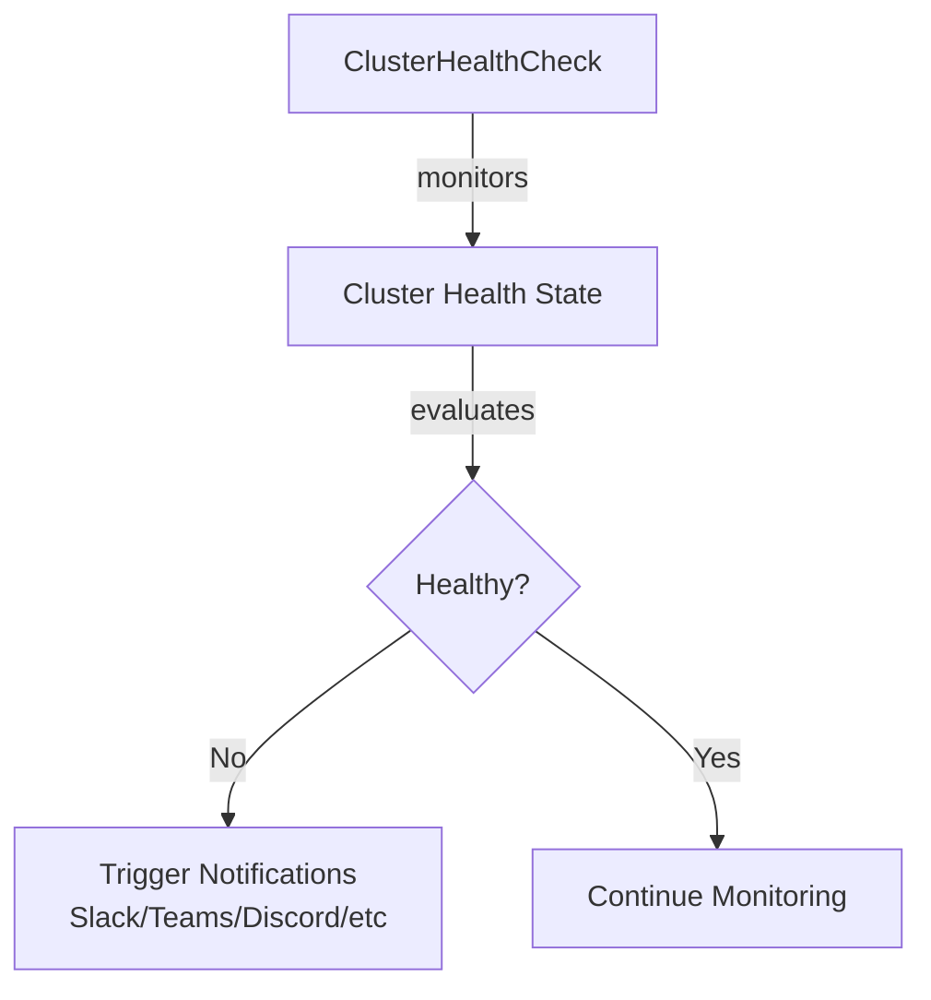
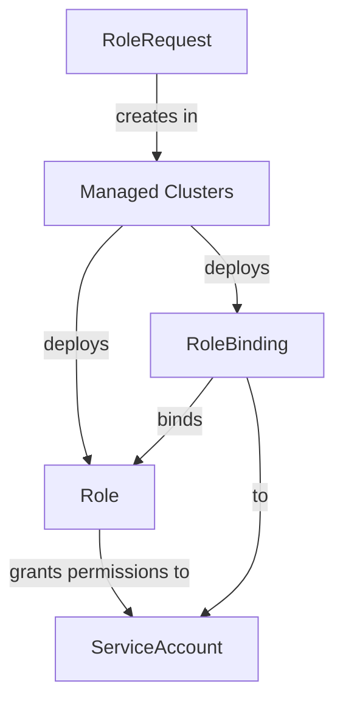
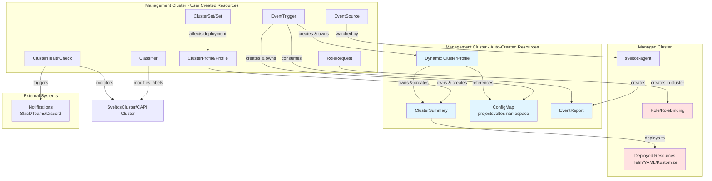

# Custom Resource Ownership

## Overview

Understanding ownership relationships between Custom Resources (CRs) is crucial for working with Sveltos internals. This document provides comprehensive information about which CRs create, own, and manage other resources within the Sveltos ecosystem.

In Kubernetes, ownership is established through `ownerReferences` in resource metadata. When a resource is owned by another, the owner's deletion automatically triggers the deletion of owned resources through garbage collection.

---

## Core Ownership Relationships

### ClusterProfile/Profile → ClusterSummary

The most fundamental ownership relationship in Sveltos.



**Owner**: `ClusterProfile` (cluster-scoped) or `Profile` (namespace-scoped)

**Owned Resource**: `ClusterSummary`

**Controller**: `addon-controller`

#### When Created

A `ClusterSummary` is automatically created when:

- A cluster matches the `clusterSelector` defined in the ClusterProfile/Profile
- One ClusterSummary is created per matching cluster per ClusterProfile/Profile

#### When Deleted

A `ClusterSummary` is deleted when:

- The parent ClusterProfile/Profile is deleted (cascade deletion via ownerReferences)
- The cluster no longer matches the `clusterSelector`
- `stopMatchingBehavior` is set to `WithdrawPolicies` and cluster stops matching

#### Naming Convention

```
<clusterprofile-name>-<cluster-namespace>-<cluster-name>
```

#### Example

```yaml
apiVersion: config.projectsveltos.io/v1beta1
kind: ClusterSummary
metadata:
  name: deploy-kyverno-default-cluster1
  namespace: default
  ownerReferences:
  - apiVersion: config.projectsveltos.io/v1beta1
    kind: ClusterProfile
    name: deploy-kyverno
    uid: ca908a7b-e9a7-457b-a077-81400b59902f
    controller: true
    blockOwnerDeletion: true
spec:
  clusterName: cluster1
  clusterNamespace: default
  clusterType: Sveltos
  clusterProfileSpec:
    # Copy of ClusterProfile spec
```

#### Verification

```bash
# List ClusterSummaries and their owners
kubectl get clustersummary -A

# Check ownership details
kubectl get clustersummary <name> -n <namespace> -o jsonpath='{.metadata.ownerReferences}'

# Verify matching clusters for a ClusterProfile
kubectl get clusterprofile <name> -o jsonpath='{.status.matchingClusters}'
```

---

### EventSource → EventReport

Event detection and reporting relationship.



**Owner**: `EventSource` (conceptual ownership)

**Created By**: `sveltos-agent` (running in managed cluster)

**Resource**: `EventReport`

#### When Created

An `EventReport` is created when:

- The `sveltos-agent` in a managed cluster detects a resource matching the `EventSource` criteria
- Lua script or CEL expression in EventSource evaluates to `true`
- Event occurs (resource created/updated/deleted)

#### When Deleted

An `EventReport` is deleted when:

- The matching resource no longer exists in the managed cluster
- The EventSource is deleted
- The cluster is unregistered from Sveltos

#### Content

The EventReport contains:

- Reference to the EventSource
- Cluster information (name, namespace, type)
- Matching resource metadata (always included)
- Full resource data (if `collectResources: true` in EventSource)

#### Example

```yaml
apiVersion: lib.projectsveltos.io/v1beta1
kind: EventReport
metadata:
  name: cluster1-sveltos-service-default-my-service
  namespace: default
spec:
  clusterName: cluster1
  clusterNamespace: default
  clusterType: Sveltos
  eventSourceName: sveltos-service
  matchingResources:
  - apiVersion: v1
    kind: Service
    name: my-service
    namespace: default
  resources:  # Only present if collectResources: true
  - apiVersion: v1
    kind: Service
    metadata:
      name: my-service
      namespace: default
      labels:
        sveltos: fv
    spec:
      type: LoadBalancer
      # ... full resource spec
```

#### Verification

```bash
# List all EventReports
kubectl get eventreport -A

# Check EventReport details
kubectl describe eventreport <name> -n <namespace>

# View matching resources
kubectl get eventreport <name> -n <namespace> -o jsonpath='{.spec.matchingResources}'
```

---

### EventTrigger → Dynamic ClusterProfile

Event-driven automatic ClusterProfile creation.



**Owner**: `EventTrigger`

**Owned Resources**: 
- Dynamically created `ClusterProfile` (named with pattern `sveltos-*`)
- `ConfigMap` in `projectsveltos` namespace (instantiated template)

**Controller**: `event-manager`

#### When Created

Dynamic ClusterProfile and ConfigMap are created when:

- An `EventReport` matches the `eventSourceName` in EventTrigger
- The `event-manager` processes the EventReport
- Template instantiation succeeds

#### When Deleted

Dynamic resources are deleted when:

- The parent `EventTrigger` is deleted
- The corresponding `EventReport` is removed
- Event no longer exists in the managed cluster

#### Naming Pattern

**Dynamic ClusterProfile**: `sveltos-<random-suffix>`

**ConfigMap**: `sveltos-<random-suffix>` in `projectsveltos` namespace

#### OneForEvent Behavior

- `oneForEvent: true` - One ClusterProfile per matching resource
- `oneForEvent: false` - One ClusterProfile for all matching resources

#### Example

```yaml
# Dynamic ClusterProfile created by EventTrigger
apiVersion: config.projectsveltos.io/v1beta1
kind: ClusterProfile
metadata:
  name: sveltos-8ric1wghsf04cu8i1387
  ownerReferences:
  - apiVersion: lib.projectsveltos.io/v1beta1
    kind: EventTrigger
    name: create-network-policy
    uid: a1b2c3d4-e5f6-7890-abcd-ef1234567890
    controller: true
    blockOwnerDeletion: true
  labels:
    projectsveltos.io/event-trigger-name: create-network-policy
spec:
  clusterSelector:
    matchLabels:
      env: production
  policyRefs:
  - name: sveltos-evykjze69n3bz3gavzw4
    namespace: projectsveltos
    kind: ConfigMap
```

```yaml
# Instantiated ConfigMap created by event-manager
apiVersion: v1
kind: ConfigMap
metadata:
  name: sveltos-evykjze69n3bz3gavzw4
  namespace: projectsveltos
  ownerReferences:
  - apiVersion: lib.projectsveltos.io/v1beta1
    kind: EventTrigger
    name: create-network-policy
    uid: a1b2c3d4-e5f6-7890-abcd-ef1234567890
    controller: true
data:
  policy.yaml: |
    # Template instantiated with event data
    apiVersion: networking.k8s.io/v1
    kind: NetworkPolicy
    metadata:
      name: front-my-service
      namespace: default
    # ... policy spec
```

#### Verification

```bash
# List dynamic ClusterProfiles
kubectl get clusterprofile -l projectsveltos.io/event-trigger-name

# View ConfigMaps created by EventTrigger
kubectl get configmap -n projectsveltos -l projectsveltos.io/event-trigger-name

# Check EventTrigger status
kubectl describe eventtrigger <name>
```

---

### ClusterSet/Set → Cluster Selection

Dynamic cluster selection for high availability and failover.



**Owner**: `ClusterSet` (cluster-scoped) or `Set` (namespace-scoped)

**Affects**: Which clusters receive deployments from referencing ClusterProfiles

**Controller**: `set-controller`

#### When Updated

ClusterSet selection is updated when:

- A cluster's health status changes
- A cluster becomes unavailable (automatic failover to healthy cluster)
- `maxReplicas` limit is reached
- New clusters match the `clusterSelector`

#### Behavior

- Automatically maintains specified number of selected clusters (up to `maxReplicas`)
- Performs automatic failover when selected cluster becomes unhealthy
- ClusterProfiles referencing the Set only deploy to currently selected clusters

#### Example

```yaml
apiVersion: lib.projectsveltos.io/v1beta1
kind: ClusterSet
metadata:
  name: production-set
spec:
  clusterSelector:
    matchLabels:
      env: production
  maxReplicas: 2  # Select maximum 2 clusters
```

```yaml
apiVersion: config.projectsveltos.io/v1beta1
kind: ClusterProfile
metadata:
  name: critical-service
spec:
  clusterSetRefs:
  - production-set
  helmCharts:
  - repositoryURL: https://charts.example.com
    chartName: critical-app
    chartVersion: 1.0.0
    releaseName: critical-app
    releaseNamespace: apps
    helmChartAction: Install
```

#### Verification

```bash
# Check selected clusters
kubectl get clusterset <name> -o jsonpath='{.status.selectedClusterRefs}'

# Verify ClusterProfile using ClusterSet
kubectl get clusterprofile <name> -o jsonpath='{.spec.clusterSetRefs}'
```

---

### Classifier → Cluster Labels

Dynamic cluster classification based on runtime state.



**Owner**: `Classifier`

**Modifies**: Labels on `SveltosCluster` or CAPI `Cluster` resources

**Controller**: `classifier-manager`

#### When Updated

Cluster labels are updated when:

- Classifier's Lua/CEL script evaluation result changes
- Resources in the managed cluster change (detected by sveltos-agent)
- Classifier `deployedResourceConstraints` criteria are met or unmet

#### Behavior

- Does not own clusters but modifies their labels
- Labels are added when criteria match
- Labels are removed when criteria no longer match
- Multiple Classifiers can add different labels to the same cluster

#### Example

```yaml
apiVersion: lib.projectsveltos.io/v1beta1
kind: Classifier
metadata:
  name: postgresql-clusters
spec:
  classifierLabels:
  - key: postgres
    value: present
  deployedResourceConstraints:
  - resourceSelectors:
    - kind: StatefulSet
      group: apps
      version: v1
      labelFilters:
      - key: app
        operation: Equal
        value: postgresql
```

**Effect**: Clusters with PostgreSQL StatefulSets automatically get label `postgres: present`

#### Verification

```bash
# Check cluster labels
kubectl get sveltoscluster -A --show-labels

# View Classifier status
kubectl get classifier <name> -o jsonpath='{.status.matchingClusterRefs}'
```

---

### ClusterHealthCheck → Health Monitoring

Health monitoring and notification triggering.



**Owner**: `ClusterHealthCheck`

**Triggers**: External notifications (not Kubernetes resources)

**Controller**: `healthcheck-controller`

#### When Evaluated

Health checks are evaluated:

- Continuously for matching clusters
- When cluster state changes
- According to configured health check criteria

#### Behavior

- Does not own other CRs
- Triggers external notifications based on health status
- Can check various health indicators (liveness checks, addon status)

#### Example

```yaml
apiVersion: lib.projectsveltos.io/v1beta1
kind: ClusterHealthCheck
metadata:
  name: production-health
spec:
  clusterSelector:
    matchLabels:
      env: production
  livenessChecks:
  - name: deployment-health
    type: Addons
    livenessSourceRef:
      kind: Deployment
      name: critical-app
      namespace: apps
  notifications:
  - name: slack-alert
    type: Slack
    notificationRef:
      apiVersion: v1
      kind: Secret
      name: slack-webhook
      namespace: default
```

#### Verification

```bash
# Check health check status
kubectl get clusterhealthcheck <name> -o jsonpath='{.status}'

# View matching clusters
kubectl get clusterhealthcheck <name> -o jsonpath='{.status.clusterConditions}'
```

---

### RoleRequest → RBAC Resources

Multi-tenancy RBAC provisioning.



**Owner**: `RoleRequest`

**Created Resources**: `Role` and `RoleBinding` in managed clusters

**Controller**: `role-request-controller`

#### When Created

RBAC resources are created when:

- Clusters match the `clusterSelector` in RoleRequest
- Role and RoleBinding are deployed to each matching cluster
- Permissions are granted to specified ServiceAccount

#### When Deleted

RBAC resources are deleted when:

- RoleRequest is deleted
- Cluster stops matching the selector
- Deployment is withdrawn per policy

#### Example

```yaml
apiVersion: lib.projectsveltos.io/v1beta1
kind: RoleRequest
metadata:
  name: tenant-admin-permissions
spec:
  clusterSelector:
    matchLabels:
      tenant: team-alpha
  roleRefs:
  - name: tenant-admin
    namespace: team-alpha
    kind: Role
  admin: team-alpha-admin  # ServiceAccount
```

#### Verification

```bash
# Check RoleRequest status
kubectl get rolerequest <name> -o jsonpath='{.status}'

# Verify RBAC in managed cluster
kubectl get role,rolebinding -n <namespace> --context <managed-cluster>
```

---

## Complete Ownership Diagram

The following diagram shows all ownership relationships in the Sveltos ecosystem:



---

## Resource Lifecycle Summary

| Resource | Created By | Created When | Deleted When | Owned By |
|----------|-----------|--------------|--------------|----------|
| **ClusterSummary** | addon-controller | Cluster matches ClusterProfile/Profile | Parent deleted or cluster stops matching | ClusterProfile/Profile |
| **EventReport** | sveltos-agent | Event occurs in managed cluster | Event stops existing or EventSource deleted | N/A (managed by agent) |
| **Dynamic ClusterProfile** | event-manager | EventReport matches EventTrigger | EventReport removed or EventTrigger deleted | EventTrigger |
| **ConfigMap (template)** | event-manager | EventTrigger processes EventReport | EventTrigger deleted | EventTrigger |
| **Role/RoleBinding** | role-request-controller | Cluster matches RoleRequest | RoleRequest deleted or cluster stops matching | RoleRequest (deployed to cluster) |

---

## Summary

Understanding CR ownership in Sveltos is essential for:

- **Debugging**: Trace resource creation back to source
- **Cleanup**: Understand what gets deleted when
- **Architecture**: Comprehend system design and flow
- **Troubleshooting**: Quickly identify ownership issues

Key ownership patterns:

1. **ClusterProfile/Profile** → **ClusterSummary** (core deployment)
2. **EventTrigger** → **Dynamic ClusterProfile + ConfigMap** (event-driven)
3. **sveltos-agent** → **EventReport** (event detection)
4. **RoleRequest** → **RBAC Resources** (multi-tenancy)

For additional help, consult the [Sveltos documentation](https://projectsveltos.github.io/sveltos/) or reach out on the [Sveltos Slack channel](https://join.slack.com/t/projectsveltos/shared_invite/).
