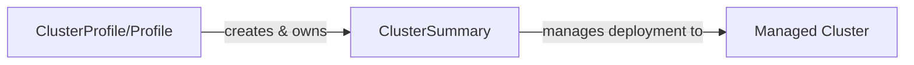
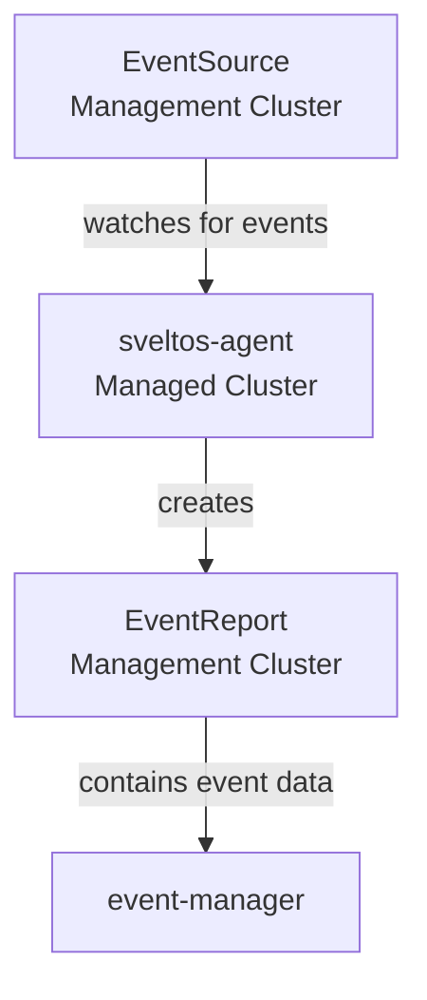
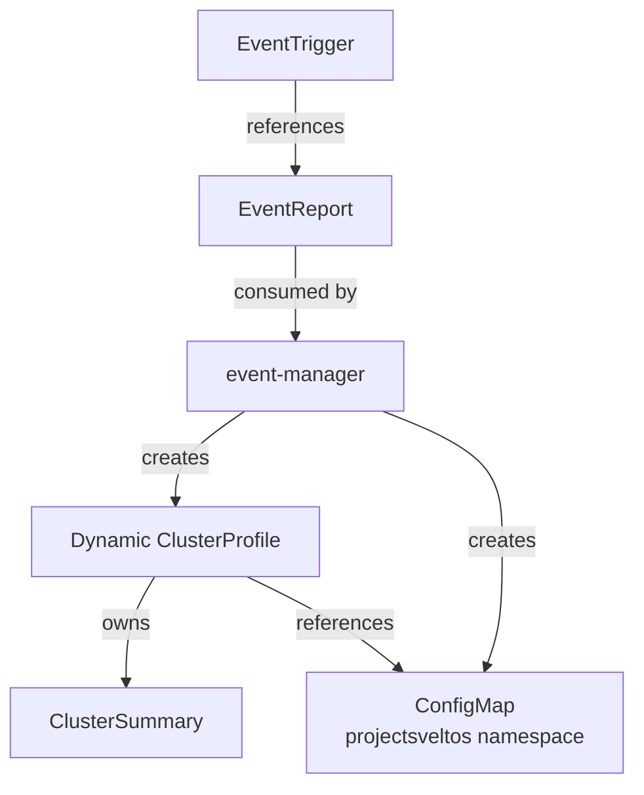
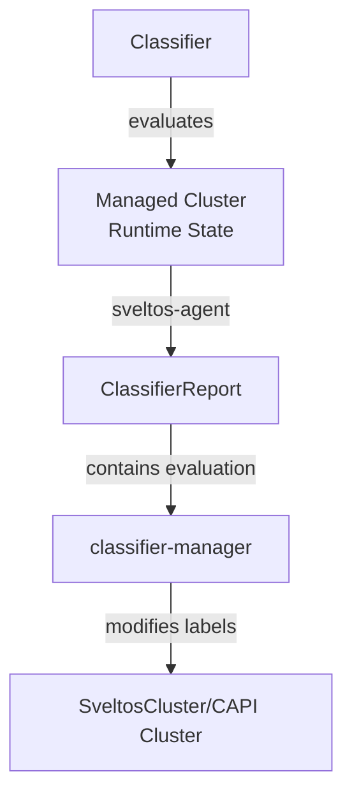
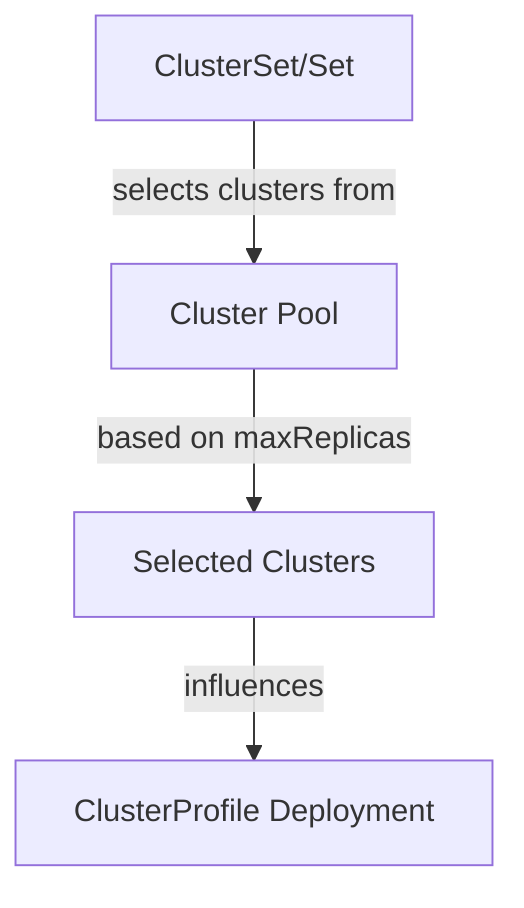
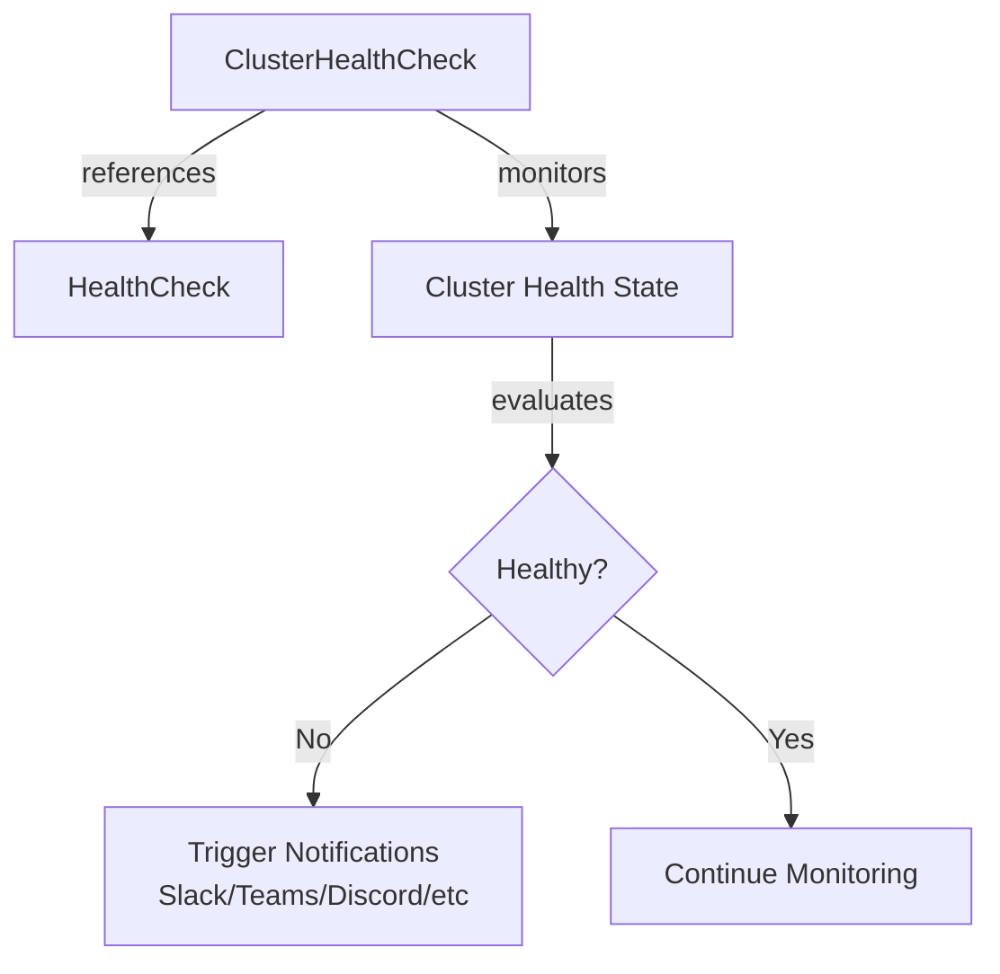
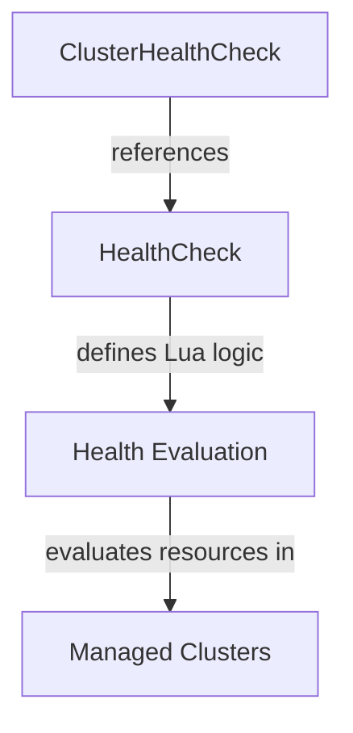
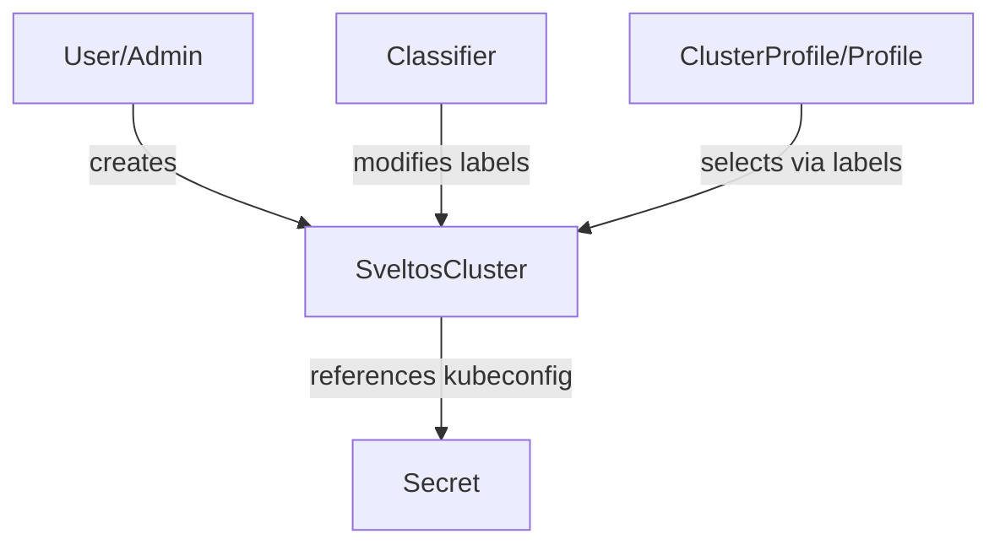
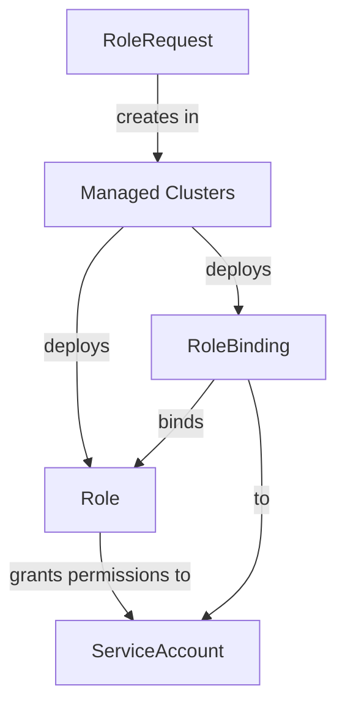
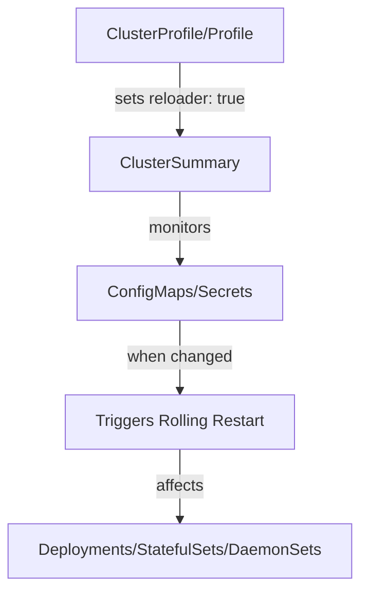

# Custom Resource Ownership

## Overview

Understanding ownership relationships between Custom Resources (CRs) is crucial for working with Sveltos internals. This document provides comprehensive information about which CRs create, own, and manage other resources within the Sveltos ecosystem.

In Kubernetes, ownership is established through `ownerReferences` in resource metadata. When a resource is owned by another, the owner's deletion automatically triggers the deletion of owned resources through garbage collection.

---

## Core Ownership Relationships

### ClusterProfile/Profile → ClusterSummary

The most fundamental ownership relationship in Sveltos.



**Owner**: `ClusterProfile` (cluster-scoped) or `Profile` (namespace-scoped)

**Owned Resource**: `ClusterSummary`

**Controller**: `addon-controller`

**API Version**: `config.projectsveltos.io/v1beta1`

#### When Created

- A cluster matches the `clusterSelector` defined in the ClusterProfile/Profile
- One ClusterSummary is created per matching cluster per ClusterProfile/Profile

#### When Deleted

- The parent ClusterProfile/Profile is deleted (cascade deletion via ownerReferences)
- The cluster no longer matches the `clusterSelector`
- `stopMatchingBehavior` is set to `WithdrawPolicies` and cluster stops matching

#### Relationship with Other CRs

- ClusterProfile/Profile owns ClusterSummary instances
- ClusterSummary references the cluster (SveltosCluster or CAPI Cluster)
- ClusterSummary deploys resources to managed clusters

#### Example

```yaml
apiVersion: config.projectsveltos.io/v1beta1
kind: ClusterSummary
metadata:
  name: deploy-kyverno-default-cluster1
  namespace: default
  ownerReferences:
  - apiVersion: config.projectsveltos.io/v1beta1
    kind: ClusterProfile
    name: deploy-kyverno
    controller: true
spec:
  clusterName: cluster1
  clusterNamespace: default
  clusterType: Sveltos
```

---

### EventSource → EventReport

Event detection and reporting relationship.



**Owner**: `EventSource` (conceptual ownership)

**Created By**: `sveltos-agent` (running in managed cluster)

**Resource**: `EventReport`

**API Version**: `lib.projectsveltos.io/v1beta1`

#### When Created

- The `sveltos-agent` in a managed cluster detects a resource matching the `EventSource` criteria
- Lua script or CEL expression in EventSource evaluates to `true`
- Event occurs (resource created/updated/deleted)

#### When Deleted

- The matching resource no longer exists in the managed cluster
- The EventSource is deleted
- The cluster is unregistered from Sveltos

#### Relationship with Other CRs

- EventSource defines what to watch for
- sveltos-agent creates EventReport instances
- EventTrigger consumes EventReports

#### Example

```yaml
apiVersion: lib.projectsveltos.io/v1beta1
kind: EventReport
metadata:
  name: cluster1-sveltos-service-default-my-service
  namespace: default
spec:
  clusterName: cluster1
  clusterNamespace: default
  clusterType: Sveltos
  eventSourceName: sveltos-service
  matchingResources:
  - apiVersion: v1
    kind: Service
    name: my-service
    namespace: default
```

---

### EventTrigger → Dynamic ClusterProfile

Event-driven automatic ClusterProfile creation.



**Owner**: `EventTrigger`

**Owned Resources**: 
- Dynamically created `ClusterProfile` (named with pattern `sveltos-*`)
- `ConfigMap` in `projectsveltos` namespace (instantiated template)

**Controller**: `event-manager`

**API Version**: `lib.projectsveltos.io/v1beta1`

#### When Created

- An `EventReport` matches the `eventSourceName` in EventTrigger
- The `event-manager` processes the EventReport
- Template instantiation succeeds

#### When Deleted

- The parent `EventTrigger` is deleted
- The corresponding `EventReport` is removed
- Event no longer exists in the managed cluster

#### Relationship with Other CRs

- EventTrigger consumes EventReports
- EventTrigger creates and owns dynamic ClusterProfiles
- EventTrigger creates and owns ConfigMaps with instantiated templates
- Dynamic ClusterProfiles follow the same lifecycle as regular ClusterProfiles

#### Example

```yaml
apiVersion: config.projectsveltos.io/v1beta1
kind: ClusterProfile
metadata:
  name: sveltos-8ric1wghsf04cu8i1387
  ownerReferences:
  - apiVersion: lib.projectsveltos.io/v1beta1
    kind: EventTrigger
    name: create-network-policy
    controller: true
  labels:
    projectsveltos.io/event-trigger-name: create-network-policy
spec:
  clusterSelector:
    matchLabels:
      env: production
  policyRefs:
  - name: sveltos-evykjze69n3bz3gavzw4
    namespace: projectsveltos
    kind: ConfigMap
```

---

### Classifier → ClassifierReport

Dynamic cluster classification and reporting.



**Owner**: `Classifier` (conceptual ownership)

**Created By**: `sveltos-agent` (running in managed cluster)

**Resource**: `ClassifierReport`

**Modifies**: Labels on `SveltosCluster` or CAPI `Cluster` resources

**Controller**: `classifier-manager`

**API Version**: `lib.projectsveltos.io/v1beta1`

#### When Created

- Classifier is deployed and sveltos-agent evaluates cluster state
- ClassifierReport is created by sveltos-agent to report evaluation results

#### When Deleted

- Classifier is deleted
- Cluster is unregistered from Sveltos

#### Relationship with Other CRs

- Classifier defines classification logic (Lua/CEL scripts)
- sveltos-agent creates ClassifierReports with evaluation results
- classifier-manager reads ClassifierReports and updates cluster labels
- Updated labels influence ClusterProfile/Profile matching

#### Example

```yaml
apiVersion: lib.projectsveltos.io/v1beta1
kind: Classifier
metadata:
  name: postgresql-clusters
spec:
  classifierLabels:
  - key: postgres
    value: present
  deployedResourceConstraints:
  - resourceSelectors:
    - kind: StatefulSet
      group: apps
      version: v1
      labelFilters:
      - key: app
        operation: Equal
        value: postgresql
```

---

### ClusterSet/Set → Cluster Selection

Dynamic cluster selection for high availability and failover.



**Owner**: `ClusterSet` (cluster-scoped) or `Set` (namespace-scoped)

**Influences**: ClusterProfile/Profile deployment decisions

**Controller**: `sc-manager`

**API Version**: `lib.projectsveltos.io/v1beta1`

#### When Used

- ClusterProfile references a ClusterSet in `clusterRefs`
- Multiple clusters match the selector
- `maxReplicas` determines how many clusters receive deployments

#### Relationship with Other CRs

- Does not own clusters but affects deployment targeting
- ClusterProfile/Profile references ClusterSet for dynamic selection
- Ensures high availability through controlled replica distribution

#### Example

```yaml
apiVersion: lib.projectsveltos.io/v1beta1
kind: ClusterSet
metadata:
  name: production-clusters
spec:
  clusterSelector:
    matchLabels:
      env: production
  maxReplicas: 3
```

---

### ClusterHealthCheck → Health Monitoring

Health monitoring and notification triggering.



**Owner**: `ClusterHealthCheck`

**References**: `HealthCheck` resources (optional)

**Triggers**: External notifications (not Kubernetes resources)

**Controller**: `healthcheck-manager`

**API Version**: `lib.projectsveltos.io/v1beta1`

#### When Evaluated

- Continuously for matching clusters
- When cluster state changes
- According to configured health check criteria

#### Relationship with Other CRs

- ClusterHealthCheck can reference HealthCheck CRs for custom logic
- Monitors SveltosCluster or CAPI Cluster health
- Triggers external notifications (Slack, Teams, Discord, etc.)

#### Example

```yaml
apiVersion: lib.projectsveltos.io/v1beta1
kind: ClusterHealthCheck
metadata:
  name: production-health
spec:
  clusterSelector:
    matchLabels:
      env: production
  livenessChecks:
  - name: custom-health-check
    type: HealthCheck
    livenessSourceRef:
      apiVersion: lib.projectsveltos.io/v1alpha1
      kind: HealthCheck
      name: pod-crashloop-check
  notifications:
  - name: slack-alert
    type: Slack
    notificationRef:
      apiVersion: v1
      kind: Secret
      name: slack-webhook
      namespace: default
```

---

### HealthCheck → Custom Health Logic

Defines custom health check evaluation logic.



**Owner**: Standalone CR (user-created)

**Referenced By**: `ClusterHealthCheck`

**Controller**: `healthcheck-manager`

**API Version**: `lib.projectsveltos.io/v1alpha1`

#### When Created

- Manually created by users to define custom health monitoring logic

#### Relationship with Other CRs

- ClusterHealthCheck instances reference HealthCheck CRs via `livenessSourceRef`
- Contains Lua evaluation scripts that determine resource health status
- Can check Pods, Deployments, or any Kubernetes resource

#### Example

```yaml
apiVersion: lib.projectsveltos.io/v1alpha1
kind: HealthCheck
metadata:
  name: pod-crashloop-check
spec:
  group: ""
  version: v1
  kind: Pod
  script: |
    function evaluate()
      hs = {}
      hs.status = "Healthy"
      if obj.status.containerStatuses then
        for _, containerStatus in ipairs(obj.status.containerStatuses) do
          if containerStatus.state.waiting and 
             containerStatus.state.waiting.reason == "CrashLoopBackOff" then
            hs.status = "Degraded"
            hs.message = obj.metadata.namespace .. "/" .. obj.metadata.name
          end
        end
      end
      return hs
    end
```

---

### SveltosCluster → Cluster Registration

Represents clusters registered with Sveltos (non-CAPI clusters).



**Owner**: User/Administrator

**Modified By**: `Classifier` (labels)

**Referenced By**: ClusterProfile/Profile (via labels)

**Controller**: `sc-manager` (SveltosCluster manager)

**API Version**: `lib.projectsveltos.io/v1beta1`

#### When Created

- Manually created when registering a cluster with Sveltos
- Created via `sveltosctl register cluster` command
- Alternative to CAPI Cluster for non-CAPI environments (e.g., GKE, EKS, AKS)

#### When Labels Modified

- Classifier adds/removes labels based on runtime state evaluation
- Manual label updates by administrators

#### Relationship with Other CRs

- ClusterProfile/Profile selects clusters via labels
- Classifier modifies labels dynamically
- ClusterHealthCheck monitors cluster health
- ClusterSummary is created for matching SveltosClusters

#### Example

```yaml
apiVersion: lib.projectsveltos.io/v1beta1
kind: SveltosCluster
metadata:
  name: production-cluster-01
  namespace: clusters
  labels:
    env: production
    region: us-east
spec:
  kubeconfigSecretRef:
    name: production-cluster-01-kubeconfig
    namespace: clusters
```

---

### RoleRequest → RBAC Resources

Multi-tenancy RBAC provisioning.



**Owner**: `RoleRequest`

**Created Resources**: `Role` and `RoleBinding` in managed clusters

**Controller**: `role-request-controller`

**API Version**: `lib.projectsveltos.io/v1beta1`

#### When Created

- Clusters match the `clusterSelector` in RoleRequest
- Role and RoleBinding are deployed to each matching cluster
- Permissions are granted to specified ServiceAccount

#### When Deleted

- RoleRequest is deleted
- Cluster stops matching the selector
- Deployment is withdrawn per policy

#### Relationship with Other CRs

- RoleRequest selects clusters similar to ClusterProfile
- Deploys RBAC resources (Role, RoleBinding) to matched clusters
- Used for multi-tenancy scenarios

#### Example

```yaml
apiVersion: lib.projectsveltos.io/v1beta1
kind: RoleRequest
metadata:
  name: tenant-admin-permissions
spec:
  clusterSelector:
    matchLabels:
      tenant: team-alpha
  roleRefs:
  - name: tenant-admin
    namespace: team-alpha
    kind: Role
  admin: team-alpha-admin
```

---

### Reloader → Automatic Rolling Updates

Configures automatic rolling updates when ConfigMaps/Secrets change.



**Configured In**: ClusterProfile/Profile spec

**Controller**: `addon-controller`

**API Version**: Part of ClusterProfile/Profile spec

#### When Active

- `reloader: true` is set in ClusterProfile/Profile
- Sveltos monitors ConfigMaps/Secrets mounted by workloads
- Changes trigger automatic rolling restarts

#### Relationship with Other CRs

- Configured as part of ClusterProfile/Profile
- Affects Deployments, StatefulSets, and DaemonSets in managed clusters
- Ensures workloads use latest configuration

#### Example

```yaml
apiVersion: config.projectsveltos.io/v1beta1
kind: ClusterProfile
metadata:
  name: app-with-reloader
spec:
  clusterSelector:
    matchLabels:
      env: production
  reloader: true
  policyRefs:
  - name: app-config
    namespace: default
    kind: ConfigMap
```

---

### ResourceSummary → Deployment Status Tracking

Internal status tracking for deployed resources.

**Owner**: ClusterSummary (internal)

**Created By**: `addon-controller`

**Controller**: `addon-controller`

**API Version**: `lib.projectsveltos.io/v1alpha1`

#### Purpose

- Internal resource used by Sveltos for tracking deployment status
- Contains information about resources deployed to managed clusters
- Not typically interacted with directly by users

#### Relationship with Other CRs

- Created and managed internally by addon-controller
- Associated with ClusterSummary instances
- Tracks deployment state and resources

---

### DebuggingConfiguration → Debug Settings

Configures debugging and logging levels for Sveltos components.

**Owner**: Standalone CR (user-created)

**Controller**: Multiple (affects all Sveltos components)

**API Version**: `lib.projectsveltos.io/v1beta1`

#### When Created

- Manually created to configure debugging for Sveltos components
- Affects logging levels and verbosity

#### Relationship with Other CRs

- Does not own or create other resources
- Configures operational behavior of Sveltos controllers
- Useful for troubleshooting and diagnostics

#### Example

```yaml
apiVersion: lib.projectsveltos.io/v1beta1
kind: DebuggingConfiguration
metadata:
  name: debug-config
spec:
  configuration:
  - component: AddonManager
    logLevel: LogLevelDebug
  - component: Classifier
    logLevel: LogLevelInfo
```
---

## Summary

Key ownership patterns:

1. **ClusterProfile/Profile** → **ClusterSummary** (core deployment)
2. **EventTrigger** → **Dynamic ClusterProfile + ConfigMap** (event-driven)
3. **sveltos-agent** → **EventReport** (event detection)
4. **sveltos-agent** → **ClassifierReport** (classification reporting)
5. **ClusterHealthCheck** → **HealthCheck** (custom health logic)
6. **Classifier** → **SveltosCluster/CAPI Cluster labels** (dynamic classification)
7. **RoleRequest** → **RBAC Resources** (multi-tenancy)

For additional help, consult the [Sveltos documentation](https://projectsveltos.github.io/sveltos/) or reach out on the [Sveltos Slack channel](https://join.slack.com/t/projectsveltos/shared_invite/).
