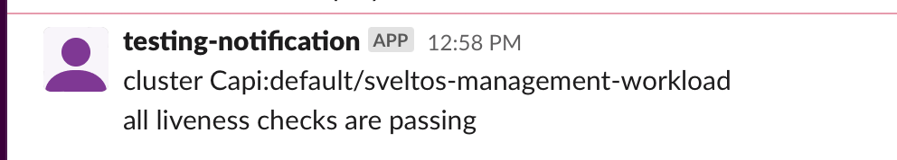

When a ClusterProfile instance is created, [Sveltos](https://github.com/projectsveltos "Manage Kubernetes add-ons")  starts watching for clusters matching ClusterProfile clusterSelector field. In each matching workload cluster, Sveltos deploys all referenced add-ons (helm charts and/or Kubernetes resource YAMLs).

After all add-ons are deployed, other tools might be used to do something else. For instance, if a cluster is being provisioned to run a CI/CD pipeline, the CI/CD needs to start running only after all necessary add-ons are deployed.

To help with this scenario, Sveltos can be configured to send notifications when certain conditions happen.

Those notifications mighty be used by other tools.

## ClusterHealthCheck

[ClusterHealthCheck](https://github.com/projectsveltos/libsveltos/raw/main/api/v1alpha1/clusterhealthcheck_type.go) is the CRD introduce to instruct Sveltos when and how to send notifications.

### Cluster Selection

The clusterSelector field is a Kubernetes label selector. Sveltos uses it to detect all the clusters to watch and send notifications about.

### LivenessChecks
The livenessCheck field is a list of __cluster liveness checks__ to evaluate.

Currently only supported type is __Addons__. Addons type instructs Sveltos to send notification(s) when there is a state change for the Kubernetes add-ons deployed by Sveltos in the selected cluster.

### Notifications
The notifications fields is a list of all __notifications__ to be sent when liveness check states change.

Currently supported types are:

1.  Kubernetes events (__reason=ClusterHealthCheck__);
2.   Slack message; 
3.   Webex notification.

### Example

By posting following ClusterHealthCheck instance

```yaml
apiVersion: lib.projectsveltos.io/v1alpha1
kind: ClusterHealthCheck
metadata:
  name: production
spec:
  clusterSelector: env=fv
  livenessChecks:
  - name: addons
    type: Addons
  notifications:
  - name: event
    type: KubernetesEvent
  - name: slack
    type: Slack
    notificationRef:
      apiVersion: v1
      kind: Secret
      name: slack
      namespace: default
  - name: webex
    type: Webex
    notificationRef:
      apiVersion: v1
      kind: Secret
      name: webex
      namespace: default      
```

where secret contains Slack channel and token

```bash
kubectl create secret generic slack --from-literal=SLACK_TOKEN=<your token> --from-literal=SLACK_CHANNEL_ID=<your channel id> --type=addons.projectsveltos.io/cluster-profile 
```

```bash
kubectl create secret generic slack --from-literal=WEBEX_TOKEN=<your token> --from-literal=WEBEX_ROOM_ID=<your channel id> --type=addons.projectsveltos.io/cluster-profile 
```

When add-ons are deployed in any cluster matching the clusterSelector, Sveltos:

1. generates a Kubernetes event;
2. send a slack message;
3. send a webex message.

To list events generated by Sveltos

```bash
clusterprofile.config.projectsveltos.io/kyverno created
➜  sveltos git:(main) ✗ kubectl get events -n default --field-selector reason=ClusterHealthCheck                                                                                                                                            
LAST SEEN   TYPE      REASON               OBJECT                  MESSAGE
31s         Normal    ClusterHealthCheck   clusterhealthcheck/hc   cluster Capi:default/sveltos-management-workload...
16s         Warning   ClusterHealthCheck   clusterhealthcheck/hc   cluster Capi:default/sveltos-management-workload...
```

Event type will be set to: type: Normal when add-ons are deployed.

Event message contains information on cluster:
1. cluster type: Capi or Sveltos
2. cluster namespace
3. cluster name

 

Above is an example of Slack notification delivered.