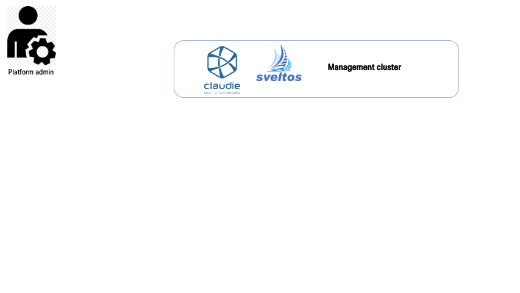

[Claudie](https://github.com/berops/claudie) simplifies the process of programmatically establishing Kubernetes clusters from a management cluster across multiple cloud vendors and on-prem datacenters.
Claudie creates fully-featured Kubernetes clusters composed of multiple different public Cloud providers and on-premise data center in an easy and secure manner. 
Simply insert credentials to your cloud projects, define your cluster, and watch how the infra spawns right in front of you.

f you're using Claudie and want Sveltos to automatically detect your Claudie-powered clusters, deploy this [controller](https://github.com/gianlucam76/claudie-sveltos-integration):

```
$ kubectl apply -f https://raw.githubusercontent.com/gianlucam76/claudie-sveltos-integration/main/manifest/manifest.yaml
```

This controller continuously monitors Claudie's secrets and creates corresponding SveltosCluster objects. Conversely, when a secret is deleted, the controller ensures the corresponding SveltosCluster object is also removed. 
As a result, any cluster managed by Claudie is automatically discovered by Sveltos, paving the way for add-on and application deployment.

