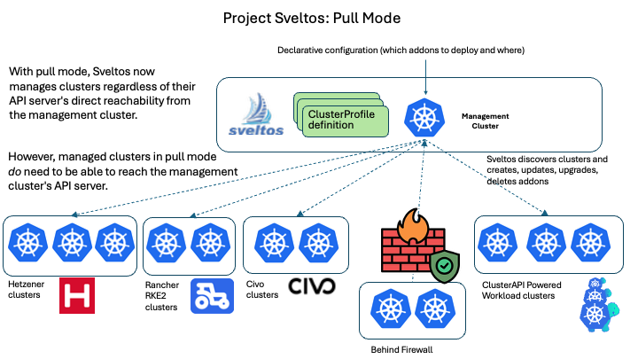

!!!video
    To learn more about the Sveltos **Pull Mode**, check out the [Youtube Video](https://www.youtube.com/watch?v=Y3dW5XYjg5I&amp;feature=youtu.be). If you find this valuable, we would be thrilled if you shared it! 😊


# Sveltos Cluster Registration Pull Mode :material-crown:{ title="Enterprise" }

Sveltos supports managed cluster registration in **Pull Mode**. In this model, **managed** clusters actively **pull** configuration and add-ons from a central source, rather than having the management cluster push them directly to the managed clusters.

The **Pull Mode** is ideal for managed clusters behind a firewall, in air-gapped environments, edge deployments with limited bandwidth or highly regulated and secure setups.

!!!info "Enterprise Feature"
    Test the **Pull Mode** with up to **two** managed clusters for free. Need more than two clusters? Contact us at [`support@projectsveltos.io`](mailto:support@projectsveltos.io) to explore license options.

If Sveltos is not already installed, have a look at the installation details located [here](../getting_started/install/install.md).

## How does it work?

While the core Sveltos controllers run in a **management** cluster and orchestrate deployments, the concept of **Pull Mode** becomes relevant when managing clusters in challenging network environments such as firewalled, air-gapped, or edge deployments, where direct inbound access from the management cluster to the managed clusters is either not possible or not desired.

This is how the **Pull Mode** flow works:

1. **Management Cluster**: It defines the desired state. We define our `ClusterProfile`/`Profile` resources in the management cluster, specifying which add-ons and configurations should be applied to which managed clusters by utilising the Kubernetes labels selection concept.
1. **Managed Cluster**: Rather than the management cluster initiating all deployments, a component on the managed cluster initiates a connection to the management cluster.
1. **Configuration Fetching**: The managed cluster pulls the relevant configuration, manifest, or Helm chart **from** the **management** cluster. The **management** cluster prepares the relevant configuration bundle for the managed clusters in Pull Mode.
1. **Apply**: The managed cluster's local agent applies the pulled configurations to the cluster.



### Advantages

The following items are some of the benefits of utilising Sveltos in **Pull Mode**.

- **Firewalled and Air-Gapped Environments**: This is the primary driver. When managed clusters are behind firewalls or in air-gapped networks, direct inbound connections from a central management cluster are not possible. Sveltos in **Pull Mode** allows the managed clusters to reach out to the management cluster or a Git repository to obtain deployment instructions.
- **Edge Deployments**: For edge locations with intermittent connectivity or limited network bandwidth, the Sveltos **Pull Mode** offers resilience.
- **Security**: Reducing the need for inbound ports to managed clusters enhances the security posture of an environment by minimising the attack surface.

!!!tip
    Find out [here](../index.md#sveltos-for-edge-kubernetes) what is being deployed by Sveltos when we talk about Edge deployments.

## Register Cluster

To register a cluster in Pull mode, we use the [sveltosctl](https://github.com/projectsveltos/sveltosctl "Sveltos CLI").

### Management Cluster

Pointing the KUBECONFIG to the **management** cluster where Sveltos is installed, perform the following `sveltosctl register` command.

```bash
$ export KUBECONFIG=</path/to/kubeconfig/management/cluster>

$ sveltosctl register cluster \
    --namespace=monitoring \
    --cluster=prod-cluster \
    --pullmode \
    --labels=environment=production,tier=backend \
    > sveltoscluster_registration.yaml
```

| Parameter        |    Description                                                                                                   |
|------------------|------------------------------------------------------------------------------------------------------------------|
| `--namespace`    |    The namespace in the **management** cluster where Sveltos stores information about the registered cluster.    |
| `--cluster`      |    The name of the cluster to identify the registered cluster within Sveltos.                                               |
| `--pullmode`     |    Enables the Sveltos **Pull Mode** registration.                                                                   |
| `--labels`       |    (Optional) Comma-separated key-value pairs to define labels for the registered cluster.                       |

When the command is executed, looking at the `sveltosclusters` resource, we do see a new instance called `prod-cluster` in a not "Ready" state. This is the expected behaviour as we register the cluster in **Pull Mode**. Feel free to look at the generated file and identify what resources will be created for the **managed** cluster.

```bash
$ kubectl get sveltoscluster -n monitoring
NAMESPACE   NAME           READY   VERSION   AGE
monitoring  prod-cluster                     1m7s
```

### Managed Cluster

Apply the generated file to the **managed** cluster.

```bash
$ export KUBECONFIG=</path/to/kubeconfig/managed/cluster>

$ kubectl apply -f sveltoscluster_registration.yaml
namespace/projectsveltos created
serviceaccount/sveltos-applier-manager created
clusterrole.rbac.authorization.k8s.io/sveltos-applier-manager-role created
clusterrolebinding.rbac.authorization.k8s.io/sveltos-applier-manager-rolebinding created
service/sveltos-applier-metrics-service created
deployment.apps/sveltos-applier-manager created
secret/pcluster01-sveltos-kubeconfig created
```

### Restricting sveltos-applier to Specific Namespaces

By default, the `sveltos-applier` is granted a `ClusterRole` and can manage resources in **any** namespace of the managed cluster. To restrict it, pass the `--watch-namespaces` flag to the `sveltosctl register cluster` command:

```bash
$ sveltosctl register cluster \
    --namespace=monitoring \
    --cluster=prod-cluster \
    --pullmode \
    --labels=environment=production,tier=backend \
    --watch-namespaces=team-a,team-b \
    > sveltoscluster_registration.yaml
```

This sets the `agent.projectsveltos.io/watch-namespaces` annotation on the new `SveltosCluster`. It also adds the `--watch-namespaces` flag to the `sveltos-applier` manifest. For an already registered Sveltos cluster, add the annotation directly:

```yaml hl_lines="6"
apiVersion: lib.projectsveltos.io/v1beta1
kind: SveltosCluster
metadata:
  name: prod-cluster
  annotations:
    agent.projectsveltos.io/watch-namespaces: "team-a,team-b"
```

Sveltos relays this into `sveltos-applier`'s `--watch-namespaces` flag every time it deploys or upgrades the agent in the managed cluster. With it set, `sveltos-applier` only creates namespaced resources in `team-a` or `team-b`, erroring out if asked to create one in any other namespace. Stale-resource cleanup also only searches `team-a` and `team-b` instead of cluster-wide. Cluster-scoped resources are unaffected. This is the same annotation used to [restrict RBAC in agentless mode](../getting_started/install/agentless_limited_rbac.md#the-fix-namespace-scoped-watch-mode).

Neither the `--watch-namespaces` nor the annotation narrows the `ClusterRole` in the `sveltoscluster_registration.yaml` manifest; it still grants cluster-wide access to whatever resource kinds `sveltos-applier` supports. Knowing which resource types the `ClusterProfiles`/`Profiles` use in the `team-a`/`team-b` namespaces, make sure to narrow the `ClusterRole`'s `rules` before applying them.

!!! warning
    On every Sveltos upgrade, the `sveltos-applier` Deployment, `ClusterRole`, and `ClusterRoleBinding` are all regenerated from scratch, including the `ClusterRole`'s rules. Editing the `ClusterRole` in the applied YAML only holds until the next upgrade, which resets it back to the default, cluster-wide rules. To narrow the `ClusterRole` and keep it across upgrades, use [Sveltos Applier Overrides](../getting_started/install/air_gapped_installation.md#sveltos-applier-overrides) instead.

`sveltos-applier` is only part of a Pull Mode managed cluster's Sveltos footprint. `sveltos-agent`, which evaluates Classifiers, HealthChecks, EventSources and Reloaders, and `drift-detection-manager`, which watches whatever a `ClusterProfile`/`Profile` with `syncMode: ContinuousWithDriftDetection` deploys, both run in the same cluster and default to their own cluster-wide `ClusterRole`s too — both also honor the same `--watch-namespaces` annotation. For a worked example narrowing sveltos-agent's `ClusterRole`, pairing the annotation with a `sveltosagent.projectsveltos.io/config-override-ref` patch and hand-created namespaced `Role`s, see [Restricting sveltos-agent RBAC in Pull Mode](pull_mode_sveltos_agent_scoped_rbac.md). `drift-detection-manager`'s `ClusterRole` is narrowed the same way, via [Drift Detection Manager Overrides](../getting_started/install/air_gapped_installation.md#drift-detection-manager-overrides).

### Validation

```bash
$ export KUBECONFIG=</path/to/kubeconfig/management/cluster>

$ kubectl get sveltoscluster -n monitoring
NAMESPACE   NAME           READY   VERSION    AGE
monitoring  prod-cluster   true    v1.30.5    9m15s
```
