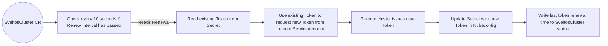

# Automatically Token Renewal

To register a managed cluster (e.g., GKE, AKS, EKS) with Sveltos, a temporary Kubeconfig file is generated using sveltosctl. 
However, due to potential expiration limits imposed by cloud providers, this can disrupt Sveltos' management of the cluster.

To prevent this, configure automatic renewal: edit the SveltosCluster resource. Add or modify the tokenRequestRenewalOption section to include:

```yaml
tokenRequestRenewalOption:
  renewTokenRequestInterval: 1h0m0s
  saName: cluster-admin
  saNamespace: projectsveltos
```

<details>
  <summary>Supplementary Notes on Token Rotation</summary>

Note that:
• The token rotation privilege is required by the token in the Secret (the Kubeconfig) itself, not by the sveltoscluster-manager’s own ServiceAccount. So, ensure that the token used in the Secret has the ability to create new tokens for the ServiceAccount. For example:

```yaml
- apiGroups:
  - ""
  resources:
  - serviceaccounts/token
  verbs:
    - create
```

• The token is renewed based on the interval set in `renewTokenRequestInterval`. However, the token’s overall validity has an additional buffer (for instance, 30 minutes longer) to ensure that Sveltoscluster-manager has enough time to perform the rotation before it expires.

• If, for any reason, token rotation cannot happen before the current token expires, the sveltoscluster-manager can no longer update the token. Consequently, reconciliations for that cluster stop, and you must manually update the Secret for that cluster to restore functionality.

• The `saName` and `saNamespace` fields refer to a ServiceAccount in the remote (managed) cluster. This ServiceAccount must have the appropriate privileges to allow Sveltos to deploy add-ons and manage workloads in the cluster.

• If `saName` and `saNamespace` are not specified in the `tokenRequestRenewalOption`, Sveltos relies on whatever context is currently set in the Kubeconfig’s (for example, the fields under `contexts[0].context.user` and `contexts[0].context.namespace`).

Token Renewal Flow with sveltoscluster-manager:



</details>

Below is an example showing how to configure token renewal for a GKE cluster.

## Example: GKE

To connect a Google Kubernetes Engine (GKE) cluster to Sveltos, first use `sveltosctl` to create a temporary Kubeconfig file for the GKE cluster:

```
sveltosctl  generate kubeconfig --create --expirationSeconds=86400 >  /tmp/GKE/kubeconfig
```

Remember that GKE's maximum expiration time for Kubeconfig files is 48 hours (172800 seconds).

Next, point sveltosctl to your Sveltos management cluster and register the GKE cluster:

```
sveltosctl register cluster --namespace=gke --cluster=cluster --kubeconfig=/tmp/GKE/kubeconfig --labels=env=production
```

If we leave as it is, in 48 hours the Kubeconfig will expire. 
To prevent the Kubeconfig from expiring and disrupting Sveltos' management of the GKE cluster, you can configure Sveltos to automatically renew the Kubeconfig.

Edit the SveltosCluster __cluster__ in the __gke__ namespace:

```
kubectl edit sveltoscluster -n gke cluster
```

Add or modify the `tokenRequestRenewalOption` section to include:

```yaml
  tokenRequestRenewalOption:
    renewTokenRequestInterval: 1h0m0s
    saName: cluster-admin
    saNamespace: projectsveltos
```

This assumes that the ServiceAccount __cluster-admin__ exists in the __projectsveltos__ namespace  on the GKE cluster and has the necessary permissions for Sveltos to deploy applications and add-ons to the cluster.

With this configuration, Sveltos will generate a new token tied to the ServiceAccount and use it to create a new Kubeconfig every hour, ensuring continuous cluster management.

The `SveltosCluster.Status` field provides information about the last time the token was renewed:

```yaml
 status:
    connectionStatus: Healthy
    lastReconciledTokenRequestAt: "2024-10-08T07:36:42Z"
```
