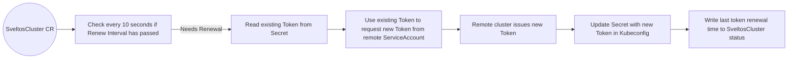

# Automatically Token Renewal

Sveltos supports automatic token renewal for clusters registered in both [push mode](register-cluster.md) and [pull mode](register_cluster_pull_mode.md). The mechanics differ between the two (see [Pull Mode](#pull-mode) below), but the underlying idea is the same: a short-lived token gets renewed automatically instead of requiring a long-lived, non-expiring credential.

## Push Mode

To register a managed cluster (e.g., GKE, AKS, EKS) with Sveltos, a temporary Kubeconfig file is generated using sveltosctl. However, due to potential expiration limits imposed by cloud providers, this can disrupt Sveltos' management of the cluster.

To prevent this, configure automatic renewal: edit the `SveltosCluster` resource. Add or modify the `tokenRequestRenewalOption` section to include:

```yaml
tokenRequestRenewalOption:
  renewTokenRequestInterval: 1h0m0s
  tokenDuration: 5h
  saName: projectsveltos
  saNamespace: projectsveltos
```

### GitOps Compatibility (In-place Renewal)
By default, Sveltos creates a new key (`re-kubeconfig`) in the Secret during rotation. In GitOps environments (ArgoCD/Flux), this causes "drift." To prevent this, set `kubeconfigKeyName` inside `tokenRequestRenewalOption` to match your existing key name. This forces Sveltos to overwrite the token in-place without modifying the `SveltosCluster` Spec.

Add or modify the `tokenRequestRenewalOption` section:

 ```yaml
 tokenRequestRenewalOption:
   renewTokenRequestInterval: 1h0m0s
   tokenDuration: 5h
   saName: projectsveltos
   saNamespace: projectsveltos
  # Set this to the same value as spec.kubeconfigKeyName to prevent GitOps drift
  kubeconfigKeyName: kubeconfig
```

If kubeconfigKeyName is provided and matches the current spec.kubeconfigKeyName, Sveltos performs an in-place update.
It updates the Secret data but does not change the SveltosCluster spec, ensuring compatibility with GitOps tools that monitor for Spec changes.

<details>
   <summary>Supplementary Notes on Token Rotation</summary>

Note that:
<ul>
<li>The token rotation privilege is required by the token in the Secret (the Kubeconfig) itself, not by the sveltoscluster-manager’s own ServiceAccount. Ensure that the token used in the Secret has the ability to create new tokens for the ServiceAccount. For example:</li>
</ul>

```yaml
- apiGroups:
  - ""
  resources:
  - serviceaccounts/token
  verbs:
    - create
```

<ul>
<li>The token is renewed based on the interval set in <strong>renewTokenRequestInterval</strong>.  The token total lifespan is determined  by <strong>tokenDuration</strong>. Ensure tokenDuration is longer than renewTokenRequestInterval to keep the token valid between renewals.
</li>

<li>If, for any reason, token rotation cannot happen before the current token expires, the sveltoscluster-manager can no longer update the token.
Consequently, reconciliations for that cluster stop, and you must manually update the Secret for that cluster to restore functionality.</li>

<li>The <strong>saName</strong> and <strong>saNamespace</strong> fields refer to a ServiceAccount in the remote (managed) cluster. This ServiceAccount must have the appropriate
privileges to allow Sveltos to deploy add-ons and manage workloads in the cluster.</li>

<li>If <strong>saName</strong> and <strong>saNamespace</strong> are not specified in the <strong>tokenRequestRenewalOption</strong>, Sveltos relies on whatever context is currently set in the
Kubeconfig’s (for example, the fields under <strong>contexts[0].context.user</strong> and <strong>contexts[0].context.namespace</strong>).</li>
</ul>

Token Renewal Flow with sveltoscluster-manager:


```mermaid
%% sveltoscluster-manager uses the token from the Secret to request a new token from the remote cluster (via the ServiceAccount).
%% It then updates the Secret with the newly generated token, and finally writes
%% the last renewal timestamp to the SveltosCluster status (lastReconciledTokenRequestAt).
flowchart LR
    A((SveltosCluster CR)) --> B[Check every 10 seconds if Renew Interval has passed]
    B -->|Needs Renewal| C[Read existing Token from Secret]
    C --> D[Use existing Token to request new Token from remote ServiceAccount]
    D --> E[Remote cluster issues new Token]
    E --> F[Update Secret with new Token in Kubeconfig]
    F --> G[Write last token renewal time to SveltosCluster status]
```

</details>

Below is an example showing how to configure token renewal for a GKE cluster.

## Example: GKE

To connect a Google Kubernetes Engine (GKE) cluster to Sveltos, first use `sveltosctl` to create a temporary Kubeconfig file for the GKE cluster:

```
$ sveltosctl  generate kubeconfig --create --expirationSeconds=86400 >  /tmp/GKE/kubeconfig
```

Remember that GKE's maximum expiration time for Kubeconfig files is 48 hours (172800 seconds).

Next, point sveltosctl to your Sveltos management cluster and register the GKE cluster:

```
$ sveltosctl register cluster --namespace=gke --cluster=cluster --kubeconfig=/tmp/GKE/kubeconfig --labels=env=production
```

If we leave as it is, in 48 hours the Kubeconfig will expire.
To prevent the Kubeconfig from expiring and disrupting Sveltos' management of the GKE cluster, you can configure Sveltos to automatically renew the Kubeconfig.

Edit the SveltosCluster __cluster__ in the __gke__ namespace:

```
$ kubectl edit sveltoscluster -n gke cluster
```

Add or modify the `tokenRequestRenewalOption` section to include:

```yaml
  tokenRequestRenewalOption:
    renewTokenRequestInterval: 1h0m0s
    saName: projectsveltos
    saNamespace: projectsveltos
```

This assumes that the ServiceAccount __projectsveltos__ exists in the __projectsveltos__ namespace  on the GKE cluster and has the necessary permissions for Sveltos to deploy applications and add-ons to the cluster.

With this configuration, Sveltos will generate a new token tied to the ServiceAccount and use it to create a new Kubeconfig every hour, ensuring continuous cluster management.

The `SveltosCluster.Status` field provides information about the last time the token was renewed:

```yaml
 status:
    connectionStatus: Healthy
    lastReconciledTokenRequestAt: "2024-10-08T07:36:42Z"
```

## Pull Mode

In [pull mode](register_cluster_pull_mode.md), the direction is reversed: the credential being renewed is the one **sveltos-applier**, running in the managed cluster, uses to connect back to the management cluster — not a credential the management cluster uses to reach into the managed cluster.

Because of that, the ServiceAccount being renewed lives in the **management** cluster, and the component doing the renewing (`sveltoscluster-manager`) doesn't need any remote connectivity to do it: it renews the token locally, against its own cluster's API server.

### Register with automatic renewal

Pass `--token` when registering a cluster in pull mode:

```bash
$ export KUBECONFIG=</path/to/kubeconfig/management/cluster>

$ sveltosctl register cluster \
    --namespace=monitoring \
    --cluster=prod-cluster \
    --pullmode \
    --token \
    --management-cluster-url=https://<management-cluster-api-server>:6443 \
    --labels=environment=production,tier=backend \
    > sveltoscluster_registration.yaml
```

| Parameter                      | Description                                                                                                                                                                                                          |
|---------------------------------|------------------------------------------------------------------------------------------------------------------------------------------------------------------------------------------------------------------|
| `--token`                       | Opt in to automatic renewal. Without it, `--pullmode` registration behaves as before: a long-lived, non-renewing Secret.                                                                                          |
| `--management-cluster-url`      | Required with `--token`. The management cluster's externally reachable API server address, **including scheme** (e.g. `https://203.0.113.10:6443`) — the same kind of value found in a kubeconfig's `server:` field. See [why this is needed](#why-the-management-cluster-url-is-needed) below. |
| `--sveltos-namespace`           | (Optional) The namespace Sveltos is installed in on the management cluster. Defaults to `projectsveltos`. Used to scope the renewal permission granted below to the right identity.                              |

`--token` also creates a namespace-scoped `Role`/`RoleBinding` in the management cluster, granting `sveltoscluster-manager`'s own ServiceAccount permission to renew this cluster's token specifically — not a blanket grant. `sveltoscluster-manager` can only ever mint tokens for clusters actually registered with `--token`.

Apply the generated file to the managed cluster exactly as in the [non-renewing pull mode flow](register_cluster_pull_mode.md#managed-cluster).

### Why the management cluster URL is needed

`sveltoscluster-manager` runs inside the management cluster, so its own view of "where the management cluster is" is typically an internal address (the `kubernetes.default.svc` ClusterIP) that the managed cluster cannot reach — and, on at least one provider (Civo), its in-cluster CA doesn't even validate the certificate presented at the externally reachable endpoint. `--management-cluster-url` is captured once, at registration time, from `sveltosctl`'s own working connection to the cluster (the same one already used to register it), and reused for every renewal after that.

This is usually, but not necessarily, the same address as the kubeconfig `sveltosctl` itself is using — if you're registering through a port-forward, proxy, or VPN tunnel that isn't reachable from the managed cluster, pass the actual externally reachable address here instead.

### How renewal is delivered

Unlike push mode, `sveltoscluster-manager` cannot write the renewed kubeconfig directly into a Secret in the managed cluster — pull-mode clusters aren't reachable from the management cluster. Instead, the renewed kubeconfig is delivered through the same `ConfigurationGroup`/`ConfigurationBundle` mechanism pull mode already uses to deliver every other add-on. `sveltos-applier` watches for the update and, since a running process can't swap out its own connection to the management cluster, rebuilds that connection in-process (no pod restart).

!!!tip "renewTokenRequestInterval and the renewal threshold"
    Sveltos renews a token some time *before* it's actually due, as a safety margin — by default, 10 minutes before `renewTokenRequestInterval` would otherwise elapse. For most intervals (an hour or more) this is a small, sensible buffer. For short intervals — anywhere from just above 10 minutes up to roughly 20 minutes — that same fixed 10-minute margin eats a large fraction of the interval, so renewal (and, in pull mode, a connection rebuild) happens much more often than the configured interval suggests. If you're configuring a short renewal interval, prefer something comfortably above 20 minutes, or expect more frequent renewals than `renewTokenRequestInterval` alone implies.
