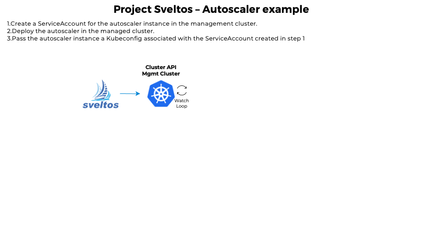

Sveltos allows you to represent add-ons and applications as templates. Before deploying to managed clusters, Sveltos instantiates these templates. Sveltos can gather the information required to instantiate the templates from either the management cluster or the managed clusters themselves.

For example, let's say you need to deploy Calico in multiple CAPI-powered clusters while fetching Pod CIDRs from the corresponding CAPI Cluster instance. With ClusterProfile, you can create a configuration that specifies these details, and the deployment will be ready to go in all matching clusters.

```yaml
---
apiVersion: config.projectsveltos.io/v1alpha1
kind: ClusterProfile
metadata:
  name: deploy-calico
spec:
  clusterSelector: env=fv
  helmCharts:
  - repositoryURL:    https://projectcalico.docs.tigera.io/charts
    repositoryName:   projectcalico
    chartName:        projectcalico/tigera-operator
    chartVersion:     v3.24.5
    releaseName:      calico
    releaseNamespace: tigera-operator
    helmChartAction:  Install
    values: |
      installation:
        calicoNetwork:
          ipPools:
          {{ range $cidr := .Cluster.spec.clusterNetwork.pods.cidrBlocks }}
            - cidr: {{ $cidr }}
              encapsulation: VXLAN
          {{ end }}
```

Likewise, you can define any resource contained in a referenced ConfigMap/Secret as a template by adding the `projectsveltos.io/template` annotation. This ensures that the template is instantiated at the time of deployment, making your deployments faster and more efficient.

Sveltos supports the template functions that are included from the [Sprig](https://masterminds.github.io/sprig/) open source project.

## Variables

By default, templates have access to the following managment cluster resources:

1. CAPI Cluster instance. Keyword is `Cluster`
2. CAPI Cluster infrastructure provider. Keyword is `InfrastructureProvider`
3. CAPI Cluster kubeadm provider. Keyword is `KubeadmControlPlane` 
4. For cluster registered with Sveltos, the SveltosCluster instance. Keyword is `SveltosCluster` 

In addition, Sveltos can fetch any resource from the management cluster. You can set the **templateResourceRefs** in the ClusterProfile Spec section to instruct Sveltos to do so.

For example, the following YAML instructs Sveltos to fetch the Secret instance autoscaler in the namespace default and make it available to the template with the keyword AutoscalerSecret.

```yaml
apiVersion: config.projectsveltos.io/v1alpha1
kind: ClusterProfile
metadata:
  name: deploy-resources
spec:
  clusterSelector: env=fv
  templateResourceRefs:
  - resource:
      kind: Secret
      name: autoscaler
      namespace: default
    identifier: AutoscalerSecret
  ...
  policyRefs:
  - kind: ConfigMap
    name: info
    namespace: default
```

The ConfigMap default/info referenced by ClusterProfile can then be expressed as a template:

```yaml
apiVersion: v1
kind: ConfigMap
metadata:
  name: info
  namespace: default
  annotations:
    projectsveltos.io/template: "true"  # add annotation to indicate Sveltos content is a template
data:
  secret.yaml: |
    # AutoscalerSecret now references the Secret default/autoscaler
    apiVersion: v1
    kind: Secret
    metadata:
      name: autoscaler
      namespace: {{ (index .MgtmResources "AutoscalerSecret").metadata.namespace }}
    data:
      token: {{ (index .MgtmResources "AutoscalerSecret").data.token }}
      ca.crt: {{ $data:=(index .MgtmResources "AutoscalerSecret").data }} {{ (index $data "ca.crt") }}
```

Note that MgtmResources is internally defined as

```go
MgtmResources          map[string]map[string]interface{}
```

If you want to refer to any resource fetched by Sveltos within a template, you can do so using the following syntax:

```yaml
(index .MgtmResources "<Identifier>")
```

When using Sveltos, the same principle applies to Helm charts. The `values` section of a Helm chart can reference any field of a Secret instance named `autoscaler` in the `default` namespace by referring to it as `AutoscalerSecret`.

### Extra RBACs

At Sveltos, we adhere to the least privilege principle, which means that Sveltos does not have all the necessary permissions to fetch resources from the management cluster by default. Therefore, when using `templateResourceRefs`, you need to provide Sveltos with the correct RBACs.

Providing the necessary RBACs to Sveltos is a straightforward process. Sveltos' ServiceAccount is tied to the **addon-controller-role-extra** ClusterRole. To grant Sveltos the necessary permissions, simply edit that role.

If the ClusterProfile is created by a tenant administrator as part of a [multi-tenant setup](../multi-tenancy.md), Sveltos will act on behalf of (impersonate) the ServiceAccount that represents the tenant. This ensures that Kubernetes RBACs are enforced, which restricts the tenant's access to only authorized resources.

### Namespace

When using `templateResourceRefs` to fetch resources in Sveltos, the namespace field is optional. Here's how it works:

1. If the namespace field is set, Sveltos will fetch the resource in that specific namespace.
2. If the namespace field is left empty, Sveltos will fetch the resource in the namespace of the cluster at the time of deployment.

## Dynamically Creating Resources in the Management Cluster

When deploying add-ons in a managed cluster, there may be a need to first dynamically create resources in the management cluster and then use their values to instantiate add-ons in the managed cluster. For example, when deploying `autoscaler` with [ClusterAPI](https://cluster-api.sigs.k8s.io/tasks/automated-machine-management/autoscaling.html) one option is to deploy the autoscaler in the managed cluster and provide it with a Kubeconfig to access the management cluster so it can scale up/down the nodes in the managed cluster using the ClusterAPI resources.

```
Management cluster            Managed cluster
+---------------+             +------------+
| mgmt/workload |             |     ?      |
|               |  kubeconfig | ---------- |
|               |<------------+ autoscaler |
+---------------+             +------------+
```

We want Sveltos to take care of everything, so we instruct Sveltos to perform the following tasks for each managed cluster:

1. Create a ServiceAccount for the autoscaler instance in the management cluster.
2. Deploy the autoscaler in the managed cluster.
3. Pass the autoscaler instance a Kubeconfig associated with the ServiceAccount created in step 1.

Let us now explore how to accomplish this task with ease..

### Instruct Sveltos to deploy resources in the management cluster

When a new cluster matches the ClusterProfile's `clusterSelector`, we want Sveltos to automatically create a *ServiceAccount* and a *Secret* for that ServiceAccount in the management cluster. To achieve this, we can reference a ConfigMap containing the necessary resources and set `deploymentType: Local` to instruct Sveltos to deploy the resources in the management cluster.

Here's an example YAML code block that demonstrates how to achieve this:

```yaml
  policyRefs:
  - deploymentType: Local # Content of this ConfigMap will be deployed 
                          # in the management cluster
    kind: ConfigMap
    name: serviceaccount-autoscaler # Contain a template that will be 
                                    # instantiated and deployed in the 
                                    # management cluster
    namespace: default
```

In the above code block, the ConfigMap named `serviceaccount-autoscaler` contains the template for the ServiceAccount and the Secret, which will be deployed in the management cluster. The `deploymentType` is set to `Local` to indicate that the resources should be deployed in the management cluster.

When using Sveltos to deploy resources in the management cluster, remember to [grant Sveltos](#extra-rbacs) permissions to do so.

This ServiceAccount will be given permission to manage MachineDeployment for a specific clusterAPI powered cluster (we are leaving this part out).

### Deploy Autoscaler in the managed cluster

When deploying autoscaler in the managed cluster, it is necessary to provide a Kubeconfig associated with the ServiceAccount that was created earlier. This enables the autoscaler running in the managed cluster to communicate with the management cluster and scale up/down the number of machines in the cluster.

To achieve this, the Secret Sveltos that was created in the management cluster needs to be fetched. We can do this by using the following YAML code:

```yaml
  templateResourceRefs:
  - resource:
      kind: Secret
      name: autoscaler
    identifier: AutoscalerSecret
```

Since we are not specifying the namespace, Sveltos will automatically fetch this Secret from the cluster namespace.

Next, we need to instruct Sveltos to take the content of the ConfigMap secret-info in the default namespace and deploy it to the managed cluster (`deploymentType: Remote`).

```yaml
 - deploymentType: Remote # Content of this ConfigMap will be 
                          # deployed in the managed cluster
    kind: ConfigMap
    name: secret-info # Contain a template that will be instantiated 
                      # and deployed in the managed cluster 
    namespace: default
```

The content of this ConfigMap is a template that uses the information contained in the Secret above:

```yaml
# This ConfigMap contains a Secret whose data section will contain token and ca.crt
# taken from AutoscalerSecret
apiVersion: v1
kind: ConfigMap
metadata:
  name: secret-info
  namespace: default
  annotations:
    projectsveltos.io/template: "true" # indicate Sveltos content of this ConfigMap is a template
data:
  secret.yaml: |
    apiVersion: v1
    kind: Secret
    metadata:
      name: autoscaler
      namespace: {{ (index .MgtmResources "AutoscalerSecret").metadata.namespace }}
    data:
      token: {{ (index .MgtmResources "AutoscalerSecret").data.token }}
      ca.crt: {{ $data:=(index .MgtmResources "AutoscalerSecret").data }} {{ (index $data "ca.crt") }}
```

### Putting all together



```yaml
apiVersion: config.projectsveltos.io/v1alpha1
kind: ClusterProfile
metadata:
  name: deploy-resources
spec:
  clusterSelector: env=fv
  templateResourceRefs:
  - resource:
      kind: Secret
      name: autoscaler
    identifier: AutoscalerSecret
  policyRefs:
  - deploymentType: Local # Content of this ConfigMap will be deployed
                          # in the management cluster
    kind: ConfigMap
    name: serviceaccount-autoscaler # Contain a template that will be 
                                    # instantiated and deployed in the management 
                                    # cluster
    namespace: default
  - deploymentType: Remote # Content of this ConfigMap will be deployed in the 
                           # managed cluster
    kind: ConfigMap
    name: secret-info # Contain a template that will be instantiated and deployed
                      # in the managed cluster 
    namespace: default
---
# This ConfigMap contains a ServiceAccount and a Secret for this ServiceAccount.
# Both are expressed as template and use managed cluster namespace/name
apiVersion: v1
kind: ConfigMap
metadata:
  name: serviceaccount-autoscaler
  namespace: default
  annotations:
    projectsveltos.io/template: "true" # indicate Sveltos content of this ConfigMap is a template
data:
  autoscaler.yaml: |
    apiVersion: v1
    kind: ServiceAccount
    metadata:
      name: "{{ .Cluster.metadata.name }}-autoscaler"
      namespace: "{{ .Cluster.metadata.namespace }}"
    ---
    # Secret to get serviceAccount token
    apiVersion: v1
    kind: Secret
    metadata:
      name: autoscaler
      namespace: "{{ .Cluster.metadata.namespace }}"
      annotations:
        kubernetes.io/service-account.name: "{{ .Cluster.metadata.name }}-autoscaler"
    type: kubernetes.io/service-account-token
---
# This ConfigMap contains a Secret whose data section will contain token and ca.crt
# taken from AutoscalerSecret
apiVersion: v1
kind: ConfigMap
metadata:
  name: secret-info
  namespace: default
  annotations:
    projectsveltos.io/template: "true" # indicate Sveltos content of this ConfigMap is a template
data:
  config.yaml: |
    apiVersion: v1
    kind: Secret
    metadata:
      name: autoscaler
      namespace: {{ (index .MgtmResources "AutoscalerSecret").metadata.namespace }}
    data:
      token: {{ (index .MgtmResources "AutoscalerSecret").data.token }}
      ca.crt: {{ $data:=(index .MgtmResources "AutoscalerSecret").data }} {{ (index $data "ca.crt") }}
```