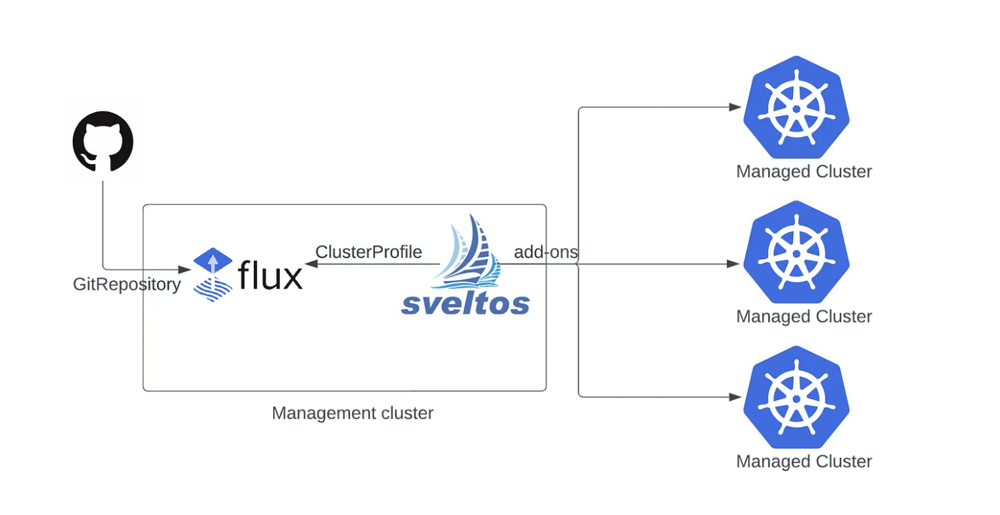

## Introduction to Sveltos and GitOps Controllers

Sveltos is not competing with GitOps controllers like ArgoCD or Flux. Instead, these components work together to improve and extend existing GitOps setups. Sveltos configuration is cluster-agnostic. Its built-in Event Framework and templating features allow it to manage complex tasks and support GitOps-driven workflows.

### Sveltos and Flux

From the beginning, Flux integration was available to users. [Flux](https://fluxcd.io/) is a CNCF graduate project that offers users a set of continuous and progressive delivery solutions for Kubernetes that are open and extensible. By integrating Flux with Sveltos, we can automate the synchronisation of any desired Kubernetes add-ons, removing any manual steps and ensuring consistent deployment across different clusters.



#### What are the benefits?

1. **Centralized Configuration:** Store `YAML/JSON` manifests in a central Git repository or Bucket.
1. **Continuous Synchronisation:** **Flux** in the **management cluster** ensures continuous synchronisation of configurations.
1. **Consistent Deployments:** Use Sveltos `ClusterProfiles` and `Profiles` to reliably deploy Kubernetes add-ons in matching clusters.

## Common Use-Cases

There are different deployment approaches when it comes to Sveltos and Flux integration.

| | Use-Case 1: Existing Flux Setup (Mature Projects) | Use-Case 2: New GitOps/Platform Engineering Projects |
|---|---|---|
| **Starting point** | Flux is already responsible for the GitOps part, and the teams do not want or need to update the existing setup | Greenfield project with no existing GitOps setup in place |
| **How Sveltos is installed** | Sveltos is installed and managed by Flux in the management cluster (brain of operations) | Sveltos is installed in the management cluster (brain of operations) with any means available: Infrastructure as Code (IaC), pipeline execution, scripts |
| **Role of Flux** | Flux continues to own any GitOps operations related | Flux is installed after Sveltos and used exclusively to synchronise manifest files into the management cluster based on specific needs and use-cases to be covered |
| **Role of Sveltos** | Sveltos extends the existing operations at scale using cluster-agnostic configuration. For example, automating the [Flux Helm Releases](https://fluxcd.io/flux/components/helm/helmreleases/) based on a label identifier defined in a cluster | Sveltos takes over the deployment lifecycle of a fleet of clusters |
| **Effort required** | A few changes on the existing setup | Full setup from scratch |

### Use-Case 1: Sveltos Integration to Existing Flux Setup

As Flux is already responsible for the GitOps part, we can install Sveltos using Flux resources. Once done, Sveltos will be used to automate the deployment of Flux Helm Releases to a fleet of clusters based on labels.

#### Install Sveltos

!!! example "Flux Resources for Sveltos Installation"
    ```yaml
    ---
    apiVersion: v1
    kind: Namespace
    metadata:
      name: projectsveltos
    ---
    apiVersion: source.toolkit.fluxcd.io/v1
    kind: HelmRepository
    metadata:
      name: projectsveltos
      namespace: flux-system
    spec:
      interval: 24h
      url: https://projectsveltos.github.io/helm-charts
    ---
    apiVersion: helm.toolkit.fluxcd.io/v2
    kind: HelmRelease
    metadata:
      name: projectsveltos
      namespace: flux-system
    spec:
      interval: 30m
      targetNamespace: projectsveltos
      storageNamespace: projectsveltos
      chart:
        spec:
          chart: projectsveltos
          version: ">=1.6.1"
          sourceRef:
            kind: HelmRepository
            name: projectsveltos
            namespace: flux-system
          interval: 12h
      install:
        crds: Create
        createNamespace: true
        timeout: 10m
        strategy:
          name: RetryOnFailure
      upgrade:
        crds: CreateReplace
        timeout: 10m
        cleanupOnFail: true
        strategy:
          name: RetryOnFailure
    ```
!!! example "Flux Kustomization"
    ```yaml
    apiVersion: kustomize.config.k8s.io/v1beta1
    kind: Kustomization
    resources:
      - sveltos-helm.yaml
    ```

Using the Flux approach, we can install Sveltos to the management cluster with no major changes to the existing setup.

!!!tip
    Sveltos needs to be installed in the `projectsveltos` namespace; this is not negotiable.

#### Sveltos Event Framework

In this example, we will automate the deployment of [Flux Helm Releases](https://fluxcd.io/flux/components/helm/helmreleases/) for Kyverno on clusters with the label set to `kyverno=required`. As a starting point, we will assign the label `type=mgmt` to the Sveltos management cluster because we want to control resources in the management cluster.

```bash
$ kubectl label sveltoscluster mgmt -n mgmt type=mgmt
```

Next, we will work with the Sveltos Event Framework to define the trigger of an action. We listen for new Sveltos clusters with the label set to `kyverno=required`.

!!! example "Kyverno EventSource"
    ```yaml
    apiVersion: lib.projectsveltos.io/v1beta1
    kind: EventSource
    metadata:
      name: detect-kyverno-clusters
    spec:
      collectResources: true
      resourceSelectors:
      - group: "lib.projectsveltos.io"
        version: "v1beta1"
        kind: "SveltosCluster"
        labelFilters:
        - key: kyverno
          operation: Equal
          value: required
    ```

Let's define the trigger once an Event is detected.

!!! example "Kyverno EventTrigger"
    ```yaml
    apiVersion: lib.projectsveltos.io/v1beta1
    kind: EventTrigger
    metadata:
      name: deploy-kyverno
    spec:
      sourceClusterSelector:
        matchLabels:
          type: mgmt
      destinationClusterSelector:
        matchLabels:
          type: mgmt
      eventSourceName: detect-kyverno-clusters
      oneForEvent: true
      policyRefs:
      - name: kyverno-helmrelease
        namespace: default
        kind: ConfigMap
    ```
Notice in the above YAML file, we deploy a `ConfigMap` in the management cluster with the name set to `kyverno-helmrelease`. The `ConfigMap` contains the Kyverno Flux Helm Release expressed in a [Sveltos template](http://localhost:8000/template/intro_template/). 

!!! example "Kyverno Flux Helm Release"
    ```yaml
    apiVersion: v1
    kind: ConfigMap
    metadata:
      name: kyverno-helmrelease
      namespace: default
      annotations:
        projectsveltos.io/instantiate: ok
    data:
      kyverno.yaml: |
        apiVersion: helm.toolkit.fluxcd.io/v2
        kind: HelmRelease
        metadata:
          name: kyverno-{{ .Resource.metadata.name  }}
          namespace: {{ .Resource.metadata.namespace }}
        spec:
          interval: 15m
          kubeConfig:
            secretRef:
              name: {{ .Resource.metadata.name }}-sveltos-kubeconfig
              key: kubeconfig
          chart:
            spec:
              chart: kyverno
              version: "v3.9.0"
              sourceRef:
                kind: HelmRepository
                name: kyverno
                namespace: flux-system
              interval: 15m
          install:
            createNamespace: true
            timeout: 10m
            remediation:
              retries: 3
          upgrade:
            timeout: 10m
            cleanupOnFail: true
            remediation:
              retries: 3
              strategy: rollback
          values:
            crds:
              enabled: true
              keep: true
    ```

The annotation `projectsveltos.io/instantiate: ok` is what converts a plain `ConfigMap` into a Sveltos template. Sveltos will pull information directly from the **management** cluster and dynamically pre-instantiate and deploy the resource using the detected cluster's metadata. Notice how `{{ .Resource.metadata.name }}` and `{{ .Resource.metadata.namespace }}` are automatically resolved per cluster, one template, many clusters. The `ConfigMap` can be further templatised based on different use cases. Both Lua and CEL languages are supported for Sveltos templating.

!!!tip
    The above resources need to be deployed to the management cluster where Flux is installed.

### Use-Case 2: Sveltos for Greenfield Environments

As we refer to more like Greenfield setups, Sveltos will be installed in the management cluster by any means available. From there, we will install Flux into the management cluster. This approach is much simpler, as we are in the beginning of defining how our project outline and architecture might look.

#### Label Management Cluster

Because we want to manage resources in the management cluster using Sveltos, let's add a label to the Sveltos management cluster.

```bash
$ kubectl label sveltoscluster mgmt -n mgmt type=mgmt
```

#### Install Flux

Flux can be installed in the management cluster or any other cluster that needs a GitOps controller using the Sveltos `ClusterProfile` resource. In the manifest, we define the clusters we want to match and how to install Flux to the cluster.

!!! example "Flux Operator ClusterProfile"
    ```yaml
    apiVersion: config.projectsveltos.io/v1beta1
    kind: ClusterProfile
    metadata:
      name: flux
    spec:
      clusterSelector:
        matchLabels:
          type: mgmt
      helmCharts:
      - repositoryURL: oci://ghcr.io/controlplaneio-fluxcd/charts
        repositoryName: flux-operator
        chartName: flux-operator
        chartVersion: 0.40.0
        releaseName: flux-operator
        releaseNamespace: flux-system
        helmChartAction: Install
      policyRefs:
      - name: flux-resources
        namespace: default
        kind: ConfigMap

      - kind: GitRepository
        name: sveltos-repo-sync # Define the Flux GitRepository resource name defined in the flux-resources ConfigMap
        namespace: flux-system
        path: ./resources/sveltos-manifests/
    ```

!!! example "Sveltos Template - Flux ConfigMaps"
    ```yaml
    apiVersion: v1
    kind: ConfigMap
    metadata:
      name: flux-resources
      namespace: default
    data:
      flux_resources.yaml: |
        ---
        apiVersion: fluxcd.controlplane.io/v1
        kind: FluxInstance
        metadata:
          name: flux
          namespace: flux-system
          annotations:
            fluxcd.controlplane.io/reconcile: "enabled"
            fluxcd.controlplane.io/reconcileEvery: "1h"
            fluxcd.controlplane.io/reconcileTimeout: "5m"
        spec:
          distribution:
            version: "2.x"
            registry: "ghcr.io/fluxcd"
          components:
            - source-controller
            - kustomize-controller
            - helm-controller
          cluster:
            type: kubernetes
            size: medium
            multitenant: false
            networkPolicy: false
            domain: "cluster.local"
          commonMetadata:
            labels:
              app.kubernetes.io/name: flux
          kustomize:
            patches:
              - target:
                  kind: Deployment
                patch: |
                  - op: replace
                    path: /spec/template/spec/nodeSelector
                    value:
                      kubernetes.io/os: linux
                  - op: add
                    path: /spec/template/spec/tolerations
                    value:
                      - key: "CriticalAddonsOnly"
                        operator: "Exists"
        ---
        apiVersion: source.toolkit.fluxcd.io/v1
        kind: GitRepository
        metadata:
          name: sveltos-repo-sync
          namespace: flux-system
        spec:
          interval: 30s
          ref:
            branch: main
          timeout: 60s
          url: https://<your domain>/<group name>/<repository name>.git
    ```

Ensure the name of the resources defined under `policyRefs` matches the names defined in the ConfigMap resources. The example above can be modified to include Git repositories of your preference. If a Git repository is private, we need to provide authentication. This lets Flux sync resources to the management cluster.

## Final Thoughts

There is no one-size-fits-all approach. Before you begin, think about both your current and future use-cases. Whichever integration you pick, make sure the architecture stays flexible and can be extended as your needs grow.

## More Resources

For more information about the Sveltos and Flux integration, have a look [here](../../addons/example_flux_sources.md). An example respository is located [here](https://github.com/gianlucam76/kustomize/).
