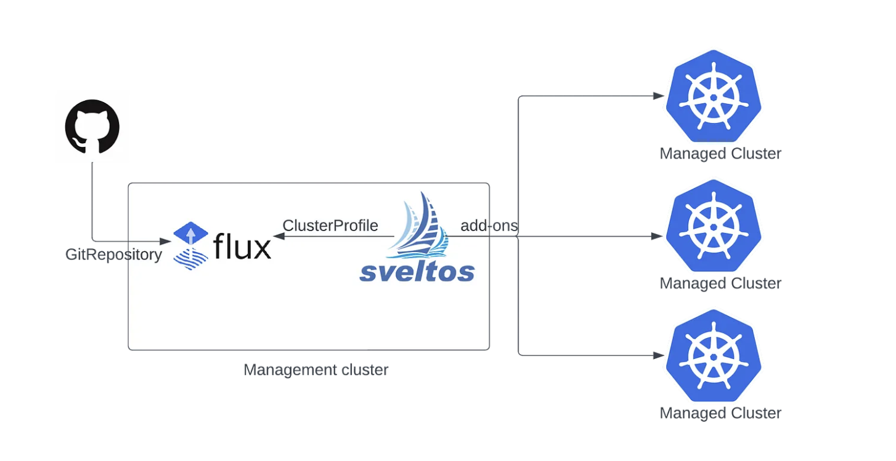

## Introduction to Sveltos and Flux

With the latest release of Sveltos [v0.23.0](https://github.com/orgs/projectsveltos/discussions/454), the existing integration with [Flux](https://fluxcd.io/) is greatly enhanced. Flux is a CNCF graduate project that offers users a set of continuous and progressive delivery solutions for Kubernetes which are open and extensible.

By integrating Flux with Sveltos, we can automate the synchronisation of the desired Kubernetes add-ons, removing any manual steps and ensuring consistent deployment across clusters.



## What are the benefits of the integration?

1. **Centralised Configuration:** Store YAML/JSON manifests in a central Git repository or a bucket
2. **Continuous Synchronisation of Resources:** Running Flux in the management cluster will ensure the continuous synchronisation of the configuration
3. **Consistent Deployments:** Define Sveltos ClusterProfiles to confidently deploy Kubernetes add-ons in matching clusters

## How it works?

We can store all the required Kubernetes resources in a Git repository and let Flux take care of the continuous synchronisation of those. Below, we demonstrate how to leverage Flux and Sveltos to automatically deploy a HelloWorld application to several managed clusters.

- Example Repository: https://github.com/gianlucam76/kustomize/

### Step 1: Configure Flux in the Management Cluster

Run Flux in the management cluster and configure it to synchronise the Git repository which contains the HelloWorld manifests. Use a GitRepository resource similar to the below YAML definitions.

```yaml
---
apiVersion: source.toolkit.fluxcd.io/v1
kind: GitRepository
metadata:
  name: flux-system
  namespace: flux-system
  annotations:
    projectsveltos.io/template: "true"
spec:
  interval: 1m0s
  ref:
    branch: main
  secretRef:
    name: flux-system
  timeout: 60s
  url: https://github.com/gianlucam76/kustomize.git
```

The above definition will look for updates of the main branch of the specified repository every minute.

### Step 2: Create a Sveltos ClusterProfile

Define a Sveltos ClusterProfile referencing to the `flux-system` `GitRepository` resource and define the HelloWorld directory as the source of the deployment. In the below YAML definition, application will get deployed on Cluster with the label selector set to *env=fv*.


```yaml
---
apiVersion: config.projectsveltos.io/v1alpha1
kind: ClusterProfile
metadata:
  name: deploy-helloworld-resources
spec:
  clusterSelector: env=fv
  policyRefs:
  - kind: GitRepository
    name: flux-system
    namespace: flux-system
    path: ./helloWorld/
    targetNamespace: eng
```

Whenever there is a change in the Git repository, Sveltos will leverage the Kustomize SDK to retrieve a list of resources to deploy to any cluster that matches the label selector `env=fv` in the `eng` namespace.

**Note:** The GitRepository or Bucket content can also be a template. Sveltos will take the content of the files and instantiate them by the use of the data resources in the management cluster. 

## More Resources

For more information about the Sveltos and Flux integration, have a look [here](../addons/example_flux_sources.md).