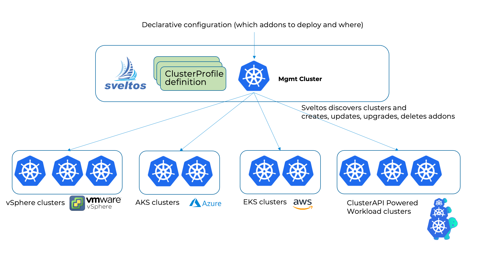

## What is Sveltos?

[Sveltos](https://github.com/projectsveltos "Manage Kubernetes add-ons") is a **set of Kubernetes controllers** that run in a **management cluster** and manage **add-ons** and **applications** on a fleet of clusters.

Sveltos **automatically** supports the discovery of [ClusterAPI](https://github.com/kubernetes-sigs/cluster-api)-powered clusters, but it does not stop there. [Registration](../register/register-cluster.md) of any other cluster (on-prem, Cloud) is possible and seamless.



## Platform Administrators - Hybrid Multicloud Environments

In today's fast-paced and ever-evolving IT landscape, where [hybrid](https://csrc.nist.gov/glossary/term/hybrid_cloud) and [multicloud](https://www.google.com/search?q=what+is+a+multicloud&oq=what+is+a+multicloud&gs_lcrp=EgZjaHJvbWUyBggAEEUYOdIBCDQyNzBqMGoxqAIAsAIA&sourceid=chrome&ie=UTF-8) concepts are becoming the norm, **automating** the creation of **Kubernetes clusters** while **managing** their **lifecycle programmatically** is essential for Kubernetes platform administrators.

Sveltos offers a **simple**, **unified** interface to easily review existing configurations and perform necessary adjustments seamlessly. It helps break down organisation silos by allowing different administrators to collaborate on defining the required cluster types (test, staging, production). Each administrator can independently configure policies for their designated cluster type, ensuring **global compliance** and **consistency** across environments. This leads to optimised operations and supports overall organisational success!

### Benefits of a Central Management Cluster

- **Centralized Management:** Manage multiple clusters from one place, ensuring consistency and reducing configuration errors.

- **Consistency:** Automate processes for uniform configurations and deployments, boosting reliability.

- **Scalability:** Easily scale infrastructure by simplifying the creation and management of clusters.

- **Cost Optimisation:** Centralized control maximizes resource use and lowers operational costs.

- **Better Security:** Security-related add-ons, such as network policies and secrets management, for secure cluster deployment.

- **Increased Automation:** Integrate with CI/CD pipelines to automate deployments and reduce management effort.

### Sveltos add-on Management Solution

Sveltos allows platform administrators to utilise the `ClusterProfile` Custom Resource Definition to perform Kubernetes [add-on](../addons/addons.md) deployments. Within a Sveltos `ClusterProfile`, we define the below points.

1. What Kubernetes add-ons to get deployed (Helm charts, Kustomize, YAML/JSON manifests)?
2. Where should they get deployed?
3. List the add-ons deployed

!!! example "Example - ClusterProfile"
    ```yaml
    ---
    apiVersion: config.projectsveltos.io/v1beta1
    kind: ClusterProfile
    metadata:
      name: deploy-kyverno
    spec:
      clusterSelector:
        matchLabels:
          env: prod
      syncMode: Continuous
      helmCharts:
      - repositoryURL:    https://kyverno.github.io/kyverno/
        repositoryName:   kyverno
        chartName:        kyverno/kyverno
        chartVersion:     v3.3.3
        releaseName:      kyverno-latest
        releaseNamespace: kyverno
        helmChartAction:  Install
      policyRefs:
      - name: disallow-latest-tag # (1)
        namespace: default
        kind: ConfigMap
    ```

    1. Reference a ConfigMap that contains a Kyverno ClusterPolicy

## More Resources

For more information about the Sveltos add-on deployment capabilities, have a look [here](../addons/addons.md).
