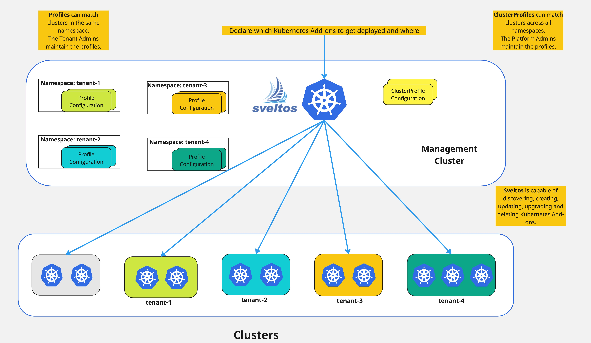

## Introduction to Sveltos Multitenancy Capabilities

In the previous use case, we covered how Sveltos can assist platform administrators to deploy and manage more effectively and efficiently Kubernetes add-ons in a multi-cloud environment. In this section, we will go through the concept of multitenancy, what it means, and how Sveltos is used to support multitenancy deployments.

## What is multitenancy?

Multenancy in cloud computing is the concept of multiple clients sharing the same computing resources. Multitenancy in Kubernetes can appear in two forms, either share a cluster between multiple tenants within an organisation or have more than one cluster reserved by an organisation.

## What are the Challenges?

1. How platform administrators can programmatically grant permissions to tenant administrators?
2. How to control what the tenant administrators can deploy on a cluster or a namespace based on their permissions?

We mentioned two terms in the challenges above: `platform administrator` and `tenant administrator`.

- **Platform administrator:** Manages and maintains the infrastructure of the managed Kubernetes clusters. This includes tasks like creating clusters, managing the nodes, performing installation and updates, ensuring the health of the cluster etc.

- **Tenant administrator:** Is the persona that has admin access to the cluster or the namespaces where applications are running. The permissions are assigned by the platform administrator.

## Sveltos Multitenancy Solution: Full Isolation

A common multi-tenant scenario involves assigning dedicated namespaces within the management cluster for each tenant. Tenant admins then create and manage clusters within their designated namespace and use Profile instances to define list of add-ons and applications to deploy in their managed clusters.

Similar to ClusterProfiles, Profiles utilize a cluster selector and list of add-ons and applications. However,  Profiles operate within a specific namespace, matching only clusters created in that namespace. 



## Sveltos Multitenancy Solution: Cluster Sharing Between Tenants

Sveltos allows platform administrators to utilise the CRD with the name `RoleRequest` that will effectively grant permissions to a number of tenant admins. More information can be found [here](../features/multi-tenancy-sharing-cluster.md).

!!! example "Example RoleRequest"
    ```yaml
    apiVersion: lib.projectsveltos.io/v1alpha1
    kind: RoleRequest
    metadata:
      name: full-access
    spec:
      serviceAccountName: "eng"
      serviceAccountNamespace: "default"
      clusterSelector: env=prod
      roleRefs:
      - name: full-access
        namespace: default
        kind: ConfigMap
    ```
Based on the above YAML definition, we defined the below fields:

- `serviceAccountName`: The service account the permission will be applied to;
- `serviceAccountNamespace`: The namespace the service account has been deployed in the **management cluster**
- `clusterSelector`: This is a Kubernetes label selector. Sveltos uses the label to detect all the clusters where permissions need to be granted;
- `roleRefs`: References ConfigMaps/Secrets each containing one or more Kubernetes [ClusterRoles/Roles](https://kubernetes.io/docs/reference/access-authn-authz/rbac/) defining the permissions to be granted.

The configMap in the example above can be something similar to be below YAML definition.

!!! example "Example ConfigMap"
    ```yaml
    apiVersion: v1
    kind: ConfigMap
    metadata:
      name: full-access
      namespace: default
    data:
      role.yaml: |
        apiVersion: rbac.authorization.k8s.io/v1
        kind: ClusterRole
        metadata:
          name: eng-full-access
        rules:
        - apiGroups: ["*"]
          resources: ["*"]
          verbs: ["*"]
    ```

If we have a look at the YAML definitions above, what will happen from a Sveltos point of view? By referencing the ConfigMap `default/full-access`, the `RoleRequest` with the name `full-access` will reserve a cluster matching the `clusterSelector` *env=prod* to the service account with the name `eng`.

### Example - Tenant Admin Application Management

Once the `RoleRequest` instance has been created, the defined tenant admin can use the Sveltos `ClusterProfile` CRD. The only requirement from a ClusterProfile point of view, is to define the labels `projectsveltos.io/serviceaccount-name: <service account name>` and `projectsveltos.io/serviceaccount-namespace: <service account namespace>` to the ClusterProfile instance.

!!! note
    The service account name defined should be a Kubernetes `ServiceAccount` on the **management cluster**.

!!! example "Example ClusterProfile"
    ```yaml
    apiVersion: config.projectsveltos.io/v1alpha1
    kind: ClusterProfile
    metadata:
      name: deploy-kyverno
      labels:
        projectsveltos.io/serviceaccount-name: eng
        projectsveltos.io/serviceaccount-namespace: default
    spec:
      clusterSelector: env=prod
      syncMode: Continuous
      helmCharts:
      - repositoryURL:    https://kyverno.github.io/kyverno/
        repositoryName:   kyverno
        chartName:        kyverno/kyverno
        chartVersion:     v3.0.1
        releaseName:      kyverno-latest
        releaseNamespace: kyverno
        helmChartAction:  Install
      policyRefs:
      - name: disallow-latest-tag # (1)
        namespace: default
        kind: ConfigMap
    ```

    1. Reference a ConfigMap that contains a Kyverno ClusterPolicy

In the ClusterProfile definition above we allow the service account *eng* found in the *default* namespace to deploy Kyverno v3.0.1 to the cluster it has access to. This is the cluster with the label selector set to `env=prod`.

If the service account tries to deploy the same ClusterProfile definition to a cluster with a clusterSelector set to *env=test*, the deployment should fail it does not have permissions in clusters with the mentioned clusterSelector.

## More Resources

For more information about the Sveltos multitenancy capabilities, have a look [here](../features/multi-tenancy-sharing-cluster.md).
